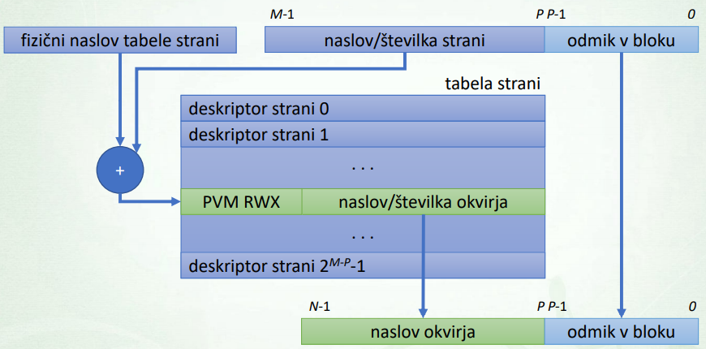

# OS Izpiski
- [OS Izpiski](#os-izpiski)
  - [Racunalniski sistem](#racunalniski-sistem)
    - [Lupina](#lupina)
    - [Graficna lupina](#graficna-lupina)
    - [Upravljanje oken](#upravljanje-oken)
    - [Ukazna lupina](#ukazna-lupina)
    - [Lupina bash](#lupina-bash)
    - [Sistemska orodja](#sistemska-orodja)
  - [Operacijski sistem](#operacijski-sistem)
    - [Koncepti operacijskih sistemov](#koncepti-operacijskih-sistemov)
    - [Jedro](#jedro)
    - [Arhitektura jedra](#arhitektura-jedra)
  - [Sistemski klici](#sistemski-klici)
    - [Ovojne funkcije sistemskih klicev](#ovojne-funkcije-sistemskih-klicev)
    - [Standardi](#standardi)
  - [Upravljanje z uporabniki](#upravljanje-z-uporabniki)
    - [Varnost in zascita](#varnost-in-zascita)
    - [Uporabniski racun](#uporabniski-racun)
    - [Prijava v sistem](#prijava-v-sistem)
    - [Uporabniki v Linuxu](#uporabniki-v-linuxu)
  - [Upravljanje z datotekami](#upravljanje-z-datotekami)
    - [Datotecni sistem](#datotecni-sistem)
    - [Datoteke](#datoteke)
    - [Kodiranje datotek](#kodiranje-datotek)
    - [Pripenjanje naprav](#pripenjanje-naprav)
    - [Nadzor dostopa](#nadzor-dostopa)
  - [Procesi](#procesi)
    - [Zivljenje procesa](#zivljenje-procesa)
    - [Stanje procesa](#stanje-procesa)
    - [Podatkovne strukture](#podatkovne-strukture)
  - [Vecopravilnost](#vecopravilnost)
    - [Virtualizacija procesorja](#virtualizacija-procesorja)
    - [Neposredno izvajanje](#neposredno-izvajanje)
    - [Preklop procesa](#preklop-procesa)
  - [Razvrscanje](#razvrscanje)
    - [Mere zmogljivosti](#mere-zmogljivosti)
    - [Razvrscevalni algoritmi](#razvrscevalni-algoritmi)
    - [Osnovni algoritmi](#osnovni-algoritmi)
    - [Prednostni algoritmi](#prednostni-algoritmi)
    - [Prakticni algoritmi](#prakticni-algoritmi)
  - [Upravljanje s pomnilnikom](#upravljanje-s-pomnilnikom)
    - [Naslovni prostor](#naslovni-prostor)
    - [Pomnilniski API - libc](#pomnilniski-api---libc)
  - [Pomnilniske storitve OS](#pomnilniske-storitve-os)
  - [Virtualizacija pomnilnika](#virtualizacija-pomnilnika)
    - [Ostrjevanje](#ostrjevanje)
    - [Uporaba zunanjega pomnilnika](#uporaba-zunanjega-pomnilnika)
  - [Medprocesna komunikacija](#medprocesna-komunikacija)
    - [Prenasanje sporocil](#prenasanje-sporocil)
    - [Deljen pomnilnik](#deljen-pomnilnik)
  - [Niti](#niti)

## Racunalniski sistem
- **Strojna oprema (hardware)**
  - fizicna racunalniska oprema
  - procesor, pomnilnik, I/O, prekinitve, ...
- **Programska oprema (software)**
  - brez fizicne oblike
  - podatki in programi
  - **Sistemska programska oprema**: OS, goniilniki, lupina in sistemski upazi, upravljanje diska in datotek, ...

### Lupina
- Uporabniski program, ki nudi osnovni uporabniski vmesnik za upravljanje racunalniskega sistema
- **Storitve**:
  - upravljanje z datotekami, procesi, napravami in s programi
  - nadzor in konfiguracija OS
  - ...
- **Vrste**:
  - **Graficna**: graficni uporabniski vmesnik, namizno okolje
  - **Tekstovna**: tekstovni uporabniski vmesnik, ukazna lupina
  - Zvocni vmesniki: zvocni ukazi
  - Mesani nacini uporabe
- **Nacini dela**:
  - **Interaktivna uporaba**: vnos ukazov in zahteva po izvedbi -> lupina izvede ukaz in sporoci status izvedbe
  - **Neinteraktivna uporaba**: izvajanje zaporedja ukazov (skripte). Uporabnik zahteva izvedbo skripte in lupina jo izvede

### Graficna lupina
- preprosta za uporabo
- graficni uporabniski vmesnik (GUI)
- napredne vnosne naprave (tipkovnica, miska, ...)
- **Arhitektura**:
  - **Graficni vmesnik (graphical interface)**:
    - desktop environment
    - graficni elementi (okna, ikone, meniji, ...)
    - interaktivni elementi (kurzor, izbira, ...)
  - **Prikazni streznik (display server)**:
    - kominikacija z aplikacijami po protokolu
    - posreduje dogodke I/O naprav
    - upravlja izris oken (window manager)
    - izris graficnih primitivov (crta, pravokotnik, ...)
  - **Upravitelj oken (window manager)**
    - program, ki nadzoruje postavitev in prikaz oken
    - pogosto zdruzen s prikaznim streznikom
    - nacini upravljanja oken (skladovni, ploscicni, kompozitni in dinamicni)
  - **Operacijski sistem (video / GPU podsistem)**
    - Framebuffer naprava (`/dev/fb0`): dostop do video pomnilnika, upravljanje video naprave, ...
    - Direct rendering manager (`/dev/dri/card0`): podsistem za upravljanje z GPU napravami

### Upravljanje oken
- **Skladovni ali lebdeci**:
  - prekrivanje oken po principu sklada
  - izris oken v vrstnem redu glede na oddaljenost
- **Ploscicni**:
  - vec ne-prekrivajocih podrocji
  - vertikalno in horizontalno rezanje
- **Dinamicni**:
  - hibrid med ploscicnim in skladovnim
- **Kompozitni**:
  - vsako okno se izrise samo zase v vmesni pomnilnik

### Ukazna lupina
- imenujemo jo tudi tekstovna
- tekstovni uporabniski vmesnik
- napredna uporaba (programiranje, preusmerjanje vhoda in izhoda)
- tezja za uporabo kot graficna
- **REPL (read-evaluate-print loop)**
- **Tekstovni terminal (konzola)**: ukazna lupina tece v terminalu
- **Psevdo terminal**: program, ki emulira tekstovni terminal. Lahko tece v graficnem okolju.
  
### Lupina bash
- avtomatko dopoljevanje ukazov in zgodovina
- preusmerjanje, cevovodi
- izvajanje v ozadju
- **Vgrajeni ukazi**: jih neposredno podpira lupina
- **Zunanji ukazi**: nekje v `/bin` ali `/usr/bin`
- `type ukaz`: tip ukaza
- `$PATH`: pot, kjer so zunanji ukazi
- `which ukaz`: pot do ukaza
- `man ukaz` prirocnik za zunanje ukaze

### Sistemska orodja
- Upravljanje datotecnega sistema: konsistentnos strukture, ciscenje, kompresija, etc.
- Delo z datotekami: file manager, arhiverji, varnost, sinhronizacija, etc.
- Urejevalniki teksta: uproraba pri upravljanju sistema, hex urejevalniki, ukazni (premik po tekstu, etc.) in urejevalni (vstavljanje in brisanje) nacin
- Sistemska orodja: analiza delovanja sistema, konfiguracija, optimizacija, varnost, mrezna, etc.
- Razvojna orodja: 
  - programska oprema za razvoj programske opreme
  - vrste: programerski, prevajalniki, povezovalniki, etc.

## Operacijski sistem
- **Lastnosti:**
  - nabor programske opreme
  - nadzoruje izvajanje programov
  - povezuje uporabnika s strojno opremo
  - deluje kot vmesnik med programi in strojno opremo
- **Vloge:**
  - sistemski vpogled
  - upravljanje racunalniskih virov
  - nadzor nad delovanjem
  - ponudnik sistemskih storitev
- Sestavljen iz jedra, gonilnikov, lupine in sistemskih orodji
- **Storitve:** upravljanje z uporabniki, procesi, pomnilnikom, datotecnimi sistemi in datotekami, I/O napravami, medprocesna komunikacija, ...
- **Cilji**: ease of use, security, reliability, performance and flexibility

### Koncepti operacijskih sistemov
- **Abstrakcija:** 
  - posplositev in skrivanje podrobnosti
  - poenotenje in zdruzevanje podobnih entitet v eno krovno (primer `datoteka`)
- **Virtualizacija:**
  - mehanizem, ki nekaj ustvari navidezno (navidezna naprava, pomnilnik, procesor)
  - preslikava navideznega v realno
- **Abstrakcija in virtualizacija**: komplementarna koncepta. Primer: navidezni datotecni sistem `VFS` nudi enovit dostop do datotek, zdruzuje razlicne naprave in vkljucuje razlicne datotecne sisteme
- **Varnost:**
  - zaupanje v dobro delovanje sistema in jo dosezemo prek mehanizmov zascite sistema
- **Socasnost:**
  - obstoj vec procesov hkrati
  - obcutek hkratnega izvajanja vec procesov
- **Persistenca:**
  - dolgorocni obstoj podatkov in informacij
  - ucinkovitost hrambe
  - omogoca medprocesno komunikacijo (npr datoteka)
  
### Jedro
- programska koda, ki vsebuje bistveni del OS (npr upravljanje s procesi in pomnilnikom)
- izvaja se v priviligiranem nacinu delovanja procesorja (obvladuje celoten sistem)
- **Procesorki nivoji zascite:**
  - **Uporabniski prostor (zasciten nacin)**: omejena uporaba procesorja, napacna uporaba povzroci izjemo
  - **Jedrni prostor (priviligiran nacin)**: neomejen dostop do pomnilnika in naprav, nekateri ukazi se lahko izvajajo samo v tem nacinu
- **Komunikacija med jedrom in strojno opremo:**
  - **naprava**: dejanska naprava (npr tipkovnica)
  - **kontrolnik naprav**: elektronska vezja, ki razumejo ukaze podane na vmesniku in jih posredujejo napravi (npr USB kontrolnik)
  - **vmesnik strojne opreme**: mehanizem programskega podajanja ukazov napravam (npr pomnilnisko preslikan I/O)
  - **gonilniki naprav**: programska koda, ki zna upravljati z napravo preko vmesnikov strojne opreme (niso del jedra)

### Arhitektura jedra
- struktura in nacin povezovanja med posameznimi deli jedra
- **Vrste:**
  - **Monolitno jedro:**
    - velik kos strojne kode (vsebuje cel OS)
    - deli OS lahko hitro komunicirajo preko klicev funkcij
    - napaka v enem delu OS sesuje cel OS
    - tezja obvladljivost programske kode
    - sprememba izvorne kode -> ponovno prevajanje jedra
    - **DOS, FreeDOS, Windows 9x**
  - **Monolitno modularno jedro:**
    - modularna zasnova jedra (modul vsebuje gonilnik naprave)
    - module je moc vloziti in izlociti iz jedra tekom izvajanja
  - **Mikro jedro:**
    - vsebuje samo osnovne funkcionalnosti, ostale funkcionalnosti so izvedene preko procesov
    - medprocesna komunikacija (odjemalec-streznik)
    - medsebojni klici so casovno zahtevnejsi
    - prilagodljivost, varnost, porazdeljenost in enostavnejsa implementacija
  - **Hibridno jedro:**
    - zasnova je mikro jedro, izvedba pa monolitna (npr Windows NT)
  - **Nano jedro:** manjse mikro jedro
  - **Exokernel:** manjse mikro jedro, omogoca le zascito in souporabo virov
  - **Unikernel:** specificno namensko jedro za izbrano aplikacijo

## Sistemski klici
- mehanizem preko katerega uporabniski program zahteva jedrno storitev
- vsak klic ima svojo stevilko, prejme lahko tudi argumente
- stevilke in argumenti se prenasajo preko registrov in sklada
- **Tabela rokovalnikov sistemskih klicev**:
  - i-ti element tabele je naslov rokovnika
  - npr. 1 → exit, 2 → fork, 3 → read, ...
- **Preklop nivoja zascite procesorja:**
  - direkten klic podprograma v jedru sprozi izjemo zato s pomocjo strojne opreme izvedemo preklop v priviligiran nacin in klicemo podprogram
- **Sistemski vmesnik - preklop v jedro:**
  - **Namenski strojni ukaz:** procesor naredi prekop in poklice namesceni rokovalnik sistemskih klicev v jedru
  - **Programska prekinitev:** procesor naredi preklop in poklice namesceni rokovalnik prekinitve v jedru
  - Call gate: zahteva oddaljen klic v drug segment in initializacijo segmentov
  - Pomnilniska vrsta: sistemske klice postavimo v vrsto
- **Izvedba sistemskega klica:**
  1. priprava: podajanje st. sistemskega klica in arg
  2. vstop v jedro: preko sistemskega vmesnika, preklopimo v priviligiran nacin in sprozimo rokovoalnik
  3. izvedba rokovalnika sistemskega vmesnika: preverimo st klica in klic specificnega rokovalnika
  4. izvedba rokovalnika sistemskega klica: navaden klic rutine znotraj jedra
  5. iztop iz jedra: preklop nazaj v uporabniski nacin
- **sistemski klic vs klic funkcije:** 
  - sistemski klic je pocasnejsi (preklop nivoja zascite)
  - izvedba rokovalnika klica je zahtevnejsa
  - podpora procesorja: funckijski (strojni ukaz), sistemski (poseben mehanizem)
  - za funkcijske je OS kot programska knjiznica
  - funkcijski klici so manj varni
  - lunkja v sistemskem klicu lahko sesuje celoten os
  - luknja v funkcijskem klicu sesuje lahko le program
  - sistemski klic je tudi mehanizem zascite

### Ovojne funkcije sistemskih klicev
- neposredna izvedba je zahtevna (assembly) saj je potrebno rokovanje z registri in vstop v jedro
- Ovojna funkcija je namenjena izvedbi sistemskega klica
- je v standardni kljiznici
- npr fork (`unistd.h`)
- **Izvedba sistemskega klica:**
  - **neposredno:** nastavitev registrov in vstop v jedro v zbirniku
  - **specificne ovojne funkcije:** predpripravljena ovojna funkcija iz knjiznice
  - **splosne ovojne funkcije:** `syscall()`
  - **posredno preko ostalih funkcij:** npr `printf()`

### Standardi
- **API:** application programming interface. Vmesnik za uporabo programskih knjiznic. Temelji na simbolicni predstavitivi
- **ABI:** application binary interface. Temelji na stevilski predstavitvi.
- POSIX - standard `IEEE 1003`:
  - prenosljiv vmesnik operacijskega sistema
  - programski vmesnik med aplikacijami in OS
  - predpisuje funkcije, ukazno lupino, ...
  - standard omogoca prenosljivost programov
- Skladnos s SUS standardom:
  - **certificirani Unix**
  - **ne-certificirani Unix**
  - **ostali ne-certificirani**

## Upravljanje z uporabniki
### Varnost in zascita
- **Zascita:**
  - mehanizem za nadzor dostopa do virov (sciti pred nodovoljeno uporabo virov)
  - pravila uporabe, politika (policy)
  - naloga OS: os je odgovoren za vzpostavljanje zascite virov, ki jih upravlja
- **Varnost:**
  - mera zaupanja v ohranjanje integritete sistema
  - vkljucuje tudi okolje
  - zascita virov pred *omreznim dostopom (firewall)*, *fizicnim dostopom* in *uporabniska ozavescenost*
- **Nacela nacrtovanja varnosti:**
  - mehanizem zascite mora biti **javen**
  - privzeto dovoljenje = **ni dostopa**
  - **sprotno preverjanje dovoljnenj**
  - procesi naj imajo **najmanjse mozne privilegije**
  - mehanizem naj bo **preprost, celovit in vgrajen**
  - shema varnosti naj bo **uporabnisko prijazna**

### Uporabniski racun
- **Uporabnik:** oseba, ki uporablja racunalniski sistem (zabava, programiranje, vzdrzevanje, etc.)
- uporabniki si lahko podatke delijo ali ne
- **Vrste:** *navaden*, *admin/root*, *superuser* in *gost*
- **Stevilo uporabnikov OS:** *brezuporabniski (enouporabniski)* in *vecuporabniski*
- **Uporabniski racun:**
  - mehanizem za **razlikovanje med uporabniki**, **prijavo v sistem** in **locevanje virov med uporabniki**
  - **Podatki o uporabniku:**
    - **Osebni:** stevilka, ime, priimek, ...
    - **za prijavo:** ime in geslo, imenik, ...
    - **za mehanizem zascite:** skupine

### Prijava v sistem
- **Identifikacija:** kdo je dani uporabnik
- **Avtentikacija:** potrjevanje identitete
- Nacini avtentikacije:
  - **pomnenje podatkov:** gesla, pin, podpis, ...
  - **fizicne lastnosti:** prstni odtis, ...
  - **fizicne naprave:** RFID, ...
- Nacini dostopa: **lokalna prijava** in **oddaljena prijava** (npr ssh)

### Uporabniki v Linuxu
- **Administrator:** `root`, imenik `/root`, ima vsa dovoljenja in odgovornosti
- **Ostali uporabniki:** `<username>`, imenik `/home/<username>`
- **Uporabniski racuni:**
  - `/etc/passwd`: vse razen podatki o geslu (`ime:x:uid:gid:polno ime: domaci imenik:prijavna lupina`)
  - `/etc/shadow`: hrani zgoscene vrednosti (hash) gesel za uporabnike in skupine (`ime:$metoda$sol$koda:ostalo (rok trajanja gesel itd.)`)
  - **Sol:** nakljucni niz dodan geslu pred zgoscanjem. Namenjen temu da imata 2 enaki gesli z razlicno soljo razlicna hasha. onemogoci napad z mavricno tabelo (rainbow table)
  - `etc/group`: hrani seznam uporabnikov, ki se pripadajo skupini poleg skupine zapisane v `etc/passwd` (`ime skupine:x:gid:seznam uporabnikov`)

## Upravljanje z datotekami
### Datotecni sistem
- pomnilni medij oz pomnilna naprava, ki omogoca dolgotrajno hranjenje podatkov
- OS premosca vrzel med medijem in uporabnikom
- **Logicna organizacija podatkov:**
  - Visoko nivojski pogled: uporabnikov pogled na podatke
  - OS nudi enotno abstrakcijo podatkov
  - osnovni koncep med OS je datoteka
- **Fizicna organizacija podatkov:**
  - nizko nivojski pogled: za uporabnika je skrit
  - nacin in oblika zapisa podatkov in metapodatkov
  - nacin se prilagodi pomnilnem mediju
  - **gonilnik datotecnega sistema** je program, ki skrbi za specificen datotecni sistem
- **Datoteka:**
  - osnovna zakljucena zbirka podatkov
  - hrani neko vsebino
  - **meta podatki:** npr ime datoteke, velikost, lastnik, etc.
- **Imenik:**
  - omogoca zdruzevanje datotek
  - vsebuje datoteke in druge imenike
  - hierarhicna struktura
- **Hierarhicna struktura imenikov:**
  - gnezdenje imenikov in datotek
  - odnosi: **podimenik** in **nadimenik**
  - **korenski imenik (root directory)**: imenik, ki nima nadimenika
- **Naslavljanje datotek:** *absolutna pot* je pot od korenskega imenika, *relativna pot* je pot ki se pricne v delovnem imeniku

### Datoteke
- **Abstrakcija datoteke:**   

  |oznaka|opis|primer|
  |:-|:-|:-|
  |`-`|regular file|`/etc/passwd`|
  |`d`|directory|`/bin`|
  |`s`|symbolic link|`/usr/src/linux`|
  |`b`|block special device|`/dev/sda`|
  |`c`|character special device|`/dev/tty`|
  |`p`|named pipe||
  |`s`|socket||

- **Navadna datoteka:**
  - vsebina je poljubna (binarna ali tekstovna)
  - OS omogoca notranje operacije
  - vrsto datoteke doloca koncnica `<name>.*`
- **Imenik:**
  - posebna datoteka, ki vsebuje seznam imeniskih vnosov (**imeniski vnos (directory entry)** vsebuje ime in kazalce na ostale podatke)
- **Simbolicna (mehka) povezava:**
  - posebna datoteka, ki vsebuje simbolicne povezave (pot do ciljne datoteke)
  - ukazi na datoteko operirajo na ciljni datoteki
  - ukaz `ln -s`
- **Simbolicna (trda) povezava:**
  - dodaten imeniski vnos za isto datoteko
  - razlicni imeniski vnosi lahko predstavljajo isto datoteko
  - ukaz `ln original trda`
  - veckratne trde povezave
- **Blocna in znakovna naprava:**
  - dva posebna tipa
  - branje in pisanje se neposredno nanasa na napravo
  - **blocne naprave:** dostop po blokih
  - **znakovne naprave:** dostop po znakih
- **Cev (pipe) in vticnica (socket):**
  - mehanizem za medprocesno komunikacijo
  - naslavljajo preko imen datotek
  - **imenovana cev (named pipe):** FIFO, ustvarimo z `mkfifo`
  - **lokalna vticnica (local socket):** Unix domain socket, poseben vmesnik

### Kodiranje datotek
- **Kodiranje znakov:**
  - preslikava **zaporedja bytov v znake** (moresejeva koda, braillova pisava)
  - pomembno za tekstovne datoteke
- **Kodiranje ASCII**
  - 7b kodiranje
- **Izzivi internacionalizacije**
  - manjkajo znaki ne-angleskih jezikov
  - razsiritev ASCII na 8b
- **Unicode**
  - nabor UCS (universal character set)
  - 21b kodni prostor
  - *kodirani znaki 143.859 znakov in 154 pisav*
- **Razlicna kodiranja**
  - UTF: unicode transformation format
  - UTF-32: 4B zacetni biti so 0, **prostorsko neucinkovit**
  - UTF-16: 1B ali 2B besedi
  - **UTF-8**
    - razsirjen ASCII, se ujema na prvih 128 znakov
    - 1 do 4B/znak
    - samo-sinhronizacija
- **Skok v novo vrstico**
  - **LF:** naslednja vrstica
  - **CR:** skok na zacetek vrstice
  - WP:Newline

### Pripenjanje naprav
- pripenjanje vec pomnilnih naprav omogoci dostop vseh naprav
- vsaka naprava ima svojo imenisko strukturo
- v **windows** sistemih je vec locenih imeniskih struktur (C:, D:, ...) v **unix** sistemih pa je ena enotna (root)
- **Vec imeniskih struktur:** vsaka naprava ima svoj znak (C:, D:, ...)
- **Enotna imeniska struktura:** naprave so dostopne prek nekaterih imenikov (podstruktura na podan imenik)
- **Korenski datotecni sistem:**
  - vsebuje datoteke, pomembne za zagon OS
  - se priklopi in pripne ob zagonu OS na korenski imenik enotne imeniske strukture
- **Pripenjanje (mount)**
  - pripenjanje dodatnega datotecnega sistema v obstojeco imenisko strukturo
  - **tocka pripenjanja (mount point)** je ciljni imenik v obstojeci imeniski strukturi kamor zelimo pripeti dodatni datotecni sistem (`/mnt/...`)
  - tocka pripenjanja se prekrije s korenskim imenikom
  - ukaza `mount` in `unmount`

### Nadzor dostopa
- doloca **kdo** lahko **kaj** pocne **s cim**
- *kdo?* **subjekt** je uporabnik, skupina, proces ali obmocje zascite
- *kaj?* **dovoljenje** za operacije nad datoteko (npr branje)
- *s cim?* **objekt** zascite je navadna datoteka lahko pa tudi naprava, pomnilnik, ...
- **Matrika dostopa**
  - **stolpci:** objekti nadzora dostopa
  - **vrstice:** subjekti, ki dostopajo
  - **elementi:** nabor dovoljenj  

    |  | Datoteka 1 | Datoteka 2 | Datoteka 3 | Datoteka 4 |
    |-|-|-|-|-|
    | Uporabnik A | lastnik, R, W | R, X | lastnik, R ||
    | Uporabnik B |  | lastnik, R, W, X | R ||
    | Uporabnik C | W |  |  | lastnik, R |

- **Nadzorni seznam dostopa (access control list)**
  - dekompozicija matrike dostopa po stolpcih
  - stolpci matrike predstavljajo seznam dostopa  
    ```
    Datoteka 1: (A, lastnik, R, W), (C, W)
    Datoteka 2: (A, R, X), (B, lastnik, R, W, X)
    Datoteka 3: (A, lastnik, R), (B, R)
    Datoteka 4: (C, lastnik, R)
    ```
- **Seznam zmoznosti (capabillities list)**
  - dekompozicija matrike dostopa po vrsticah
  - vrstice matrike predstavljajo zmoznosti  
    ```
    Uporabnik A: (1, lastnik, R, W), (2, R, X), (3, lastnik, R)
    Uporabnik B: (2, lastnik, R, W, X), (3, R)
    Uporabnik C: (1, W), (4, lastnik, R)
    ```
- **Zascita datotek v Unix/Linux sistemih**
  - vrste dovoljenj: **r** - **r**ead, **w** - **w**rite, **x** - e**x**ecute, **-** - prazno
  - sklopi uporabnikov: **u** - **u**ser (lastnik), **g** - **g**roup (skupina), **o** - **o**ther, **a** - **a**ll (vsi)
  - `[user][group][other]` → `rwxrwxrwx` → `rw-r-xr--`  

    |znak| datoteka |imenik|
    |-|-|-|
    |`r`| branje datoteke | izpis vsebine datoteke|
    |`w`| pisanje oz. spreminjanje datoteke | spreminajanje imenika (ustvarjanje in brisanje datotek v imeniku) |
    |`x`| izvajanje oz. datoteke je izvršljiva| vstop v imenik (sistemski klic chdir oz. ukaz cd) |

## Procesi
- **Program** je **pasivna** entiteta, ki je shranjen v izvrsljivi datoteki
- **Proces** je **aktivna** entiteta, ki je program v izvajanju
- Stanje programa dolocajo podatki, sklad, kopica, datoteke in IO naprave
- Proces tekmuje z drugimi procesi za vire
- **Glavni nalogi**
  - **lastnistvo** oz zascita virov
  - **izvajanje kode** sledi neki poti preko vec programov
  - nalogi sta neodvisni storitvi:
    - **procesi** so povezani z lastnistvom virov
    - **niti** so povezane z izvajanjem kode
- **Storitve OS** so *ustvarjanje procesa*, *koncanje procesa*, *odlozitev izvajanja processa*, *komunikacija med procesi*, *resevanje sporov pri virih*, ...
- **Sestava procesa**
  - **programska koda** je strojna koda, ki se lahko izvaja na procesu
  - **sklad** so podatki, pomembni za izvajanje
  - **kopica** so dinamicno alocirani podatki
  - **podatki** so ostali podatki, ki jih proces obdeluje
  - **deskriptor procesa** so dodatni nadzorni podatki, ki jih os potrebuje za upravljanje procesa
- **Naslovni prostor procesa** je pomnilnik, ki ga proces lahko naslavlja

### Zivljenje procesa
- **Stvaritev procesa**
  - **Razlogi**
    - **prevzem novega posla v paketnih OS**
    - **zagon programa preko lupine**
    - **prijava uporabnika v sistem**
    - **zagon servisa OS**
    - **programsko izkoriscanje socasnosti**
    - **vzporedno procesiranje**
  - **Hierarhija procesov**
    - **stars:** proces, ki je podal zahtevo po stvaritvi novega procesa - otroka
    - **otrok:** proces, ki je bil ustvarjen na zahtevo drugega procesa - starsa
    - OS vodi evidenco procesov
    - **PID (process identification)** je stevilka procesa
    - **PPID (parent PID)** je stevilka starsa (stars ne ve PID otroka)
  - **Storitev OS**
    - **priprava procesnega deskriptorja:** init PID, PPID in stanje, podajanje argumentov in vstavitev v vrsto za razvrscanje
    - **priprava pomnilniskega prostora:** navidezni pomnilnik in preslikovalna tabela naslovov
    - **razno:** preverjanje pravic in zascite in priprava odprtih datotek
  - **nalaganje iz izvrsne datoteke:** program se nalozi in zacne izvajati(**eager** - nalaganje celotnega programa pred izvajanjem, **lazy** - nalaganje po potrebi)
  - **stvaritev iz obstojecega procesa:** stars in otrok si delita vire (niti) lahko pa tudi **kloniram** kar pomeni da je otrok kopija starsa (`fork()`)
- **Koncanje procesa**
  - **Razlogi**
    - **normalen zakljucek:** preko sistemskega klica (npr `exit()`)
    - **napaka pri izvajanju:** npr aritmetika, napaka zascite, priviligiran ukaz
    - **na zunanjo zahtevo:** s strani drugega procesa, prekoracitev virov
  - **Storitev OS**
    - **sprostitev zasedenih virov**
    - **sprostitev deskriptorja procesa:** pogosto zakasnjena

### Stanje procesa
- glede na to ali se proces izvaja, caka na rezultat IO, ...  
  
- **nov:** ko se ustvari, inicializacija deskriptorja procesa, alokacija potrebnih virov
- **koncan:** ko se ukinja, sprostitev zasedenih virov
- **pripravljen:** pripravljen in caka na dodelitev procesorja
- **izvajan:** dejansko izvajanje na procesorju
- **cakajoc:** caka na nek dogodek, da nadaljuje
- **aktiven:** *izvajan* ali *pripravljen*
- **ni aktiven:** cka na nek dogodek

### Podatkovne strukture
- **Podatkovne strukture za opravljanje procesov**
  - **seznami:** vrsta pripravljenih/cakajocih procesov
  - **informacije o procesu:** deskriptior procesa
- **Deskriptior procesa**
  - jedrna podatkovna struktura
  - hrani nadzorne podatke procesa (id, stanje, ...)
  - omogoca preklapljanje procesov  
  

## Vecopravilnost
### Virtualizacija procesorja
- izziv je socasno izvajati poljubno stevilo procesov
- **Stevilo procesorjev**
  - **vecprogramiranje / multiprgoramiranje:** socasno izvajanje vec programov oz procesov na enem procesorju
  - **vecprocesiranje / multiprocesiranje:** vzporedno izvajanje vec programov na vec procesorjih (procesor je **vecjedrni** ali **vecnitni**)
- **Deljenje vira med vec entitetami**
  - **casovno dodeljevanje (time sharing)**
    - vsaka entiteta uporablja vir nekaj casa (**casovna rezina** je cas uporabe vira)
    - delijo si procesor in omrezno povezavo
  - **prostorsko dodeljevanje (space sharing)**
    - vsaka entiteta uporablja del vira
    - delijo si pomnilnik in diskovni prostor
- **Vecopravilnost (multitasking)**
  - vrsta programiranja
  - izvajanje vec procesov hkrati
  - preko **casovnega dodeljevanja**
  - vrsti: **sodelovalna / brez odvzemanja** in **prekinjevalna / z odvzemanjem**
- **Sodelovalna vecopravilnost**
  - temelji na sodelovanju procesov
  - odvzem procesorja je mozen znotraj sistemskih klicov
  - eksplicitno prepuscanje procesorja (`yield`)
  - predpostavi se razumno obnasanje procesov
  - racunsko intenzivni procesi lahko "ugrabijo" procesor
- **Prekinjevalna vecopravilnost**
  -  temelji na odvzemanju procesorja oz prekinjanju procesa (npr timer). Nadzor ima OS
  -  **casovna rezina:** 
     -  cas, ki ga ima proces na voljo
     -  po izteku se dodeli procesor drugemu procesu
     -  prekinjen proces se postavi v vrsto

### Neposredno izvajanje
- **Neomejeno neposredno izvajanje**
  - samo pozene program
  - **hitro:** program se direktno izvede
  - **izvajanje v celoti**
  - **neizkoriscenost virov:** proces caka npr IO
  - **tezak nadzor:** nemogoce nadzorovati
  - **TEZAVA:** OS ne tece vedno → izgubi nadzor nad sistemom
  - **RESITEV:** strojna podpora (uporabniski in jedrni nacin, preklopi, prekinitve, syscall)
- OS dobi nadzor ob
  - strojni prekinitvi
  - izjemi
  - sistemskem klicu
  - **prozenju ustreznega rokovalnika**
    - **PSP:** prekinitveno servisni program
    - **vstop v jedrni rokovalnik:** statusni register in PC na sklad, prekinitve se onemogocijo, izvedba rokovalnika in nivo zascite se preklopi na jedrni
    - **vrnitev iz rokovalnika:** statusni register in PC iz sklada, nivo zascite se proklopi na uporabniski
    - za ostale registre poskrbi rokovalnik
- **Omejeno neposredno izvajanje**
  - init rokovalnike prekinitev in pasti, rokovalnik syscall in casovnik
  - pozene program in pocakaj da OS dobi nadzor

### Preklop procesa
- vec procesov socasno v sistemu → casovno dodeljevanje → potrebno je **razvrscanje procesov** → mehanizem zamanjave procesa
- **Preklop procesa** se izvede na koncu rokovalnika, tik pred menjavo nacina
- preklop ni vedno potreben lahko se vrnemo v isti proces
- **Izvedba**
  - izbira drugega procesa (**razvrscevalnik**)
  - sprememba stanj procesov
  - preklop konteksta (PS, sklad, statusni in ostali registni) → v deskriptor procesa shranimo kontekst in obnovimo kotekst izbranega procesa
- **Ucinkovitost** je odvisna od
  - **strojne opreme:** hitrost pomnilnika, procesorja in stanje procesorja, ...
  - **operacijskega sistema:** zapletenost komponent, razvrscevalni algoritem, ...
  - v modernih sistemih traja preklop procesa pod `1 qs`

## Razvrscanje
- odlocanje o tem, kateri proces se razvrsti na viru → kljucno za zagotavljanje vecopravilnosti
- pogledi: **dolgorocno (job scheduling)**, **srednjerocno (swapping)** in **kratkorocno (CPU scheduling)**
- **Razvrscanje poslov (dolgorocno)**
  - paketna obdelava → enota obdelave je **posel**
  - posli cakajo in ko so izbrani se nalozijo in zacnejo izvajati
  - **job scheduler** je del OS, ki skrbi za razvrscanje poslov
  - navadno ni podprto na modernih OS
- **Menjava procesov (srednjerocno)**
  - disk se uporabi za umikanje procesov, npr ce primankuje pomnilnika proces umaknemo na disk sprostimo vire in ga potem lahko nalozimo nazaj
  - menjalnik (**swapper**) izbira procese za umik in vracanje (enakomerna obremenitev virov)
- **Razvrscanje na procesorju (kratkorocno)**
  - odloca o tem, kateri proces dobi moznost izvajanja na procesorju
  - kljucno za zagotavljanje vecopravilnosti
  - **Razvrscevalnik (scheduler)** je del upravitelja procesov in izbira enega izmed pripravljenih procesov
  - **Dodeljevalnik (dispatcher)** preklip procesa iz trenutnega na izbranege
- Razvrscevalnik se aktivira ko
  - proces konca
  - proces onemogoci
  - konec casovne rezine
  - konec cakanja
  - nov proces
- **Casovna rezina**
  - **racunsko intenzivna opravila:** rajsi daljse casovne rezine, omejijo stroske preklopa, vecja izkoriscenost procesorja
  - **interaktivna opravila:** krajse casovne rezine, procesi prej pridejo na vrsto, boljsa uporabniska izkusnja

### Mere zmogljivosti
- **Paketni sistemi**  
  [](images/paketni_sistemi.png)  
  - **cakalni cas:** $T_{cakalni} = T_{zacetni} - T_{prihodni}$
  - **odzivni cas:** $T_{odzivni} = T_{v/i} - T_{prihodni}$
  - **cas obdelave:** $T_{obdelave} = T_{koncni} - T_{prihodni}$
- **Interaktivni sistemi**  
  [](images/interaktivni_sistemi.png)
  - **cakalni cas:** celoten cas v stanju pripravljen
  - **odzivni cas:** $T_{odzivni} = T_{zacetni} - T_{prihodni}$ (predpostavimo $T_{zacetni} = T_{v/i}$)
  - **cas obdelave:** $T_{obdelave} = T_{koncni} - T_{prihodni}$
- **Ostale mere**
  - **izkoriscenost procesorja (processor utilization):** delez zaposlenosti procesorja
  - **prepustnost sistema (system troughput):** stevilo obdelanih procesov v danem casovnem obdobju
  - **postenost (fairness):** enakomernost delitve procesorja procesom

### Razvrscevalni algoritmi
- **Osnovni**
  - **FCFS:** prvi pride prvi melje
  - **SJF:** najkrajsi posel naprej
  - **PSFJ:** prekinjevalni najkrajsi posel naprej
  - **RR:** krozno razvrscanje
- **Prednostni**
  - **HPF:** najvisja prioriteta naprej
  - razvrscanje s prepustnicami
  - koracno razvrscanje
- **Prakticni**
  - **MLFQ:** vecnivojska odzivna vrsta
  - razvrscevalnik Linux
  - **CFS:** ppoplnoma posteno razvrscanje

### Osnovni algoritmi
- **FCFS** - first come, first served oz **FIFO** - first in, first out
  - **proces, ki je prej pripravljen, prej dobi procesor**
  - procesi na konec vrste, vzame se iz zacetka vrste
  - lastnosti:
    - razvrscanje **brez odvzemanja**
    - slab odzivni cas
    - dober cas obdelave
- **SJF** - shortest job first
  - **najkrajsi pripravljen posel dobi procesor**
  - potrebno je vnaprejsnje poznavanje dolzine poslov
  - lastnosti:
    - razvrscanje **brez odvzemanja**
    - algoritem je optimalen
    - slab odzivni cas
    - odlicen cas obdelave
- **PSJF** - preemptive shortest job first
  - **pripravljen posel z najkrajsim preostankom casa prej dobi procesor**
  - vnaprejsne poznavanje dolzin poslov
  - lastnosti:
    - razvrscanje **z odvzemanjem**
    - slab odzivni cas
    - odlicen obracalni cas
- **RR** - round robin
  - **pripravljene posle krozno razvrscamo zaporedoma, vsakega za nekaj casa**
  - procesi na konec vrste, vzame se iz zacetka vrste
  - izvajanje za dolocen cas (**casovna rezina**)
  - **casovna rezina** mora biti dovoj kratka za odzivnost in dovolj dolga za opravicitev casa preklopa
  - lastnosti:
    - razvrscanje **z odvzemanjem**
    - odlicen odzivni cas
    - slab cas obdelave
- **Ocena casa izvajanja**
  - **t** ... trajanje zadnjega teka procesa
  - **t'** ... ocena trajanja teka
  - **α** ... faktor pozabljanja (`α = 1` preteklost se ne uposteva, `α = 0` trajanje zadnjega teka nima vpliva)
  - $t' := \alpha \cdot t + (1 - \alpha) \cdot t'$
- **Vkljucevanje I/O operacij:** tekom i/o operacij je proces blokiran zato je bolje da prekrivamo izvajanja

### Prednostni algoritmi
- **prednostno razvrscanje:** algoritmi dajejo prednost glede na neko lastnost
- uposteva se prioriteta procesov (**notranja** - odvisna od lastnosti (npr trajanje) in **zunanja** - dolocena s strani uporabnika)
- **HPF** - highest priority first
  - **pripravljen posel z najvisjo prioriteto dobi procesor**
  - **z odvzemanjem:** ce ima prispeli proces visjo prioriteto zamenjamo
  - **brez odvzemanja:** pocakamo da trenutni proces prepusti procesor
- **Upostevanje prioritete procesov**
  - tezava se pojavi pri **stradanju:** procesi z visjo prioriteto nenehno prehitevajo
  - resitev je **staranje:** procesom, ki ne dobijo procesa vsake toliko povecamo prioriteto
- **SIRO** - service in random order
  - **razvrscanje po neki shemi nakljucnosti**
  - z ali brez odvzemanja
- **Lottery scheduling**
  - **dolocanje procesa z loterijo**
  - proces $i$ ima $p_i$ prepustnic
  - proces z visjo prioriteto dobi vec prepustnic
  - razvrscevalnik nakjucno izbere eno prepustnico in lastniku prepustnice dodeli procesor
  - lahko prepuscajo prepustnice drugim
  - verjetnost izbire k-tega procesa $\frac{p_k}{\sum^{n}_{i=1}{p_i}}$
- **Stride scheduling**
  - **proces, ki je najmanj prehodil, naprej**
  - ob stvaritvi dolocimo dolzino koraka
  - visja prioriteta → krajsi korak
  - procesu, ki je prehodil najmanj se dodeli procesor

### Prakticni algoritmi
- **MLQ** - multilevel queue
  - interaktivna in paketna opravila
  - vecnivojska vrsta: padajoce po prioriteti in narascajoce po casovni rezini
  - znotraj vrste se uporablja RR
- **MLFQ** - multi-level feedback queue
  - prehajanje med vrstami
    - ob prihodu najvisja prioriteta
    - ce posel porabi celo casovno rezino dekriemntiramo prioriteto
    - po dolocenem casu imajo vsi posli najvisjo prioriteto
  - ce posel vracas procesor tik pred iztekom rezine se mu prioriteta zmanjsa
- **Razvrscevalnik Linux O(1)**
  - izvira in dodajanje opravil v konstantnem casu
  - z odvzemanjem in proiriteto
  - aktivna in pretecena tabela
- **CFS** - popolnoma posteno razvrscanje
  - postenost: v danem casovnem intervalu naj posli dobijo delez, ki je enakovreden prioriteti
  - LINUX CFS razvrscevalnik
    - izbira posle z najmanjsim porabljenim caosm izvajanja
    - izvaja toliko casa, da ujamemo naslednji posel z najmanjsim porabljenim casom
    - po izvedbi se posel vstavi v drevo z novim skupno porabljenim casom izvajanja
    - nizja prioriteta cas tece hitreje

## Upravljanje s pomnilnikom
### Naslovni prostor
- **Pomnilnik** se deli se na **fizicni** in **naslovni** (kot ga vidi procesor, abstrakcija fizicnega)
- Vcasih je bil **logicni naslov = fizicni naslov**, pomnilnik se je delil na `[OS | ostalo]` in OS je bil kot knjiznica
- **Vecprogramiranje**
  - vec procesov v pomnilniku → deljenje pomnilnika → preklaplanje procesov → zascita procesov
  - Izgled `[OS | Proces A | Proces B | Proces C]`
- **Naslovni prostor**
  - pomnilnik kot ga vidi procesor → vidi samo svoj kos
  - sestaljen je iz **kode**, **kopice**, **sklada**, ...
  - navidezni naslov se preslika v fizicni naslov
  - Izgled `[koda | kopica | prosto | sklad]`
- **Dolocanje naslovov**
  - **cas prevajanja (compile time):** zbirnik ali prevajalnik doloci naslove simbolov oz spremenljivk
  - **cas povezovanja (link time):** zlaganje vec predvidenih modulov skupaj
  - **cas nalaganja (load time):** prenosljiva koda, poljubna lokacija
  - **cas izvajanja (run time):** premikanje in izmenjava procesov
- **Zascita procesa:**
  - naslovni prostor procesa je izoliran (za to skrbi OS)
  - preverja se naslove (preslikava na prosto ni dovoljena) in dovoljenja

### Pomnilniski API - libc
- **Aloacija pomnilnika**
  - **sklad** se implicitno alocira in dealokacija preko prevajalnika. Hrani lokalne spremenljivkem argumente funkcij in izvajalne podatke
  - **kopica** se eksplicitno alocira in delocira
- **Standardna knjiznica v C**
  - **alokacija pomnilnika**  
    ```c
    void* malloc(size_t size)
    // ali calloc(...), realloc(...)
    ```  
  - **dealokacija pomnilnika**  
    ```c
    free(void* ptr)
    ```  

## Pomnilniske storitve OS
- **Klasicne napake**
  - alokacija premalo pomnilnika → `malloc(strlen(s) + 1)`
  - pomnilnik ni inicializiran
  - prezgodnja sprostitev pomnilnika
  - veckratna sprostitev pomnilnika
  - napacna sprostitev pomnilnika
  - memory leak (pozabimo sprostiti)
- **Kaj naredi** `exit()`
  - sprosti naslovni prostor procesa
  - pomnilnik pusca le znotraj procesa
- **Velikost podatkovnega segmenta (kopice)**
  - sistemski klic `brk(...)`
  - **nastavljanje velikosti:** `void* brk(void* addr)`
  - **spreminjanje velikosti:** `void* sbrk(int incr)`
  - **trenutna velikost:** `brk(0)`
-  **Alokacija in preslikava pomnilnika**
   -  **alokacija in preslikava**  
    ```c
    void* mmap(void* addr, size_t len, int prot, int flags, int fd, off_t offset)
    ```   
  - **sproscanje pridobljenega pomnilnika**  
    ```c
     void* munmap(void* addr, size_t length)
    ```    
- **Randomizacija naslovnega prostora**
  - **ASLR** - address space layout randomization
  - **KASLR** - kernel ASLR
  - to se pojavi zaradi moznega **napada** (skok v okvarjeno kodo na nek znan fiksen naslov)
  - **resitev** je nakljucna razporeditev kljucnih delov naslovnega prostora (tezje se najde naslov)

## Virtualizacija pomnilnika
- **Cilji**
  - proces vidi **sklenjen kos pomnilnika**
  - **izolirani procesi** (mehanizem zascite)
  - **transparentnos** (proces se ne zaveda)
  - **ucinkovitost** (hitra preslikava)
- **Preslikava naslovov**
  - **navidezni naslov** → **fizicni naslov** ($PA = f(VA)$)
  - **OS skrbi za konfiguracijo**
  - **MMO** izvaja preslikavo
  - **TLB** skrbi za ucinkovitost preslikovanja
- **Izvedba preslikovanja**
  - izvedba za **vse navidezne naslove je nemogoca**
  - naslovni prostor premestimo na **poljubno mesto v fizicnem pomnilniku** (**realocation**)
  - **segmentacija** razdeli pomnilnik na bloke razlicnih velikosti. Segmenti so razdeljeni na strani
  - **ostrjevanje (paging)** razddeli pomnilnik na bloke enake velikosti
- **Staticno premescanje**
  - program se prevede na naslov 0
  - program se nalozi na izbrani **ciljni fizicni naslov**
  - **tezava** se pojavi pri dinamicnih naslovih (**ponovno premescanje programov**)
  - uporabimo le ce ni podpore za virtualizacijo
- **Dinamicno premescanje**
  - program se nalozi na izbrani **ciljni fizicni naslov**
  - **bazni register** hrani nalagalni naslov
  - **mejni register** hrani velikost naslovnega prostora
  - **enostavno** preslikovanje, zascita in premescanje
  - **MMU** je bazni in mejni register za izvedbo preslikovanja in preverjanja zascite
  - **pasti**
    - **prekoracitev baznega registra** → OS ukine proces
    - **izvedba priviligeranih ukazov** → OS ukine proces
    - posebne strojne ukaze za manipuliranje baznega in mejnega registra uporablja le OS 
- **Segmentacija in ostrjevanje**
  - pomnilnik razdeljen na bloke velikosti $2^P$  
      
  - iz **M**b navideznega v **N**b fizicni    

    |Segmentacija|Ostrjevanje|
    |-|-|
    |blok: segment| blok: stran in okvir|
    |segmenti razlicnih velikosti| enake velikosti strani|
    |segmenti imajo pomen (npr koda)|strani nimajo pomena|
    |tezavno upravljanje pomnilnika|lahko upravljanje pomnilnika|
    |zunanja fregmentacija|notranja fregmentacija|

  - v sodobnih OS se uporablja le ostrjevanje

### Ostrjevanje
- **stran** je blok v navideznem naslovnem prostoru
- **okvir strani** je blok v fizicnem naslovnem prostoru (hrani poljubno stran, enake velikosti kot stran)
- **Preslikovanje:** **navidezni naslov** (`naslov strani + odmik`) → **fizicni naslov** (`naslov okvirja + odmik`)  
  
- **Preslikovanje s tabelo strani**  
  
- **velikost tabele strani** je $2^{M - P}$ deskriptorjev v tabeli
- **resitvi:** vecnivojska tabela strani in invertirana tabela strani
- **Ucinkovitost preslikovanja**
  - **ena preslikava:** `st. dostopov do pomnilnika = st. dostopov do tabel in podtabel strani + 1`
  - **resitev:**
    - **TLB** - translation lookaside buffer
    - preslikovalnik predpomnilnik
    - prostorska lokalnost
    - casovna lokalnost
- **Naloge OS**
  - evidenca prostih okvirjev strani
  - upravljanje preslikovalnih tabel (stvarite in koncanje procesa in preslikava pomnilnika)
  - poznavanje TLB ob preklopu procesa

### Uporaba zunanjega pomnilnika
- **pomnilniska hierarhija:** **notranji (fizicni)** je `RAM` in **zunanji** je `HDD/SSD`
- **izziv** je zagotoviti vec navideznega naslovnega prostora kot je velikost fizicnega
- **Pomnilniski prekrivki (memory overlays)**
  - star pristop
  - program je razdeljen na vec kosov ki so shranjeni v datotekah
  - programer sam poskrbi za sproscanje pomnilnika in nalaganje nove kode, ki prekrije staro
- **Vecprogramiranje**
  - vec procesov hkrati nalozenih v premajhnem pomnilniku → resitev je **odlagalni prostor**
- **Odlagalni prostor (swap space)** je del zunanjega pomnilnikga
  - **swap out** - shranjevanje strani iz pomnilnika na disk
  - **swap in** - nalaganje strani iz diska v pomnilnik  
      
    
- **Postopek naslavljanja podatka**
  1. **zadetek v TLB:** ce **VPN** obstaja potem naslovi ustrezen del fizicnega pomnilnika
  2. **zgresitev v TBL, iskanje v tabeli strani:** ce **VPN** obstaja v preslikovalni tabeli strani in ce je veljaven in stran obstaja ga naslovi na ustrezen del fizicnega pomnilnika
  3. **zgresitev strani:** nalozi stran iz zunanjega pomnilnika, osvezi vnos v preslikovalni tabeli strani in ponovi strojni ukaz
- **Kaj ce je pomnilnik v celoti zaseden?**
  - pride do zamenjave strani (**swap in** in **swap out**)
  - **page replacement policy** minimizira stevilo zgresitev strani
  - **page (out) deamon**
- **Algoritmi izbire strani za izlocitev**
  - **FIF** - furthest in the future
    - optimalen algoritem
    - izloci stran, ki bo dostopana najdlje v prihodnosti
    - zgresitev strani prestavimo kar se da v prihodnost
    - moram poznati prihodnost
  - **FIFO** - first in, first out
    - izloci stran, ki je najdlje v pomnilniku
    - stare strani se lahko pogosto uporabljajo
  - **Nakljucna zamenjava**
  - **LFU** - least-fequently used
    - izloci najmanj uporabno stran
    - potrebno evidentirati frekvenco uporabe
  - **LRU** - least-recently used
    - izloci najdlje neuporabljeno stran
    - z **casovnim zaznamkom:** zaznamek se osvezi ob vsakem dostopu strani
    - z **vrsto strani:** ob vsakem dostopu do strani, stran pomaknemo na zacetek vrste
- **Strojna pomoc**
  - **dodatni bit v vnosu tabele strani**
  - **dirty bit:** ce je bila stran spremenjena od zadnega nalaganja
  - **fiksen bit:** preslikava je fiksna
  - **access/reference:** ali je bila stran dostopana

## Medprocesna komunikacija
- **Medprocesna komunikacija** je
  - komunikacija med procesi (naceloma socasni)
  - nadzorovan mehanizem OS, ki omogoca komunikacijo brez krsenja zascite procesov
- **namenjena je** izmenjavi podatkov, sinhronizaciji akcij, pohitritvi in modularnosti
- **Osnovna nacina**
  - **prenasanje sporocil** preko vticnice, cevi, ... (zgled `A → jedro → B`)
  - **deljen pomnilnik**
- **Ostali nacini**
  - **args**
  - **env**
  - izhodni status
  - stdin, stdout, stderr
  - datoteke
  - klic oddaljene procedure
  - sinhronizacija
- **Sporocilo** za OS nima pomena, za proces pa ima
- **Kanal** je medij za komunikacijo, ki ga ustvari in vzdrzuje OS (npr medpomnilnik) na katerega se preko **vrat** povezejo procesi

### Prenasanje sporocil
- **Prenos sporocila**
  - OS vzpostavi in sprosti kanal
  - OS opravlja kanal
  - OS poskrbi za uspesen prenos
  - kanal je v jedru
- **Osnovne operacije oz programski vmesniki**
  - **posiljanje** - `send` in `write`
  - **prejem** - `receive` in `read`
  - **odgovor** - `reply`
- **Sinhronost komunikacije**
  - **sinhrona operacija:** operacije blokirajo, **zmenek** kadar sta obe sinhroni
  - **asinhrona operacija:** operacije ne blokirajo, potrebujemo medpomnenje sporocil
- **Medpomnenje**
  - podatkovna struktuaa za hranjenje poslanih in se ne prejetih sporocil
  - **neomejena kapaciteta** → posiljatelj nikoli ne blokira
  - **omejena kapaciteta** → poiljatelj pri polni vrsti blokira
  - **nicelna kapaciteta** → posiljatelj blokira dokler prejemnik ne prejme
- **Naslavljanje procesov**
  - **neposredna komunikacija:** procesi se **eksplicitno poznajo**, naslavlja se preko **PID**  
    ```c
    send(pid, msg)
    receive(pid, msg)
    ```
  - **posredna komunikacija:** procesi komunicirajo preko **vmesnega objekta** → komunicira lahko vec procesov → v naprej vzpostavljen kanal  
    ```c
    send(addr, msg)
    receive(addr, msg)
    ```
- **Posredna komunikacija**
  - **nabiralnik** je vmesni objekt
  - nabiralnik v **naslovnem prostoru** zivi dokler zivi proces
  - nabiralnik v **sistemskem prostoru** prezivi proces, OS skrbi za ciscenje
  - **vec pisalcev** - vec procesov v isti nabiralnik
  - **vec bralcev** - vec procesov bere isti nabiralnik
- **Ucinkovitost**
  - zahteva sistemske klice
  - **request-reply** → 4x prehod med nacinom in 4x kopiranje podatkov
  - **Leno kopiranje**
    - kopiramo le naslov sporocila
    - kopiranje sporocila izvedemo kasneje
    - **request-reply** → 4x prehod in 2x kopiranje
- **Enostavnost uporabe**
  - OS skrbi za stvaritev in upravljanje kanala
  - OS skrbi za medpomnenje in sinh
- **Problem producer-consumer**
  - `>= 2` socasnih procesov
  - ni znano kdo ima procesor, kdaj se proizvede podatek in kdaj se lahko uporabi
- **Prakticne izvedbe prenasanja sporocil**
  - **signali**
  - **anonimne in imenovane cevi**
  - **sporocilne vrste**
  - **vticnice**

### Deljen pomnilnik
- je pomnilnik, ki je skupen dvema ali vec procesom
- je del fizicnega pomnilnika, preslikan v naslovni prostor procesov
- **Uporaba**
  - OS **vzpostavi**, doda v naslovni prostor in skonfigurira
  - **komunikacija** je neposredno branje in pisanje v deljen pomnilnik
  - po koncu uporabe deljen pomnilnik **sprostimo**
  - **hiter**
  - **podatki so takoj na voljo**
  - **potrebna eksplicitna sinhronizacija** - programer odgovoren
- Kako sinhronizirati dostop?
  - z mehanizmi iz knjiznice **pthreads**
  - z mehanizmi iz OS
  - sinhrono prenasanje sporocil
- **Ostrjevanje** → del navideznega prostora vec procesov je preslikan v iste okvirje strani
- **Nacini prenasanja podatkov**
  - **prenasanje sporocil**
    - **kopiranje** podatkov
    - hitra vzpostavite
    - pocasna komunikacija
  - **deljen pomnilnik**
    - **preslikava** vsebine pomnilnika med naslovnimi prostori
    - pocasna vzpostavitev
    - hitra komunikacija
    - enkratna vzpostavitev, veckratna uporaba

## Niti    