<!-- #region -->
- [Ukazna lupina](#ukazna-lupina)
  - [Ukazna vrstica](#ukazna-vrstica)
  - [Se vec ukazov](#se-vec-ukazov)
  - [Premikanje po datotecnem sistemu](#premikanje-po-datotecnem-sistemu)
- [Skriptiranje - osnovni gradniki](#skriptiranje---osnovni-gradniki)
  - [Skriptiranje](#skriptiranje)
  - [Argumenti skripte](#argumenti-skripte)
  - [Spremenljivke](#spremenljivke)
  - [Pogojni izrazi](#pogojni-izrazi)
  - [Programski stavki](#programski-stavki)
- [Podlupina, preusmeritve, pogojno izvajanje in funkcije](#podlupina-preusmeritve-pogojno-izvajanje-in-funkcije)
  - [Izvajanje v podlupini](#izvajanje-v-podlupini)
  - [Preusmerjanje](#preusmerjanje)
  - [Pogojni izrazi](#pogojni-izrazi-1)
  - [Skriptiranje](#skriptiranje-1)
  - [Aritmetika](#aritmetika)
  - [Funkcije](#funkcije)
  - [Obnasanje funkcij in iteratorjev](#obnasanje-funkcij-in-iteratorjev)
  - [Ostalo](#ostalo)
- [Sistemski klici](#sistemski-klici)
  - [Jedro](#jedro)
  - [Standardna C knjiznica](#standardna-c-knjiznica)
  - [Obdelava napak](#obdelava-napak)
  - [Sledenje programom](#sledenje-programom)
- [Uporabniki](#uporabniki)
  - [Uporabniski racuni](#uporabniski-racuni)
  - [Uporabniske skupine](#uporabniske-skupine)
  - [Administracija uporabnikov](#administracija-uporabnikov)
  - [Administracija skupin](#administracija-skupin)
  - [Ujemanje vzorcev](#ujemanje-vzorcev)
  - [Zascita datotek](#zascita-datotek)
- [Procesi](#procesi)
  - [Imenik /proc/PID/](#imenik-procpid)
  - [Info o procesih](#info-o-procesih)
  - [Zagon ukazov v lupini](#zagon-ukazov-v-lupini)
  - [Procesi](#procesi-1)
  - [Posli](#posli)
- [Vzporednost poslov](#vzporednost-poslov)
  - [Sistemski klici](#sistemski-klici-1)
  - [Stvaritev procesa](#stvaritev-procesa)
  - [Zagon progama](#zagon-progama)
  - [Koncanje procesa](#koncanje-procesa)
  - [Cakanje otroka](#cakanje-otroka)
  - [Procesi v C](#procesi-v-c)
    - [Vejitev](#vejitev)
    - [Sirota](#sirota)
    - [Zombi](#zombi)
    - [Zagon procesa oz programa](#zagon-procesa-oz-programa)
  - [Procesi v lupini](#procesi-v-lupini)
    - [Zagon programa v ospredju](#zagon-programa-v-ospredju)
    - [Zagon programa v ozadju](#zagon-programa-v-ozadju)
    - [Cevovod](#cevovod)
    - [Lupina in sistemski klici](#lupina-in-sistemski-klici)
- [Socasnost: Signali in preusmeritve](#socasnost-signali-in-preusmeritve)
  - [Signali](#signali)
  - [Sistemski klici](#sistemski-klici-2)
  - [Signali](#signali-1)
  - [Lovlenje signalov](#lovlenje-signalov)
- [Preusmeritve](#preusmeritve)
  - [Kopiranje deskriptorjev](#kopiranje-deskriptorjev)
  - [Preusmeritev v terminalu](#preusmeritev-v-terminalu)
- [Razvrscanje](#razvrscanje)
  - [FCFS](#fcfs)
  - [SJF](#sjf)
  - [PSJF](#psjf)
  - [Round robin](#round-robin)
- [Cevovodi](#cevovodi)
<!-- #endregion -->

## Ukazna lupina
### Ukazna vrstica
- preko ukazne vrstice vnasamo ukaze
- `student@stroj:~>` - pozivnik
- **osnovni ukazi:** `echo, printf, logout, cat, date, ls, cd, ...`
- **naprednejsi ukazi**
  - **stikala** → `-x`
  - **sestavljeni** → `<ukaz> && <ukaz> && ...`
  - skripte
- okno konzole je kot **neskoncen trak**
- `[Tab]` → avtomatsko dopolnjevanje (path, imena datotek)
- `Ctrl + C` → prekinitev izvajanja
- `Ctrl + Z` → zaustavitev izvajanja
- `Ctrl + D` → konec vnosa

### Se vec ukazov
- `cat, less, head, tail` → izpis vsebine
- `sort` → urejanje vrstic
- `shuf` → permutiranje vrstic
- `uniq` → odstranjevanje duplikatov
- `nl` → stevilcenje vrstic
- `rev` → obrat vrstic
- `tr` → spreminjanje znakov
- `cut` in `paste` → obdelava stolpcev
- `wc` → stetje besed
- `cmp` → primerjava vsebine
- `split` → sekanje
- `comm, diff in patch` → ugotavljanje razlik
- `grep` in `egrep <regex>` → iskanje v datotekah
- `sed -r 'naslovs/ri/niz` → urejevalnik toka podatkov
- `awk`

### Premikanje po datotecnem sistemu
- `cd <imenik>` → vstop v imenik
- **relativno** → `cd ../../abc`
- **absolutno** → `cd /usr/abc/def/`
- `pwd` → trenutna lokacija

## Skriptiranje - osnovni gradniki
### Skriptiranje
- `#!` → **shebang**  
  ```bash
  #!/bin/bash

  # komentar

  exit 42
  ```
- **Zagon skripte**
  - **neposreden** → `chmod u+x skripta.sh` → `./skripta.sh`
  - **prek arumenta tolmacu** → `bash skripta.sh`
  - **v trenutni lupini** → `source skripta.sh`
- za **zaporedno izvajanje** uporabimo `EOL` ali `;`  
  ```bash
  echo -n "Vnesi svoje ime: "; read ime
  echo "Zdravo $ime"
  ```

### Argumenti skripte
- **Vgrajene spremenljivke**
  - `$#` - stevilo argumentov
  - `$0` - ime skripte
  - `$1, $2, ...` - argumenti skripte
  - `$*, $@` - vsi argumenti skripte
- `shift` ukaz

### Spremenljivke
- dekleracija ni potrebna
- **tipi**
  - `ime=vrednost`
  - `local ime=vrednost`
  - `readonly ime=vrednost`
  - `export ime=vrednost`
- **uporaba** → `${ime}` ali `$ime`
- **privzeta vrednost** → `${ime:-privzeto}` ali `${ime:=privzeto}` (nastavi vrednost)
- **podnizi**
  - `${#ime}` - dolzina niza
  - `${ime:poz}` - podniz od **poz** do konca
  - `${ime:poz:dol}` - podniz od **poz** dolzine **dol**
- `${!ime}` - kadar spr vsebuje ime spremenljivke
- **odstranjevanje podnizov**
  - `${ime#vzorec}` - najkrajsa predpona
  - `${ime##vzored}` - najdaljsa predpona
  - `${ime%vzored}` - najkrajsa pripona
  - `${ime%%vzorec}` - najdaljsa pripona
- **zamenjava podniza**
  - `${ime/vzorec/vrednost}` - prva pojavitev
  - `${ime//vzorec/vrednost}` - vse pojavitve
- **zanimive spremenljivke** → `$SHELL, $BASH, $LINES, $COLUMNS, $PWD, $RANDOM`
- `read` - prebere input (`-p` dodamo string, `-n` dodamo stevilo znakov)

### Pogojni izrazi
- `[ pogoj ]` je ukaz `test`
- `[[ pogoj ]]` ni ukaz ampak kljucna baseda
- **primerjava nizov**
  - `test -z niz` - dolzina niza enaka nic
  - `test -n niz` - dolzina niza vecja od nic
  - `test niz1 == niz2`
  - `test niz1 != niz2`
  - `test niz1 > niz2`
  - `test niz1 < niz2`
- **preverjanje datotek**
  - `test -e datoteka` - ali obstaja
  - `test -f datoteka` - ali je navadna
  - `test -d datoteka` - ali je imenik
  - `test -L datoteka` - ali je simbolicna povezava
  - `test -b datoteka` - ali je blocno oorientirana
  - `test -c datoteka` - ali je znakovno orientirana
  - ...

### Programski stavki
- **zanke**
  - `while pogoj; do ukazi; done`
  - `until pogoj; do ukazi; done`
  - `for var in spisek; do ukazi; done`
  - `for ((init; pogoj; inkrement)); do ukazi; done`
  - `break` in `continue`
- **if**  
  ```bash
  if pogoj; 
  then 
    ukazi; 
  elif pogoj; 
  then 
    ukazi; 
  else 
    ukazi; 
  fi
  ```
- **case**  
  ```bash
  case niz in
    (vzorec1) ukazi1 ;;
    (vzorec2) ukazi2 ;;
    ...
    (*) ukazi ;;
  esac
  ```

## Podlupina, preusmeritve, pogojno izvajanje in funkcije
### Izvajanje v podlupini
- **podlupina** je podproces trenutne lupine
- **navadno** `( ukaz )`
- **s substitucijo** `$( ukaz )` → `dirname $(which less)`

### Preusmerjanje
- `stdin` → deskriptor `0`
- `stdout` → deskriptor `1`
- `stderr` → deskriptor `2`
- **preusmerjanje standardnega vhoda** → `ukaz < datoteka`
- **preusmerjanje standardnega izhoda** → `ukaz > datoteka` ali `ukaz >> datoteka`
- **splosno preusmerjanje**
  - `ukaz deskriptor < datoteka`
  - `ukaz deskriptor > datoteka`
  - `ukaz deskriptor >> datoteka`
  - `ukaz deskriptor1 >& deskriptor2`
- **tukaj dokument** → `ukaz << locilo` → `cat << 'EOF' > skripta.sh`
- **tukaj niz** → `ukaz <<< niz` → `tr "13579" "123" <<< $(seg 0 9)`
- **cevovod**
  - `ukaz 1 | ukaz 2 | ... | ukaz N`
  - primer `cat /etc/passwd | cut -d -f7 | sort`

### Pogojni izrazi
- odvisni od **izhodnega statusa**
- `ukaz1 && ukaz2` **in**
- `ukaz1 || ukaz2` **ali**

### Skriptiranje
- `{ ukazi; }` - statement block

### Aritmetika
- `(( aritmetika ))` ali `$(( aritmetika ))` 
- primer `(( a = 1 + 2 * 3 ))`

### Funkcije
- `function ime { ukazi }`
- Argumenti: `$1, $2, $3, ...`
- `return vrednost` → se shrani v `$?`  
  ```bash
  function fakt {
    if (( $1 <= 1 )); then
      echo 1
    else 
      tmp=$(fakt $(( $1 - 1 )))
      echo $(( $1 * $tmp ))
    fi
  }
  ```

### Obnasanje funkcij in iteratorjev
- funkcija se obnasa kot skripta
- **preusmeritve**
  - iz datoteke  
    ```bash
    while read a; do
      echo "$a"
    done < mojadatoteka.txt
    ```
  - iz spremenljivke  
    ```bash
    studenti=(Joze Mirko Miha Janez)
    for stud in "${studenti[@]}"; do
      echo "$student"
    done

    # ali

    a=$'ena\ndva\ntri\nstiri'
    while read line; do
      echo "$line"
    done <<< "$a"
    ```

### Ostalo
- bash podpira tabele `( array )`
- `man man`

## Sistemski klici
### Jedro
- `uname` - osnovni podatki o jedru
- `/proc/` - datotecni sistem
- `dmesg` - jedrna obvestila
- `sysctl` - nastavljanje jedra

### Standardna C knjiznica
- library `glibc`
- vsebuje tudi ovojne funkcije sistemskih klicev

### Obdelava napak
- **rezultat funkcije (izhodni status)**
  - `0` - uspeh
  - `-1` - neuspeh
- `errno` - koda zadnje napake
- `perror()` - izpis obvestila o napaki  
  ```c
  #include <stdlib.h>
  #include <errno.h>
  int main(int argc, char* argv[]) {
    if (chdir(argv[1]) < 0) {
      int koda = errno;
      perror(argv[0]);
      exit(koda);
    }
    write(1, "Vse je OK.\n", 11);
    exit(0);
  }
  ```

### Sledenje programom
- `time` - merjenje casa
- `strace` - sledenje sistemskih klicev
- `ltrace` - sledenje klicem v libc

## Uporabniki
### Uporabniski racuni
- `uid` - id stevilka uporabnika
- `/home/<username>` - domac imenik uporabnika
- `passwd` - nastavitev gesla
- `whoami, users, who, w` - pregled prijav
- `last, lastb` - zgodovina prijav
- `$UID, $HOME, $HOSTNAME`
- `su` - zamenjava uporabnika na root
- `sudo <ukaz> ...` - izvajanje kot root

### Uporabniske skupine
- `gid` - id stevilka skupine
- **primarne** in **sekundarne skupine**
- `groups` - spisek skupin
- `id` - informacije o uporabniku
- `newgrp, sg` - zamenjava skupine

### Administracija uporabnikov
- `useradd` - ustvarjanje uporabnika
- `userdel` - odstranjevanje uporabnika
- `usermod` - spreminjanje uporabnika
- `md5pass, sha1pass, ...` - kriptiranje gesla

### Administracija skupin
- `gpasswd` - nastavitev gesla
- `groupadd` - ustvarjanje skupine
- `groupdel` - odstranjevanje skupine
- `groupmod` - spreminjanje skupine

### Ujemanje vzorcev
- opisovanje imen datotek in nizov
- **vzorci**
  - `*` - poljuben niz
  - `?` - poljuben znak
  - `[znaki]` = poljuben znak iz danega nabora znakov (**interval** `[g-o]` ali **nabor znakov** `[:alnum:], [:alpha:], [:digit:], ...`)
- **napredni vzorci**
  - `? (vzorci)` - 0 ali 1 ponovitev
  - `* (vzorci)` - 0 ali vec ponovitev
  - `+ (vzorci)` - 1 ali vec ponovitev
  - `@ (vzorci)` - ujemanje z natanko enim od vzorcev
  - `! (vzorci)` - neujemanje z danimi vzorci   

```bash
# osnovni
ls *
ls *.txt
echo b*.txt
echo b?.txt
ls ?2.txt f*
echo ???
ls ?
echo ?
echo c[[:digit:]].txt
echo [ac][13].*
echo [a-c][13].t?t
echo [a-c]?[02].*xt

# napredni
echo b1?(0|2).txt
echo b*(1|2).txt
echo [bf]+(o)
echo !(???|???.*)
```

### Zascita datotek
- **sklopi uporabnikov**
  - **lastnik** → `u` - user
  - **clani skupine** → `g` - group
  - **ostali** → `o` - ostali
  - **vsi** → `a` - all
- `chown` - sprememba lastnika
- `chgrp` - sprememba skupine  

```bash
# spreminjanje lastnika
chown metka pesem.txt
# spreminjanje skupine
chgrp audio pesem.txt
# oboje hkrati
chown metka:audio pesem.txt
```

- **dovoljenja nad datotekam**
  - **branje** → `r` - read
  - **pisanje** → `w` - write
  - **izvajanje** → `x` - execute
  - **prazno** → `-`  

|Znak|Datoteka|Imenik|
|-|-|-|
|`r`|branje|izpis imenika|
|`w`|pisanje|spreminjanje|
|`x`|izvajanje|vstop v imenik|

```
rwxrwxrwx
rw-r--r--
rwxr-x---
-w---xr--
```   

- **spreminjanje dovoljenj**
  - **dodajanje** → `+`
  - **odvzemanje** → `-`
  - **nastavljanje** → `=`
- `chmod [augo][+-=][rwx] datoteka` - spreminjanje dovoljenj
- `umask -S u=rwx, g=rx, o=r` - nastavitev privzetih dovoljenj

```bash
chmod u+w a.txt
chmod go+r b.txt
chmod a-xw c.txt
chmod u=rwx,g=rw,o=r d.txt
```

- **omejeno brisanje** → `chmod +t temp/`  → datoteko lahko odstrani le lastnik
- **setuid/setgid bit** → `chmod +s datoteka` → omogoca zagon izvrsljive datoteke z dovloljenji lastnika

## Procesi
- **PID** - identiteta procesa
- **PPID** - identiteta starsa procesa
- **Okolje procesa**  
  ```c
  #include <stdio.h>
  int main(int argc, char* argv[], char* environ[]) {
    // Izpis argumentov.
    for (int i = 0; i < argc; i++) printf("%s\n", argv[i]);

    // Izpis okoljskih spremenljivk.
    int i = 0;
    while (environ[i]) printf("%s\n", environ[i++]);
  }
  ```

### Imenik /proc/PID/

### Info o procesih
- `pidof` ali `pgrep` - izpis PID ov
- `ps` - izpis procesov
- `pstree` - hierarhija procesov
- `top` - interaktivni pogled procesov
- `ulimit` - omejitve procesa
- `$$` - PID lupine
- `$PPID` - PPID lupine
- `$BASHPID` - PID procesa

### Zagon ukazov v lupini
- **zagon v ospredju**
  - program se zazene, nadzor nad konzolo, vrne izhodni status lupini
  - lupina caka program, prevzame izhodni status → `$?`
- **zagon v ozadnju z** `&`
  - program se zazene, nima nadzora nad tipkovnico, vrne izhodni statuts lupini
  - lupina caka program, ob prejemu signala `SIGCHLD` prevzame izhodni status → `$!`

### Procesi
- `sleep` - spanje za dolocen cas
- `wait` - cakanje vseh otrok na dokoncanje
- `wait PID` - cakanje na dokoncanje
- `exit STATUS` - koncanje procesa
- `kill PID` - ukinjanje procesa

### Posli
- posli so procesi v ozadju
- `JID` - stevilka posla
- `jobs` - izpis tekocih poslov
- `Ctrl + Z` - zaustavitev posla v ospredju
- `fg` - nadaljevanje v ospredju
- `bg` - nadaljevanje v ozadju
- `disown` - locitev posla od lupine
- `screen` - virtualna lupina

## Vzporednost poslov
- **Linux stanja**
  - `TASK_RUNNING`
  - `TASK_STOPPED`
  - `TASK_INTERRUPTIBLE`
  - `TABSK_UNINTERRUPTIBLE`

### Sistemski klici
- `int getpid()`
- `int getppid()`
- `int sleep(unsigned int seconds)` - spanje za `seconds` sekund

### Stvaritev procesa
- `int fork()`
  - ustvari nov proces (otrok), katerega stars je tekoc proces
  - Otrok je **kopija** oz klon starsa
    - kopira se koda, podatki, sklad, ..., deskriptorji odprtih datotek
    - ne kopirajo se kljucavnice
    - `Copy-on-write` - podatki se ne kopirajo, dokler jih stars ali otrok ne spreminja
  ```c
  int pid = fork();
  if (pid < 0)
    // NAPAKA
  else if (pid == 0)
    // OTROK
  else
    // STARŠ
  ```

### Zagon progama
- druzina funkcij `int exec(...)`
  - argumenti: path, args, env
  - PID in PPID se ne spremenita
  - **podeduje:** odprte datoteke, trenutni in korenski imenik
  - **nova** koda, podatki, kopica in sklad  
  ```
  execl(...), execlp(...), execle(...),
  execv(...), execvp(...), execve(...)
  ```
  - `l` - argumenti ukaza so argumenti funkcije
  - `v` - argumenti so v tabeli
  - `p` - iskanje ukaza preko path
  - `e` - podajanje env

### Koncanje procesa
- `exit(int status)`
  - iz funkcije se nikoli ne vrnemo
  - konca proces → sprosti vire, zapre datoteke, starsu poslje `SIGCHLD`
  - otrokom poslje `SIGUP` in `SIGCONT` → ukinitev procesa
  - morebitne otroke posvoji proces `init` → **sirote**
  - izhodni status se shrani v jedru z deskriptorjem procesa
  - stars prevzame status z `wait()`
  - dokler stars ne prevzame statusa je proces **zombi**
  - proces **init** je sirotisnica

### Cakanje otroka
- druzina funkcij `int wait(...)`
  - cakanje otroka da se konca in prevzame njegov izhodni status
  - `int waitpid(pid, &status, opcije)`
  - `int wait(&status)` enako kot `waitpid(-1, &status, 0)`

### Procesi v C
#### Vejitev
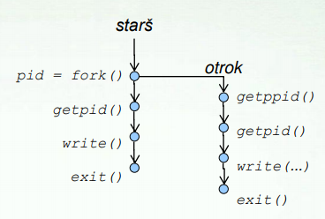  

```c
#include <stdio.h>
int main(int argc, char* argv[]) {
  int pid = fork();
  if (pid < 0)
    perror(argv[0]);
  else if (pid == 0)
    printf("Sem otrok %i s staršem %i.\n", getpid(), getppid());
  else
    printf("Sem starš %i z otrokom %i,\n", getpid(), pid);
}
```  

#### Sirota
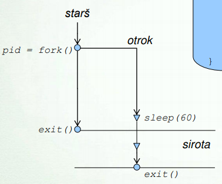

```c
#include <stdio.h>
int main(int argc, char* argv[]) {
  int pid = fork();
  if (pid < 0)
    perror(argv[0]);
  else if (pid == 0)
    sleep(60); // otrok zaspi za 60 sekund
}
```

#### Zombi
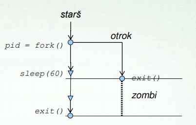

```c
#include <stdio.h>
int main(int argc, char* argv[]) {
  int pid = fork();
  if (pid < 0)
    perror(argv[0]);
  else if (pid > 0)
    // starš zaspi za 60 sekund
    sleep(60);
}
```

#### Zagon procesa oz programa
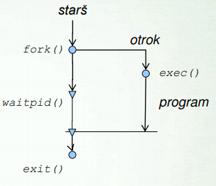

```c
#include <stdlib.h>
#include <stdio.h>
#include <sys/wait.h>
int main(int argc, char* argv[]) {
  int pid = fork();
  if (pid < 0) {
    perror("fork");
    exit(EXIT_FAILURE);
  } else if (pid == 0) {
    execvp(argv[1], &argv[1]);
    perror("exec");
    exit(EXIT_FAILURE);
  } else {
    int status;
    if (waitpid(pid, &status, 0) < 0) {
    perror("waitpid");
    exit(EXIT_FAILURE);
  }
  if (WIFEXITED(status))
    printf("Izhodni status otroka: %i\n",
    WEXITSTATUS(status));
  }
  exit(EXIT_SUCCESS);
}
```

### Procesi v lupini
#### Zagon programa v ospredju
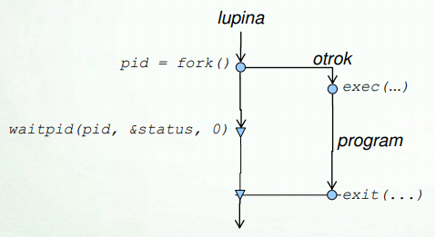

```bash
ls
```

#### Zagon programa v ozadju
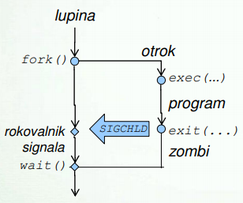

```bash
xeyes &
```

#### Cevovod
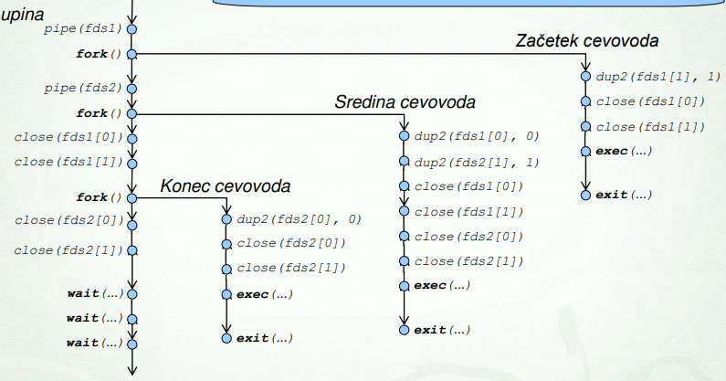

```bash
cat /etc/passwd | cut -d -f7 | sort - u
```

#### Lupina in sistemski klici
**Zagon zunanjega ukaza**
: `fork()`, `exec()`, `waitpid()`

**Zagon zunanjega ukaza v ozadju**
: `fork()` in `exec()` → `ls`

**Izvajanje v podlupini**
: `fork()` in `waitpid()` → `xeyes &`

**Izvajanje v podlupini v ozadnj**
: `fork()` → `( read line; echo $line )`

- `$$` → `getpid()` lupine
- `$PPID` → `getppid()` lupine
- `$BASHPID` → `getpid()`
- `sleep 42` → `sleep(42)` - spanje za dolocen cas
- `wait` → `wait()` - cakanje vseh otrok
- `wait 1234` → `waitpid()` - cakanje otroka
- `exit 42` → `exit(42)` - zakljucek programa

## Socasnost: Signali in preusmeritve
### Signali
- enosmerna komunikacija
- kratka sporocila cljnemu procesu
- **izvor** (posiljatelj) je jedro OS ali poljuben proces
- **ponor** (prejemnik) je poljuben proces, izvor se neposredno ne pozna
- vsak signal ima svoj **rokovalnik**
- **nacini rokovanja**
  - `SIG_DFL` - privzeti rokovalnik
  - `SIG_IGN` - ignoriranje signala
  - uporabniski rokovalnik
- **privzeti odzivi na signale**
  - koncanje procesa
  - koncanje procesa in zapis `core` datoteke
  - zaustavitev in nadaljevanje procesa
- **vrste**
  - je podan z njegovo stevilko
  - obstajajo tudi oznake namesto stevilk
- vrste signalov - **ukinjanje procesa**
  - privzet odziv je koncanje procesa
  - `SIGTERM` - genericna ukinitev procesa
  - `SIGINT` - prekinitev procesa s `Ctrl + C`
  - `SIGQUIT` - prekinitev procesa s `Ctrl + \`
  - `SIGKILL` - brezpogojna ukinitev procesa
  - `SIGHUP` - sporocilo o koncanju pripadajocega terminala
- vrste signalov - **programske napake**
  - privzet odziv je koncanje procesa in zapis `core` datoteke
  - `SIGFPE` - aritmeticna napaka
  - `SIGILL` - napacen strojni ukaz
  - `SIGSEGV` - krsenje pomnilniske zascite
  - `SIGBUS` - napacen pomnilniski prostor
  - `SIGABRT` - abort
- vrste signalov - **nadzor poslov**
  - `SIGCHLD` - sporocilo starsu o koncanju otroka
  - `SIGCONT` - nadaljevanje zaustavljenega procesa
  - `SIGSTOP` - brezpogojna zaustavitev procesa
  - `SIGSTP` - `Ctrl + Z`
  - `SIGTTIN` - posel je bral s terminala
- vrste signalov - **splosna komunikacija**
  - privzet odziv je koncanje procesa
  - `SIGUSR1` - prvi uporabniski signal
  - `SIGUSR2` - drugi uporabniski signal
- **posiljanje signala**
  - `kill(pid, signum)` 
  - `kill`
- **lovlenje signalov**
  - otroci dedujejo rokovalnike starsa
  - `fork()` kopira kodo in s tem tudi rokovalnike
- **nov program dobi privzete rokovalnike**
  - `exec()` ustvari novo sliko procesa iz podanega ukaza, s tem se stari rokovalniki izgubijo
- **nastavljanje uporabniskega rokovalnika**
  - `signal(signum, sighandler)` ob prejetnju signala se sprozi rokovalnik oz sighandler

### Sistemski klici
- **posiljanje signala samemu sebi**
  - `raise(signum)`
- **nastavljanje rokovalnika**
  - `signal(signum, action)`
  - `action` je funkcija oblike `void rokovalnik(int signum) {}`

### Signali
- **blokiranje signalov**
  - v casu med generiranjem signala in rokovanjem
  - med rokovanjem je signal blokiran

### Lovlenje signalov
- `trap` - izpis obstojecih rokovalnikov
  - nastavljanje pasti
  - ignoriranje signala
  - ponastavitev rokovalnika

## Preusmeritve
### Kopiranje deskriptorjev
- `dup2(orig, new)` je preusmeritev deskriptorja **orig** v **new**
  - ce je deskriptor **new** v uporabi se najprej zapre nato se izved kopiranje
  ```c
  // odpremo datoteko
  fd = open("vhod.txt", O_RDONLY);
  // izvedemo preusmeritev
  dup2(fd, 0);
  // zaženeno program
  execv("/bin/cat", NULL);
  ```
### Preusmeritev v terminalu
- `ukaz deskriptor < datoteka`
- `ukaz deskriptor > datoteka`
- `ukaz deskriptor >> datoteka`
- `ukaz deskriptor1 >& deskriptor 2`
- `ukaz 2 > datoteka`
- `ukaz 1 > datoteka 2 >& 1`
- `ukaz &> datoteka`

## Razvrscanje
### FCFS
**FCFS**
: first come, first served
: Ce pridejo ob istem casu, optimiziramo

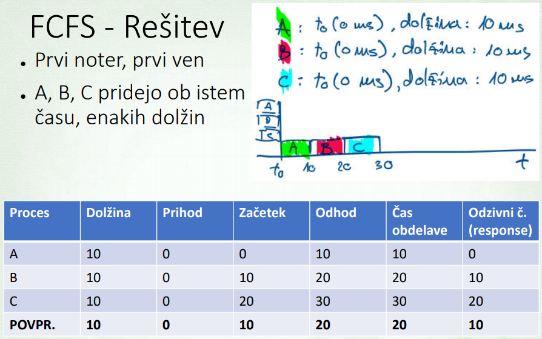
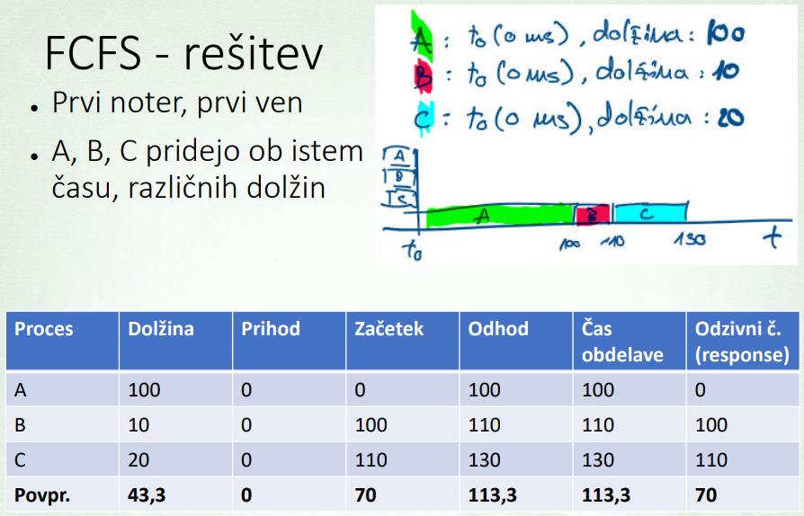
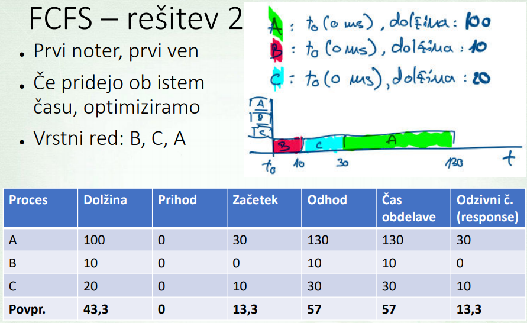

### SJF
**SJF**
: shortest job first
: obdelujemo prispelega in ne prekinjamo trenutnega procesa

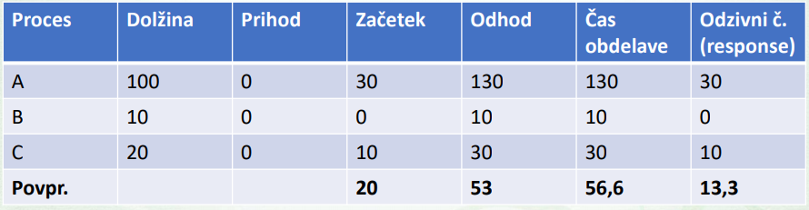

### PSJF
**PSJF**
: preemtive shrotest job first
: obdelujemo prispelega in prekinjamo
: problem je da dolg proces lahko nikoli ne pride na vrsto

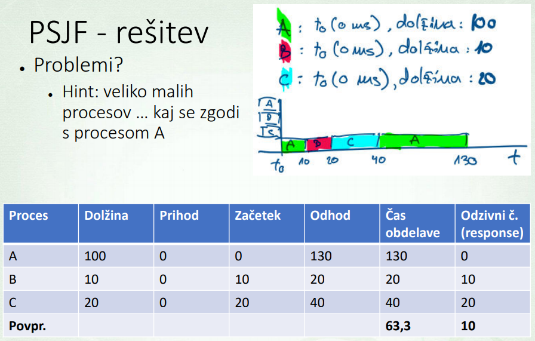

### Round robin
**Round robin**
: obdelujemo vse po vrsti (v krogu) → `slice = 10`

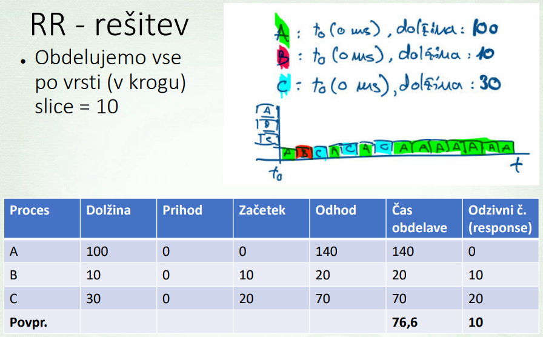
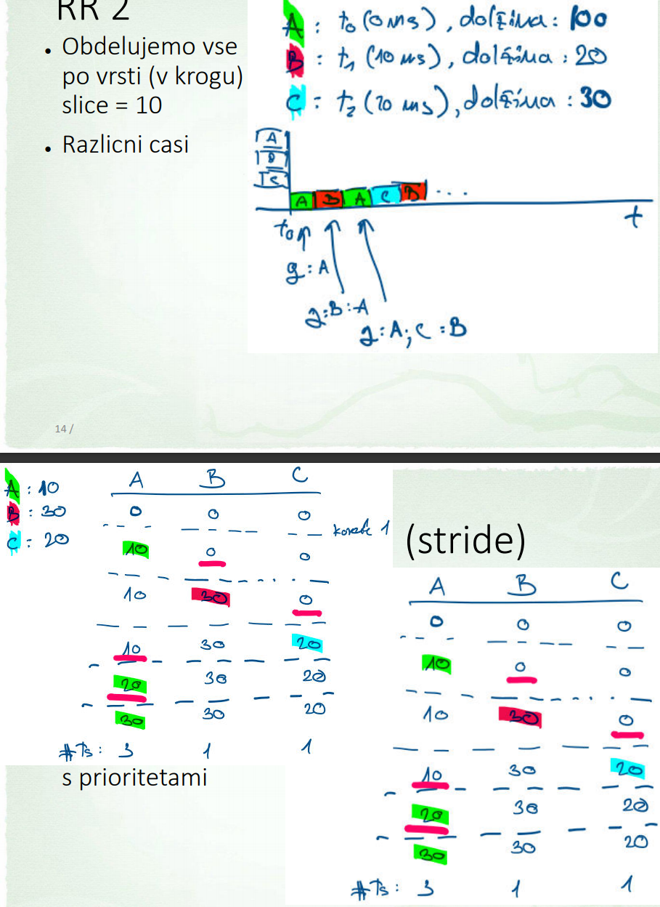

## Cevovodi