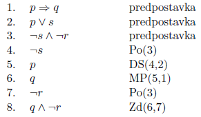
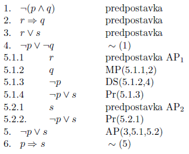
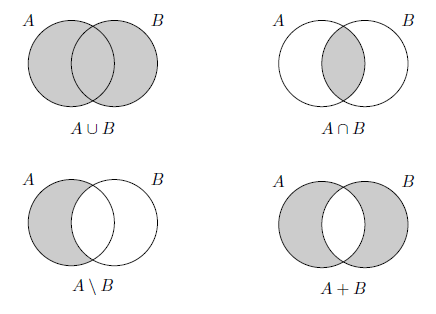

# 1. Izjavni Racun

## 1.1. Izjave

- **Izjava** je stavek, ki je bodisi resnicen ali neresnicen, z eno besedo, ki ima **logicno vrednost**. Primeri:
  - "Ena in ena je dva" $$\Rightarrow$$ logicna vrednost = 1.
  - "Dva in pet je manjse kot tri." $$\Rightarrow$$ logicna vrednost = 0.
  - "Zapri vrata!" $$\Rightarrow$$ ni izjava.
- Izjave delimo na **enostavne** ("Veter piha") in **sestavljene** ("Veter piha in Jure se vozi s kolesom"). Sestavljene so sestavljene iz enostavnih izjav in veznikov.

## 1.2. Izjavni vezniki

- **Izjavni vezniki** $$\Rightarrow$$ nacin, kako enostavne izjave zlepimo v bolj zapletene. Logicna vrednost izjave je s tem odvisna od izjav in logicnih veznikov. Tipi:
  - **Negacijo** oznacimo z $$\neg A$$:
    $$A$$ | $$\neg A$$
    :-:|:-:
    0 | 1
    1 | 0
  - **Konjunkcijo** oznacimo z $$A \land B$$:  
    $$A$$ | $$B$$ | $$A \land B$$
    :-: | :-: | :-:
    0 | 0 | 0
    0 | 1 | 0
    1 | 0 | 0
    1 | 1 | 1
  - **Disjunkcijo** oznacimo z $$A \lor B$$:  
    $$A$$ | $$B$$ | $$A \lor B$$
    :-: | :-: | :-:
    0 | 0 | 0
    0 | 1 | 1
    1 | 0 | 1
    1 | 1 | 1
  - **Implikacijo** oznacimo z $$A \Rightarrow B$$ - $$A$$ imenujemo **antecedens** in $$B$$ imenujemo **konsekvens**. "Iz A sledi B":  
    $$A$$ | $$B$$ | $$A \Rightarrow B$$
    :-: | :-: | :-:
    0 | 0 | 1
    0 | 1 | 1
    1 | 0 | 0
    1 | 1 | 1
  - **Ekvivalenco** oznacimo z $$A \Leftrightarrow B$$. "A natanko tedaj, ko B":
    $$A$$ | $$B$$ | $$A \Leftrightarrow B$$
    :-: | :-: | :-:
    0 | 0 | 1
    0 | 1 | 0
    1 | 0 | 0
    1 | 1 | 1
  - **Ekskluzivno disjunkcijo** oznacimo z $$A \veebar B$$ - "A ekskluzivni ali B":
    $$A$$ | $$B$$ | $$A \veebar B$$
    :-: | :-: | :-:
    0 | 0 | 0
    0 | 1 | 1
    1 | 0 | 1
    1 | 1 | 0
  - **Shefferjev veznik** oznacimo z $$A \uparrow B$$ (**NAND**):
    $$A$$ | $$B$$ | $$A \uparrow B$$
    :-: | :-: | :-:
    0 | 0 | 1
    0 | 1 | 1
    1 | 0 | 1
    1 | 1 | 0
  - **Peirce- Lukasiewiczevega veznik** oznacimo z $$A \downarrow B$$ (**NOR**):
    $$A$$ | $$B$$ | $$A \downarrow B$$
    :-: | :-: | :-:
    0 | 0 | 1
    0 | 1 | 0
    1 | 0 | 0
    1 | 1 | 0

## 1.3. Izjavni izrazi

- **Izjavni izraz** - **izjavni konstanti** in **izjavne spremenljivke** opisujejo bazicne izjavne izraze.
  - **izjavni konstanti** - $$0$$ in $$1$$ oz laz in resnica
  - **izjavne spremenljivke** - $$p,\ q,\ r,\ ...$$
  - Ce je $$F$$ n-mestni izjavni veznik in so $$A_1,\ A_2,\ ...,\ A_n$$ izjavni izrazi potem je $$F(A_1,\ ...,\ A_n)$$ izjavni izraz. Za enomestne in dvomestne velja:
    - Ce je $$A$$ izjavni izraz je tutdi $$\neg A$$ izjavni izraz
    - Ce $$A$$ in $$B$$ izjavna izraza so tudi $$(A \land B),\ (A \lor B),\ ...$$ izjavni izrazi

### 1.3.1. Konstrukcijsko drevo

- 
- **Konstrukcijsko drevo** - ce $$A = F(A_1, ..., A_n)$$ je $$A$$ koren drevesa, $$A_1, ..., A_n$$ so sinovi korena in konstrukcijska drevesa teh izrazov
- **Prednosti izjavnih veznikov**:  
  $$\neg \ |\  \land, \uparrow, \downarrow \ |\ \lor, \veebar \ |\ \Rightarrow \ | \Leftrightarrow$$
- $$I$$ **nastopa** v $$J$$, ce je $$I$$ vozlisce konstrukcijskega drevesa $$J$$. Primer: $$r \lor p \Rightarrow \neg (p \land q)$$  
  $$$$ p,\ q,\ r,\ r \lor p,\ p \land q,\ r \lor p \Rightarrow \neg (p \land q)$$$$
- **Globina** izjavnega izraza je enaka dolzini najdaljse poti do korenskega vozlisca v konstrukcijskem drevesu
- **Dolzina** izjavnega izraza je vsota stevil listov konstrukcijskega drevesa in stevila logicnih veznikov $$\Rightarrow$$ stevilo vseh vozlisc v konstrukcijskem drevesu

### 1.3.2. Pravilnostna tabela

- **Pravilnostna (resnicnostna) tabela** je podatkovna struktura, ki za vsak nabor logicnih vrednosti spremenljivk, ki nastopajo v $$I$$, poda logicnoi vrednost.  
  
- **Tavtologija**: izraz, ki je pri vseh naborih logicnih vrednosti resnicen (= enak 1)
- **Protislovje**: izraz, ki je pri vseh naborih logicnih vrednosti neresnicen (= enak 0)
- **Nevtralni izjavni izraz**: izraz, ki ni tavtologija in ni protislovje

## 1.4. Enakovredni izjavni izrazi

- $$I$$ in $$J$$ sta **enakovredna** ($$I \sim J$$), ce imata za vsak nabor enako logicno vrednost  
  
- $$Izjavna\ izraza\ I\ in\ J\ sta\ enakovredna\ ntk.\ je\ izraz\ I \Leftrightarrow J\ tavtologija$$
- Za poljubne izjavne izraze $$I_1, I_2\ in\ I_3$$ velja:
  - $$I_1 \sim I_2 \Rightarrow I_2 \sim I_1$$
  - $$I_1 \sim I_2 \land I_2 \sim I_3 \Rightarrow I_1 \sim I_3$$
- Enakovrenost je ekvivalencna relacija v druzini vseh izjavnih izrazov. **Dokaz enakovrednosti** $$I \sim J$$ ?

## 1.5. Zakoni izjavnega racuna

- **Zakoni izjavnega racuna**:
  1. **Zakon dvojne negacije**:  
     $$\neg \neg A \sim A$$
  2. **Idempotenca**:  
     $$A \land A \sim A$$  
     $$A \lor A \sim A$$
  3. **Komutativnost**:  
     $$A \land B \sim B \land A$$  
     $$A \lor B \sim B \lor A$$  
     $$A \Leftrightarrow B \sim B \Leftrightarrow A$$  
     $$A \veebar B \sim B \veebar A$$  
     $$A \uparrow B \sim B \uparrow A$$  
     $$A \downarrow B \sim B \downarrow A$$
  4. **Asociativnost**:  
     $$(A \land B) \land C \sim A \land (B \land C)$$  
     $$(A \lor B) \lor C \sim A \lor (B \lor C)$$  
     $$(A \Leftrightarrow B) \Leftrightarrow C \sim A \Leftrightarrow (B \Leftrightarrow C)$$  
     $$(A \veebar B) \veebar C \sim A \veebar (B \veebar C)$$
  5. **Absorpcija**:  
     $$A \land (A \lor B) \sim A$$  
     $$A \lor (A \land B) \sim A$$
  6. **Distributivnost**:  
     $$(A \lor B) \land C \sim (A \land C) \lor (B \land C)$$  
     $$(A \land B) \land C \sim (A \lor C) \land (B \lor C)$$  
     $$(A \veebar B) \land C \sim (A \land C) \veebar (B \land C)$$
  7. **de Morganova zakona**:  
     $$\neg (A \lor B) \sim \neg A \land \neg B$$  
     $$\neg (A \land B) \sim \neg A \lor \neg B$$
  8. **Kontrapozicija**:  
     $$A \Rightarrow B \sim \neg B \Rightarrow \neg A$$
  9. **Tavtologija in protislovje, 0 in 1**:  
     $$A \Rightarrow A \sim 1$$  
     $$A \Leftrightarrow A \sim 1$$  
     $$A \lor \neg A \sim 1$$  
     $$A \land \neg A \sim 0$$
  10. **Substitucija 0 in 1**:  
      $$A \land 0 \sim 0$$  
      $$A \lor 0 \sim A$$  
      $$A \land 1 \sim A$$  
      $$A \lor 1 \sim 1$$  
      $$A \Rightarrow 0 \sim \neg A$$  
      $$0 \Rightarrow A \sim 1$$  
      $$A \Rightarrow 1 \sim 1$$  
      $$1 \Rightarrow A \sim A$$
  11. **Lastnosti implikacije**:  
      $$A \Rightarrow B \sim \neg A \lor B$$  
      $$\neg (A \Rightarrow B) \sim A \land \neg B$$
  12. **Lastnosti ekvivalence**:  
      $$A \Leftrightarrow B \sim (A \Rightarrow B) \land (B \Rightarrow A)$$  
      $$A \Leftrightarrow B \sim (A \land B) \lor (\neg A \land \neg B)$$  
      $$\neg (A \Leftrightarrow B) \sim \neg A \Leftrightarrow B$$
  13. **Lastnosti Shefferjevega in Pierce-Lukasiewiczevega veznika**:  
      $$A \uparrow B \sim \neg(A \land B)$$  
      $$A \downarrow B \sim \neg (A \lor B)$$
- **Dualnost med $$\land$$ in $$\lor$$**: ?

## 1.6. Normalni obliki in polni nabori izjavnih veznikov

- **Literal**: izjavna spremenljivka oz njena negacija.
- **Osnovna konjunkcija**: osamljen literal ali pa konjunkcija vecjega stevila literalov.
- **Osnovna disjunkcija**: literal bodisi disjunkcija vecjega stevlila literalov
- **Disjunktivna normalna oblika (DNO)**: je izjavni izraz za katerega velja:
  - $$I_{DNO} \sim I$$
  - $$I_{DNO}$$ je disjunkcija osnovnih konjunkcij
- DNO izjavnega izraza $$I$$ je **polna**, ce vsaka osnovna konjunkcija vsebuje vse izjavne spremenljivke, ki nastopajo v $$I$$
- DNO ni enolicno dolocena
- Vsak izjavni izraz $$I$$ lahko enakovredno zapisemo v DNO. Ce $$I$$ ni protislovje potem lahko $$I$$ enakovredno zapisemo v polni DNO.
- Polno DNO konstruiramo tako, da za vsak nabor logicnih vrednosti spremenljivk, pri katerih je $$I$$ resnicen, pripravimo eno osnovno konjunkcijo, v kater nastopajo v tem naboru resnicne spremenljivke in negacije v tem naboru laznih spremenljivk.
- **Konjuktivna normalna oblika (KNO)**: je izjavni izraz, za katerega velja:
  - $$I_{KNO} \sim I$$
  - $$I_{KNO}$$ je konjunkcija osnovnih disjunkcij
- KNO je **polna** --- || ---
- KNO ni enolicno dolocena
- Polno KNO izjavnega izraza $$I$$, ki ni tavtologija, konstruiramo tako, da za vsak nabor logicnih vrednosti spremenljivk, pri katerih ja $$I$$ neresnicen, pripravimo eno osnovno disjunkcijo, v kateri nastopajo v tem naboru lazne spremenljivke in negacije v tem naboru resnicnih spremenljivk.
- **Poln nabor izjavnih veznikov**: Naj bo $$N$$ mnozica izjavnih veznikov in $$Z$$ poln nabor izjavnih veznikov. Ce lahko za vsak veznik iz nabora $$Z$$ izrazimo samo z uporabo veznikov iz $$N$$, potem je tudi $$N$$ poln nabor izjavnih veznikov.
- Primeri polnih naborov:  
  { $$\neg, \lor$$ }, { $$\neg, \land$$ }, { $$\neg, \Rightarrow$$ }, { $$\Rightarrow, 0$$ }
- **Nabor veznikov ohranja logicno vrednost 1**. Primer: { $$\Rightarrow, \Leftrightarrow$$ }  
  $$1 \Rightarrow 1 \sim 1$$ in $$1 \Leftrightarrow 1 \sim 1$$
- Nabora {$$\uparrow$$} in {$$\downarrow$$} sta edina polna nabora izjavnih veznikov, ki vsebujeta en sam dvomestni izjavni veznik. Dokaz:  
  $$\neg p \sim \neg (p \land p) \sim p \uparrow p$$  
  $$p \land q \sim \neg \neg (p \land q) \sim \neg (p \uparrow q) \sim (p \uparrow q) \uparrow (p \uparrow q)$$

## 1.7. Sklepanje v izjavnem racunu

- Primer:  
  Ce dezuje, se bine vozi s kolesom  
  Dezuje  
  _--------------------------------------_  
  Bine se ne vozi s kolesom
- Zaporedje izrazov
  $$$$A_1, ...., A_k, B$$$$
  je **pravilen sklep** s **predpostavkami** $$A_1, ..., A_k$$ in **zakljuckom** $$B$$, pri vseh logicnih vrednosti spremenljivk, pri katerih so vse predpostavke resnicne, resnicen tudi zakljucek. Pisemo  
  $$$$A_1,....,A_k 	\models B$$$$  
  in preberemo, da zakljucek $$B$$ **logicno sledi** iz predpostavk $$A_1,...,A_k$$
- Primer protiprimera:  
  
- $$A_1, A_2, ..., A_n \models B$$ natanko tedaj, ko je izjavni izraz $$(A_1 \land A_2 \land ... \land A_n) \Rightarrow B$$ tavtologija.
- **Lastnosti sklepov**:
  1. Ce je $$B \sim C$$, potem $$A_1, ..., A_k \models B$$ natanko tedaj, ko $$A_1, ..., A_k \models C$$
  2. $$A_1, ..., A_k \models 1$$
  3. $$0, A_1, ..., A_k \models B$$
  4. Za vsak $$i \in$$ { $$1, ..., k$$ } velja: $$A_1, A_2, ..., A_k \models A_i$$
  5. $$A_1, ..., A_k \models B$$ natanko tedaj , ko $$A_1, A_2, ..., A_k, 1 \models B$$

### 1.7.1 Pravila sklepanja in dokaz pravilnosti sklepa

- **Pravila sklepanja**:  
  
- **Dokaz pravilnostnega sklepa**:  
  $$A_1, ..., A_k \models B$$  
  je zaporedje izjavnih izrazov  
  $$C_1, ..., C_m$$  
  v katerem je $$C_m = B$$, sicer pa za vsak posamezen clen velja:
  - $$C_i$$ je predpostavka ali
  - $$C_i$$ je tavtologija ali
  - $$C_i$$ je enakovreden enemu od prejsnjih clenov zaporedja ali
  - $$C_i$$ logicno sledi iz prejsnih clenov zaporedja po enem od pravil sklepanja
- **Primer sklepanja**:  
  

## 1.8. Pomozni sklepi

- **Pogojni sklep (PS)**: $$A_1, ..., A_k \models B \Rightarrow C$$ natanko tedaj, ko $$A_1, ..., A_k, B \models C$$  
  
- **Sklep s protislovjem (RA)**: $$A_1, ..., A_k \models B$$ natanko tedaj, ko $$A_1, ..., A_k, \neg B \models 0$$  
  
- **Analiza primerov (AP)**: $$A_1, ..., A_n, B_1 \lor B_2 \models C$$ natanko tedaj, ko $$A_1, ..., A_k, B_1 \models C$$ in $$A_1, ..., A_k, B_2 \models C$$  
  

# 2. Predikatni racun

## 2.1. Zakaj predikatni racun

- **Predikatni racun** je nadgradnja izjavnega racuna, opisati bomo mogli tudi notranjo zgradbo posamezne enostavne izjave in s pomocjo notranjih struktur upraviciti pravilnost sklepa.
- **Predikati** so logicne preslikave v katere vstavljamo konkretne elemente podrocja pogovora. Primer:  
  Za podrocje pogovora si izberemo _ljudi_ in nam predikat $$S$$ lahko pomeni  
  $$S(x)\ ...\ x\ ima\ sestro$$  
  Predikati imajo lahko tudi vec argumentov. Npr:  
  $$D(x,\ y)\ ...\ x\ je\ daljni\ sorodnik\ od\ y$$
- **Univerzalni kvantifikator ($$\forall$$)**:  
  $$\forall x P(x) \Rightarrow Za\ vsak\ x\ velja\ P(x)$$
- **Eksistencni kvantifikator ($$\exists$$)**:  
  $$\exists x Q(x) \Rightarrow Obstaja\ x,\ za\ katerega\ velja\ Q(x)$$

## 2.2. Izjavne formule

- Jezik predikatnega racuna vsebuje:
  - **Izjavne spremenljivke** $$x, y, z, ...$$
  - **Izjavne konstante** $$a, b, c, ...$$
  - **Predikate** $$P, Q, R, ...$$
  - **Izjavne veznike** $$\neg , \lor , \land , \Rightarrow , \Leftrightarrow , ...$$
  - **Kvantifikatorja** $$\forall$$ in $$\exists$$
  - **Oklepaja** $$($$ in $$)$$
- **Termi**: izjavne spremenljivke in izjavne konstante
- **Atomi**: predikati, v katere smo vstavili terme: $$P(x),\ Q(x, y),\ ...$$
- **Izjavna formula**:
  - Atomi so izjavne formule
  - Ce sta $$V$$ in $$W$$ izjavni formuli in $$x$$ izjavna spremenljivka, potem so tudi  
    $$(\neg W),\ (W \land V),\ ...,\ (\forall x W),\ (\exists x W)$$  
    izjavne formule.
- Konstrukcijsko drevo izjavne formule:  
  
- kvantifikatorja vezeta tako mocno kot negacija
- **Doseg kvantifikatorja in vezava spremenljivk**:
  - $$\forall x \rightarrow x\ ...\ lastna\ spremenljivka$$
  - **Vstop** v formuli $$W$$ je bodisi **prost** ali **vezan**
  - Primer:  
    
    
  - **Izjavna shema**: izjavna formula brez prostih spremenljivk $$\Leftrightarrow$$ **Zaprta formula**
  - **Odprta izjavna formula**: Izjavna formula, v kateri ne uporabimo nobenega kvantifikatorja

## 2.3. Interpretacija izjavne formule

- **Interpretacija** $$I$$ izjavne formule $$W$$ je sestavljena z izbiro:
  - **Podrocja pogovora** interpretacije, ki je neprazna druzina $$D$$, iz katere jemljemo posamezne konstante
  - **Pomena predikatov** - vsakemu k-mestnemu predikatu $$P$$, ki ga izjavna formula $$W$$ uporablja, usterza logicna preskikava, definirana na druzini k-teric elementov iz $$D$$
  - **Pomena konstant** - vsaki konstanti ustreza natancno doleocen element podrocja pogovora
  - **Izbire prostih spremenljivk** - vsaki prosti spremenljivki izberemo vrednost iz $$D$$
- **Zamenjava oz substitucije** spremenljivke s terminom. Vse proste spremenljivke nadomestimo s terminom. Primeri:  
  $$W = \forall x P(x) \land Q(x, y)$$  
  $$W(x/a) = \forall x P(x) \land Q(a, y)$$
- Spremenljivka je zamenljiva s terminom, ce noben prost vstop spremenljivke ne lezi v dosegu kvantifikatorja z lastno spremenljivko. oz ce je termin konstanta
- **Pomen kvantifikatorjev**:
  - $$\forall x (W)$$ je resnicna v interpretaciji $$I$$ s podrocjem pogovora $$D$$, ce je za vsak $$d \in D$$ v ter isti interpretaciji resnicna tudi formula $$(W)(x/d)$$ sicer je formula neresnicna
  - $$\exist x (W)$$ je resnicna v interpretaciji $$I$$ s podrocjem pogovora $$D$$, ce v podrocnju pogovora obstaja $$d \in D$$ v ter isti interpretaciji resnicna tudi formula $$(W)(x/d)$$ sicer je formula neresnicna
  - **Model** formule $$W$$ je tista interpretacija $$I$$ v kateri je fofrmula $$W$$ resnicna

## 2.4. Enakovrednost izjavnih formul

- $$W$$ je **splosno veljvana**, ce ima $$W$$ v vsaki interpretaciji logicno vrednost 1
- $$W$$ je **neizpolnjiva**, ce je $$W$$ v vsaki interpretaciji napacna
- $$U$$ in $$V$$ sta enakovredni, ce imata v vsaki interpretaciji isto logocno vrednost
- Izjavni formuli $$U$$ in $$U^{'}$$ sta enakovrendi natanko tedaj, ko je formula $$U \Leftrightarrow U^{'}$$ splosno veljavna
- Vsak par enakovrednih izjavnih formul lahko s prepisom - nadomescanjem izjavnih spremenljivk z izjavnimi formulami - spremenimo v par enakovrednih izjavnih formul, tavtologije oz protislovja pa prepisemo v splosno veljavne oz neizpolnjive izjavne formule
- **Zakoni predikatnega racuna**:

  1. **de Morganova zakona**:  
     $$\neg \forall x (W) \sim \exists x \neg (W)$$  
     $$\neg \exists x (W) \sim \forall x \neg (W)$$
  2. **Zamenjave istovrstnih kvantifikatorjev**:  
     $$\forall x \forall y (W) \sim \forall y \forall x (W)$$  
     $$\exists x \exists y (W) \sim \exists y \exists x (W)$$
  3. **Distributivnost**:  
     $$\forall x (V \land W) \sim \forall x (V) \land \forall x (W)$$  
     $$\exists x (V \lor W) \sim \exists x (V) \lor \exists x (W)$$
  4. **Odvecni kvantifikator**: ce spremenljivka x ne nastopa prosto v formuli $$W$$, potem velja enakovrednost:  
     $$\forall x (W) \sim W$$  
     $$\exists x (W) \sim W$$
  5. **Preimenovanje spremenljivk**: ce je v formuli spremenljivka x zamenljiva s spremenljivko y, potem:  
     $$\forall x (W) \sim \forall y (W(x/y))$$  
     $$\exists x (W) \sim \exists y (W(x/y))$$
  6. **Kvantifikator in konjunkcija/disjunkcija**: ce spremenljivka x ne nastopa prosto v formuli C, potem veljajo enakosti:  
     $$C \land \forall x (W) \sim \forall x (C \land W)$$  
     $$C \lor \forall x (W) \sim \forall x (C \lor W)$$  
     $$C \land \exists x (W) \sim \exists x (C \land W)$$  
     $$C \lor \exists x (W) \sim \exists x (C \lor W)$$

  - $$\forall x \exists y P(x, y) \nsim \exists y \forall x P(x, y)$$

## 2.5. Preneksna normalna oblika

- **Preneksna normalna oblika** formul $$W$$ je izjavna formula $$W_{PNO}$$, za katero velja:
  - $$W_{PNO} \sim W$$
  - v formuli $$W_{PNO}$$ se vsi kvantifikatorji nahajajo neposredno na zacetku formule
  - Primer:  
    $$\forall P(x) \land \exists Q(y)$$ je enakovredna $$\forall x \exists y (P(x) \land Q(y))$$
- vsako izjavno formulo $$W$$ lahko na enakovredno prepisemo v preneksni normalni obliki s kvantifikatorji na neposrednem zacetku
- **Ideja**:
  1. **Zamenjava izjavnih veznikov**: izjavne veznike nadomestimo s konjunkcijami, disjunkcijami in negacijami
  2. **Preimenovanje spremenljivk**: Nobena spremenljivka ne nastoopa hkrati vezano in prosto, ravno tako ne sme biti vezana z vec kot enim kvantifikatorjem
  3. **Prenos kvantifikatorjev proti zacetku**: z uporabo zakonov predikatnega racuna uspemo kvantifikatorje prestaviti na zacetek izjavne formule

## 2.6. Sklepanje v predikatnem racunu

- $$W_1, ..., W_n \models W$$ natanko tedaj, ko je izjavna formula $$(W_1 \land ... \land W_n) \Rightarrow W$$ tavtologija
- **Pravila sklepanja**:
  - **Univerzalna specifikacija (US)**  
    $$\forall x (W) \models W(x/t)$$ ce je $$x$$ zamenljiva s $$t$$
  - **Eksistencna generalizacija (EG)**  
    $$W(x/t) \models \exists x W$$ ce je $$x$$ zamenljiva s $$t$$
  - **Eksistencna specifikacija (ES)**  
    $$\exists x (W) \models W(x/c)$$ ce je $$c$$ konstanta, ki je nova in ne nastopa v zakljucku sklepa. **Skolemova funkcija**: $$c=c(y_1, ..., y_k)$$ je skolemova funkcija spremenljivk $$y_1, ..., y_k$$, kjer je c odvisna od teh spremenljivk
  - **Univerzalna generalizacija (UG)**  
    $$W \models \forall x (W)$$ ce x ne nastopa prosto v nobeni od predpostavk in v dokazu W spremenljivka x ni argument Skolemove funkcije
- Zgled pravilnega sklepa:  
  
- Zgled nepravilnega sklepa:  
  

# 3. Mnozice

- $$a \in A$$ - "a pripada/element mnozice A"
- $$a \notin A$$ - "a ne pripada A"
- Definicija mnozice:
  - $$T = \{ 1, 2, 3 \} = \{ 1, 1, 2, 2, 2, 3 \} = \{ 3, 2, 1 \}$$ - "s svojimi elementi"
  - $$T = \{x | x = 1 \lor x = 2 \lor x = 3 \}$$ - "z uporabo izjavnih formul"
  - $$T = \{x | \phi (x) \}$$ - "vsi elementi, kjer je $$\phi (x)$$ resnicna izjava"
- **Univerzalna mnozica** $$S$$ je podrocje pogovora teorije mnozic - vsebuje vse elemente
- **Prazna mnozica** $$\emptyset$$ je mnozica brez elementov. $$\emptyset = \{ x | x \ne x \}$$.
- **Singelton** - mnozica z enim samim elementom. $$\{a\}$$ **singelton a**
- **Par** - mnozica z dvema elementoma

## 3.1. Enakost in vsebovanost

- Mnozici $$A$$ in $$B$$ sta **enaki** natanko tedaj, ko imasta iste elemente:  
  $$A = B$$ natanko tedaj, ko $$\forall x (x \in A \Leftrightarrow x \in B)$$
- $$A$$ **podmnozica** $$B$$, ce za vsak element mnozice $$A$$ pripada tudi mnozici $$B$$  
  $$A \subseteq B$$ natanko tedaj, ko $$\forall x (x \in A \Rightarrow x \in B)$$  
  $$B$$ **vsebuje** $$A$$  
  "biti podmnozica" - relacija **inkluzije**
- $$A = B$$ natanko tedaj, ko $$A \subseteq B$$ in $$B \subseteq A$$
- Relacija **stroge vsebovanosti** ali **stroge inkluzije** $$\subset$$.
- **Prava podmnozica**:  
  $$A \subset B$$ natanko tedaj, ko $$A \subseteq B$$ in $$A \ne B$$
- **Zveze**:
  1. $$\emptyset \subseteq A\ in\ A \subseteq S$$
  2. $$A \subseteq A$$
  3. $$A \not\subset A$$
- Za poljubne mnozice $$A$$, $$B$$ in $$C$$ velja:  
  ce $$A \subseteq B$$ in $$B \subseteq C$$, potem $$A \subseteq C$$

## 3.2. Operacije z mnozicami

- **Operacije**:
  - **Unija** je mnozica vseh elementov, ki pripadajo vsaj eni od mnozic  
    $$A \cup B = \{ x | x \in A \lor x \in B \}$$
  - **Presek** je mnozica vseh elementov, ki pripadajo obema mnozicama  
    $$A \cap B = \{ x | x \in A \land x \in B \}$$  
    **Disjunktni mnozici**: $$A \cap B = \emptyset$$
  - **Razlika** je mnozica vseh elementov, ki pripadajo $$A$$ in ne pripadajo $$B$$  
    $$A \setminus B = \{ x | x \in A \land x \notin B \}$$
  - **Simetricna razlika** je mnozica vseh elementov, ki pripadajo natanko eni od mnozic  
    $$A + B = \{ x | x \in A \veebar x \notin B \}$$
  - **Komplement** je mnozica vseh elementov, ki ne pripadajo mnozici $$A$$ in pripadajo univerzalni mnozici  
    $$A^{c} = \{ x | x \notin A \land x \in S \}$$
- Prednosti: $$^{C} \ |\ \cap, \setminus \ |\ \cup, +$$
- **Vennovi diagrami**:  
    
  
- **Vsebovanost in operacije**
  - Naj bodo $$A, B, C$$ poljubne mnozice. Potem veljajo naslednje zveze:
    - Ce je $$A \subseteq B$$, potem je $$A \cup C \subseteq B \cup C$$
    - Ce je $$A \subseteq B$$, potem je $$A \cap C \subseteq B \cap C$$
    - $$A \cap B \subseteq A \subseteq A \cup B$$
  - Relacija vsebovanosti je **usklajena** z operacijama unije in preseka
  - Naj bosta $$A$$ in $$B$$ poljubni mnozici. Naslednje zveze so enakovredne:
    - $$A \subseteq B$$
    - $$A \cup B = B$$
    - $$A \cap B = A$$
    - $$A \setminus B = \emptyset$$
    - $$B^{c} \subseteq A^{c}$$

## 3.3. Enakosti z mnozicami

1. **Zakon dvojnega komplementa**:  
   $$(A^{c})^{c} = A$$
2. **Idempotenca**:  
   $$A \cap A = A$$  
   $$A \cup A = A$$
3. **Komutativnost**:  
   $$A \cap B = B \cap A$$  
   $$A \cup B = B \cup A$$  
   $$A + B = B + A$$
4. **Asociativnost**:
   $$(A \cap B) \cap C = A \cap (B \cap C)$$  
   $$(A \cup B) \cup C = A \cup (B \cup C)$$  
   $$(A + B) + C = A + (B + C)$$
5. **Absorpcija**:  
   $$A \cap (A \cup B) = A$$  
   $$A \cup (A \cap B) = A$$
6. **Distributivnost**:  
   $$(A \cap B) \cup C = (A \cup C) \cap (B \cup C)$$  
   $$(A \cup B) \cap C = (A \cap C) \cup (B \cap C)$$  
   $$(A + B) \cap C = (A \cap C) + (B \cap C)$$
7. **de Morganova zakona**:  
   $$(A \cup B)^{c} = A^{c} \cap B^{c}$$  
   $$(A \cap B)^{c} = A^{c} \cup B^{c}$$
8. **Kontrapozicija**:  
   $$A \subseteq B \sim B^{c} \subseteq A^{c}$$
9. **Prazna mnozica $$\emptyset$$ in univerzalna mnozica $$S$$**:  
   $$A \cup A^{c} = S$$  
   $$A \cap A^{c} = \emptyset$$  
   $$A + A = \emptyset$$  
   $$A + A^{c} = S$$
10. **Substitucija $$\emptyset$$ in $$S$$**:  
    $$A \cap \emptyset = \emptyset$$  
    $$A \cup \emptyset = A$$  
    $$A \cap S = A$$  
    $$A \cup S = S$$
11. **Lastnosti vsebovanosti**:  
    $$A \subseteq B \sim A \cup B = B \sim A \cap B = A \sim A \setminus B = \emptyset$$  
    Ce je $$A \subseteq B$$, potem je $$A \cup C \subseteq B \cup C$$  
    Ce je $$A \subseteq B$$, potem je $$A \cap C \subseteq B \cap C$$  
    $$A \cap B \subseteq A, B \subseteq A \cup B$$
12. **Lastnosti razlike mnozic**:  
    $$A \setminus B = A \cap B^{c}$$
13. **Lastnosti simetricne razlike**:  
    $$A + B = (A \setminus B) \cup (B \setminus A)$$  
    $$A + B = (A \cup B) \setminus (A \cap B)$$

## 3.4. Resevanje sistemov enacb z mnozicami

- $$A = \emptyset$$ in $$B = \emptyset$$ natanko tedaj, ko je $$A \cup B = \emptyset$$
- $$A = B$$ natanko tedaj, ko je $$A + B = \emptyset$$
- $$(X \cap P) \cup (X^{c} \cap Q) = \emptyset$$ je resljiva natanko tedaj, ko velja $$Q \subseteq P^{c}$$.  
  V tem primeru so resitve natanko vse mnozice $$X$$, za katere velja $$Q \subseteq X \subseteq P^{c}$$.

## 3.5 Druzine mnozic

- **Potencna mnozica**:
  - Potencna mnozica mnozice $$A$$, $$P A$$,je druzina vseh podmnozic mnozice $$A$$. Primer:  
    $$A = \{ 1, 2, 3 \}$$  
    $$P A = \{ \emptyset, \{1\}, \{2\}, \{3\}, \{1, 2\}, \{1, 3\}, \{2, 3\}, \{1, 2, 3\} \}$$
  - Ce je $$A$$ mnozica z $$n \in \N$$ elementi, potem ima njena potencna mnozice $$P A$$ natanko $$2^{n}$$ elementov, ali enakovredno, $$A$$ ima natanko $$2^{n}$$ podmnozic.
  - $$P \emptyset = \{ \emptyset \}$$
  - $$PP \emptyset = P \{ \emptyset \} = \{ \emptyset, \{ \emptyset \} \}$$

### 3.5.1. Unija in presek druzine

- $$I$$ **indeksna mnozica**
- **Druzina mnozic** je preslikava $$A$$, ki vsakemu indeksu $$i \in I$$ doloci mnozico $$A_{i}$$:
  $$A = \{ A_{i} | i \in I \}$$  
  Mnozice $$A_{i}, i \in I$$ imenujemo **clani** druzine $$A$$
- **Unija druzine** $$A$$ je mnozica vseh elementov, ki pripadajo vsaj enemu bloku druzine $$A$$:  
  $$\bigcup A = \bigcup\limits_{i \in I} A_{i} = \{ x |\ \exists i (i \in I \land x \in A_{i}) \}$$
- **Presek druzine** $$A$$ je mnozica tistih elementov, ki pripadajo vsem blokom druzine.  
  $$\bigcap A = \bigcap\limits_{i \in I} A_{i} = \{ x |\ \forall i (i \in I \land x \in A_{i}) \}$$

- $$\bigcup A = \bigcup\limits_{i=1}^4 A_{i} = A_1 \cup A_2 \cup A_3 \cup A_4$$
- Druzina mnozic $$A = \{ A_{i} | i \in I \}$$ je **pokritje** mnozice $$B$$, ce velja:
  - $$\bigcup A = \bigcup\limits_{ i \in I} A_i = B$$
- in **razbitje**, ce velja:
  - $$A$$ je pokritje mnozice $$B$$, $$\bigcup A = \bigcup\limits_{ i \in I} A_i = B$$
  - bloki druzine $$A$$ so neprazni, za vsak indeks $$i \in I$$ velja $$A_i \not ={\emptyset}$$
  - bloki druzine so paroma disjunktni, za vsaka razlicna indeksa $$i, j \in I$$ velja $$A_{i} \cap A_{j} = \emptyset$$

## 3.6. Kartezicni produkt mnozic

- **urejeni par $$(a, b)$$** s **prvo koordinato** $$a$$ in **drugo koordinato** $$b$$ je struktura, za katero velja **osnovna lastnost urejenih parov**:  
  $$(a, b) = (c,d)$$ natanko tedaj, ko je $$a = c$$ in $$b = d$$
- Denimo, da urejen par $$(a, b)$$ definiramo kot $$\{\{a\},\{a,b\}\}$$. Za tako definirane urejene pare velja osnovna lastnost.
- **Kartezicni produkt** mnozic $$A$$ in $$B$$, $$A \times B$$, je mnozica vseh urejenih parov s prvo koordinato iz $$A$$ in drugo koordinato iz $$B$$  
  $$A \times B = \{ (a, b) | a \in A\ in\ b \in B \}$$
- **Lastnosti kartezicnega produkta**:
  - **Prazen kartezicni produkt**  
    $$A \times B = \emptyset$$ natanko tedaj, ko je $$A = \emptyset$$ ali $$B = \emptyset$$
  - **Kartezicni produkt in unija**  
    $$A \times (B \cup C) = (A \times B) \cup (A \times C)$$  
    $$A \cup B) \times C = (A \times C) \cup (B \times C)$$
  - **Kartezicni produkt in presek**:  
    $$(A \cap B) \times (C \cap D) = (A \times C) \cap (B \times D) = (A \times D) \cap (B \times C)$$
  - **Monotonost kartezicnega produkta**:  
    Ce je $$A \subseteq C$$ in $$B \subseteq D$$, potem je $$A \times B \subseteq C \times D$$
  - **Monotonost v obratni smeri**:  
    Ce je $$A \times B \subseteq C \times D$$ in $$A \times B \not ={\emptyset}$$, potem je $$A \subseteq C \land B \subseteq D$$.

# 4. Relacije

- R je **(dvomestna) relacija** v mnozici $$A$$, ce je $$R$$ podmnozica kartezicnega produkta $$A \times A$$, $$R \subseteq A \times A$$
- $$aRb$$ - "a je v relaciji R z b"
- **Zgledi**:
  - $$R = \{(a, b), (b, c), (c,d), (c,c)\}$$ v mnozici $$A = \{a, b, c, d\}$$
  - Relacija "manjse ali enako" $$\leq$$ v mnozici $$\N$$: $$\{(0,0), (0,1), ..., (1,1), ..., (3,5), ... \}$$
  - **Univerzalna relacija** $$U_{A}$$ je kar kartezicni produkt $$A \times A$$
  - **Prazna relacija** $$\emptyset$$ je tudi podmnozica $$A \times A$$
  - **Relacija identitete** ali **enakost** $$id_{A}$$ v mnozici $$A$$ je mnozica vseh urejenih parov z enakima koordinatama  
    $$id_{A} = \{(a,a) | a \in A \}$$
- **Definicijsko obmocje** relacije $$R$$, $$D_R$$ je mnozica vseh prvih koordinat parov iz relacije $$R$$  
  $$D_R = \{ x | \exists y \in A(xRy) \}$$
- **Zaloga vrednosti** relacije $$R$$, $$Z_R$$ je mnozica vseh drugih koordinat parov iz relacije $$R$$  
  $$Z_R = \{y | \exists x \in A(xRy) \}$$
- **Zozitev relacije** $$R$$ na mnozico $$B$$ definiramo kot  
  $$R \cap (B \times B)$$

## 4.1. Lastnosti relacij

- **Lastnosti**:
  - **refleksivna**: $$\forall x\ xRx$$
  - **simetricna**: $$\forall x \forall y\ (xRy \Rightarrow yRx)$$
  - **antisimetricna**: $$\forall x \forall y\ (xRy \land yRx \Rightarrow x=y)$$
  - **tranzitivna**: $$\forall x \forall y \forall z\ (xRy \land yRz \Rightarrow xRz)$$
  - **sovisna**: $$\forall x \forall y\ (x \not ={y} \Rightarrow xRy \lor yRx)$$
  - **enolicna**: $$\forall x \forall y \forall z\ (xRy \land xRz \Rightarrow y = z)$$

## 4.2. Operacije z relacijami

- $$R \cup S,\ R \cap S,\ R \setminus S\ in\ R+S$$
- Vse te relacije so podmnozice kartezicnega produkta $$A \times A$$
- **Komplement relacije** je mnozica vseh parov kartezicnega produkta $$A \times A$$, ki niso v relaciji $$R$$  
  $$R^{c} = \{ (x,y) | (x,y) \in A \times A\ \ in\ \neg xRy \}$$  
  $$R^{c} = U_A \setminus R = (A \times A) \setminus R$$
- **Inverzno relacijo**, dobimo tako, da zamenjamo koordinati v vseh parih  
  $$R^{-1} = \{ (y, x) | (x, y) \in R \}$$  
  $$xR^{-1}y$$ natanko tedaj, ko je $$yRx$$
- **Produkt relacij**  
  $$xR * Sy$$ natanko tedaj, ko $$\exists z(xRz\ in\ zSy)$$
- **Enakosti relacij**:
  1. $$(R^{-1})^{-1} = R$$
  2. $$(R*S)^{-1} = S^{-1}*R^{-1}$$
  3. $$(R*S)*T = R*(S*T)$$
  4. $$R*(S \cup T) = (R*S) \cup (R*T)$$  
     $$(R \cup S) * T = (R*T) \cup (S*T)$$
  5. $$R*id_A = id_A * R = R$$  
     $$R * \emptyset = \emptyset * R = \emptyset$$
  6. Ce velja $$R \subseteq S$$, potem sledi $$R*T \subseteq S*T$$ in $$T*R \subseteq T*S$$
- $$R^0 = id_A$$
- $$R^{n | 1} = R*R^{n}$$, ce je $$n \geq 0$$
- $$R^{-n} = (R^{-1})^n;\ n > 0$$
- $$R^m * R^n = R^{m+n}$$

## 4.3. Graficna predstavitev relacije in potence

- Primer:  
  
- Primer potence relacije:  
  
- $$R \cap R^{-1} \subseteq id_A$$
- Naj bo $$R$$ relacija v mnozici $$A$$. Za $$a, b \in A$$ in poljuben $$n \in \N$$ je  
  $$aR^{n}b$$  
  natanko tedaj, ko lahko v grafu relacije $$R$$ iz **a** pridemo do **b** z uporabo **n** zaporednih puscic
- **Algebraicna karakterizacija lastnosti relacij**:
  - **refleksivna**: $$id_A \subseteq R$$
  - **simetricna**: $$R = R^{-1}$$
  - **antisimetricna**: $$R \cap R^{-1} \subseteq id_A$$
  - **tranzitivna**: $$R^2 \subseteq R$$
  - **sovisna**: $$id_A \cup R \cup R^{-1} = U_A$$
  - **enolicna**: $$R^{-1} * R \subseteq id_A$$

## 4.4. Ovojnice relacij

- $$L$$ - lastnost relacij
- Relacija $$R_L$$ v isti mnozici $$A$$ je **$$L$$ - ovojnica** relacije $$R$$, ce je
  - $$R \subseteq R_L$$
  - $$R_L$$ ima lastnosti $$L$$
  - ce za relacijo $$S$$ velja, da $$R \subseteq S$$ in ima $$S$$ lastnosti $$L$$, potem je $$R_L \subseteq S$$
- Naj bo $$L$$ lastnost relacij in $$A$$ poljubna mnozica. Denimo, da $$L$$ zadosca naslednjima pogojema:
  - univerzalna relacija $$U_A$$ in ima lasnost $$L$$
  - $$L$$ je zaprta za preseke relacij - presek druzine relacij, ki vse zadoscajo $$L$$, ima tudi lastnost $$L$$
  - potem za vsako relacijo $$R$$ v mnozici $$A$$ obstaja njena $$L$$-ovojnica $$R_L$$
- **Refleksivna ovojnica** relacije $$R$$ je enaka $$R \cup id_A$$
- **Simetricna ovojnica** relacije $$R$$ je enaka $$R \cup R^{-1}$$
- **Tranzitivna ovojnica** relacije $$R$$, oznacimo jo z $$R^+$$  
  $$R^+ = \bigcup\limits_{k = 1}^{\infin} R^k$$
- **Tranzitivno-refleksivna ovojnica** relacije $$R$$, oznacimo jo z $$R^*$$  
  $$R^* = \bigcup\limits_{k=0}^{\infin} R^k$$
- Naj bo $$R$$ relacija v $$A$$ in $$a,b \in A$$, potem je
  1. $$aR^+b$$ natanko tedaj, ko se lahko v grafu relacije $$R$$ sprehodimo od $$a$$ do $$b$$ in pri tem uporabimo vsaj eno usmerjeno povezavo
  2. $$aR^*b$$ natanko tedaj, ko se lahko v grafu relacije $$R$$ sprehodimo od $$a$$ do $$b$$ in pri tem uporabimo $$0$$ ali vec usmerjenih povezav

## 4.5. Ekvivalencna relacija

- Relacija je **ekvivalencna**, ce je:
  - **refleksivna**
  - **simetricna**
  - **tranzitivna**
- **Zgledi**:
  - **Relacija vzporednosti $$\|$$**
  - **Kongruencna relacija** v mnozici celih stevil

### 4.5.1. Ekvivalencni razredi

- **Ekvivalencni razred** elementa $$a \in A$$, definiramo kot  
  $$R[a] = \{ x | xRa \}$$  
  t.j. mnozica vseh tistih elementov mnozice $$A$$, ki so v relaciji z $$a$$
- **Faktorska** ali **kvocientna mnozica** je druzina vseh ekvivalencnih razredov  
  $$A \setminus R = \{ R[a] | a \in A \}$$
- Naj bo $$R$$ ekvivalencna relacija v mnozici $$A$$ in $$a,b \in A$$, potem je  
  $$R[a] = R[b]$$ natanko tedaj, ko je $$aRb$$

- Naj bo $$R$$ ekvivalencna relacija v mnozici $$A$$. Potej je kvocientna mnozica $$A \setminus R$$ razbitje mnozice $$A$$

## 4.6. Relacije urejenosti

### 4.6.1. Delna in linearna urejenost

- **Delna urejenost** v mnozici $$A$$ je vsaka relacija v $$A$$, ki je
  - **refleksivna**
  - **tranzitivna**
  - **antisimetricna**
- Delno urejenost oznacimo z $$\preceq$$:
  - $$a \preceq b$$ - "a je pod b"
- **Zgledi**:
  - Vsebovanost $$\subseteq$$ v druzini mnozic
  - Relacija deljivosti $$|$$
- $$a,b \in A$$ sta **primerljiva**, ce velja $$a \preceq b$$ ali $$b \preceq a$$
- Ce za delno urejenost v mnozici $$A$$ velja, da sta vsaka dva elementa iz $$A$$ primerljiva, potem pravimo, da je $$\preceq$$ **linearna urejenost** v $$A$$ oz da $$\preceq$$ **linearno ureja** mnozico $$A$$ oz. linearna urejenost je taksna delna urejenost, ki je sovisna
- Denimo, da $$\preceq$$ delno ureja mnozico $$A$$ in je $$A^{'} \subseteq A$$. Potem zozitev relacije $$\preceq$$ delno ureja tudi $$A^{'}$$. Ce je $$\preceq$$ linearna urejnost v $$A$$, potem je zozitev celo linearno ureja $$A^{'}$$
- **Veriga** - podmnozica mnozice, ki je tudi delno urejena
- V kartezicnem produktu $$A \times B$$ lahko deffiniramo **leksiografsko urejenost** $${\preceq}_{lex}$$ z naslednjim opisom:  
  $$(a,b) {\preceq}_{lex} (a^{'}, b^{'})$$  
  natanko tedaj, ko je
  1. $$a {\prec}_{A} a^{'}$$ ali
  2. $$a = a^{'}$$ in $$b {\prec}_B b^{'}$$
- Naj bo mnozica $$A$$ delno urejena z relacijo $$\preceq$$. Potem leksikografska urejenost $${\preceq}_{lex}$$ delno ureja druzino vseh koncnih zaporedji elementov iz $$A$$.  
  Ce je $$\preceq$$ linearna urejenost v $$A$$, potem $${\preceq}_{lex}$$ celo linearno ureja druzino vseh koncnih zaporedji iz $$A$$.
  
### 4.6.2. Posebni elementi
- Naj bo $$\preceq$$ delna urejenost v $$A$$. Za $$a \in A$$ velja:
  - $$a$$ je **minimalni element**, ce za $$\forall a^{'} \in A$$ velja $$a^{'} \nprec a$$
  - $$a$$ je **prvi element**, ce za $$\forall a^{'} \in A$$ velja $$a \preceq a^{'}$$
  - $$a$$ je **maksimalni element**, ce za $$\forall a^{'} \in A$$ velja $$a \nprec a^{'}$$
  - $$a$$ je **zadnji element**, ce za $$\forall a^{'} \in A$$ velja $$a^{'} \preceq a$$
- Maksimalni in zadnji elementi so natancno minimalni in prvi elementi v inverzni urejenosti

### 4.6.3. Hessejev diagram
- Relacija **neposrednega naslednika** $$\prec\cdot$$  
  $$a \prec\cdot b$$ natanko tedaj, ko je $$a \prec b$$ in $$\neg \exists x (a \prec x \prec b)$$
- Naj bo $$\preceq$$ delna urejenost v koncni mnozici $$A$$ in $$\prec\cdot$$ relacija neposrednega naslednika glede na $$\preceq$$. Potem velja:
  1. relacija $${\prec\cdot}^{*}$$ je enaka relaciji $$\preceq$$
  2. ce je $$R$$ prava podmnozica relacije $$\prec\cdot$$, potem relacija $$R^{*}$$ ni enaka relaciji $$\preceq$$
- **Hessejev diagram** je slikovni prikaz delne urejenosti v koncni mnozici $$A$$  
    

### 4.6.4. Dobra urejenost in dobra osnovanost

- Relaciji $$\preceq$$ pravimo **dobra osnovanost**, ce ima vsaka neprazna podmnozica $$A^{'} \subseteq A$$ minimalni element
- Relacija $$\preceq$$ je **dobra urejenost** mnozici $$A$$, ce je $$\preceq$$ linearna urejenost in ima vsaka neprazna mnozica $$A^{'} \subseteq A$$ minimalni element
- **Neskoncna padajoca veriga** v delno urejeni mnozici $$A$$ je neskoncno zaporedje  
  $$a_0, a_1, a_2, ...$$
- Za delno urejeno mnozico $$A$$ velja, da ima vsaka njena neprazna podmnozica $$A^{'} \subseteq A$$ minimalni element natanko tedaj, ko $$A$$ ne vsebuje neskoncnih padajocih verig

# 5. Preslikave