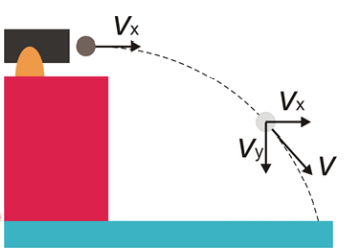
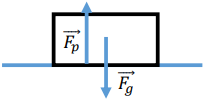
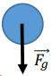
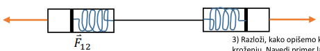
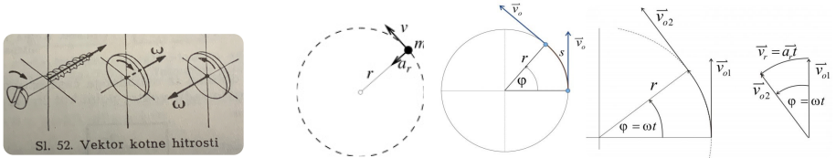
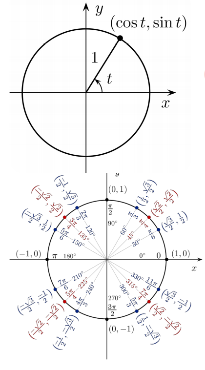
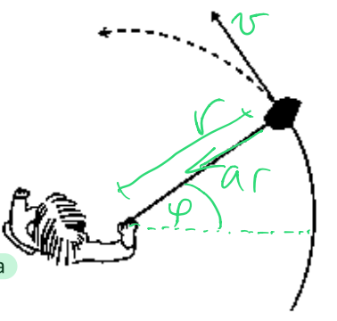

# Mehanika
### 1. Razloži, kako opišemo gibanje točkastega telesa v eni in v več dimenzijah z uporabo vektorskega zapisa. Navedi primer laboratorijskega eksperimenta (ali analize pojava v naravi) za ponazoritev pospešenega gibanja v dveh ali treh dimenzijah.
- Gibanje v 1, 2 ali 3 dimenzijah lahko opisemo s tremi spremenljivkami: **lega, hitrost in pospesek**, tako da v vsakem trenutku zabelezimo vrednosti teh treh spremenljivk *(v 3D prostoru tudi pospesek)*. To zapisemo kot funkcijo spreminjanja lege v casu, v eni dimenziji je to $x = x(t)$, pri vec dimenzijah pa dodamo se $y = y(t)$ in $z = z(t)$.
- **Hitrost gibanja** je odvod koordinate po casu, **pospesek** pa je odvod hitrosti oz. drugi odvod koordinate po casu
- Delio na **enakomerno** gibanje (velikost hitrosti se s casom ne spreminja) in **neeanakomerno** gibanje (velikost se spreminja, ce se spreminja **linearno** imamo **enakomerno pospeseno/pojemajoce gibanje**, kjer je **pospesek konstanten**)

> <t-def>Premo gibanje</t-def>  
> **X** po casu: $x(t) = x_0 + vt$  
> **Hitrosti** po casu: $v(t) = \frac{dx}{dt}$  
> **Pot**: $S = vt$

> <t-def>Enakomerno pospeseno gibanje</t-def>  
> **Pospesek** po casu: $a(t) = \frac{dv}{dt}$  
> **Hitrost** po casu: $v(t) = v_0 + \int_{0}^{t}a(t)\ dt = v_0at$  
> **X** po casu: $x(t) = x_0 + \int_{0}^{t} v(t)\ dt = x_0 + v_0t + \frac{at^2}{2}$  
> **Hitrost**: $v^2 = v_0^2 + 2a(x - x_0)$

> <t-def>Krozenje</t-def> 
> **Kotna hitrost** po casu: $\omega(t) = \frac{d\varphi}{dt}$  
> **Kotni pospesek** po casu: $\alpha(t) = \frac{d\omega}{dt}$  
> **Enakomerno krozenje**: $\varphi = \varphi_0 + \omega t$  
> **Enakomerno pospeseno krozenje**: 
> - $\omega = \omega_0 + \alpha t$
> - $\varphi = \varphi_0 + \omega_0 t + \frac{1}{2}\alpha t^2$

> <t-ex>Vodoravni met</t-ex>
> Opisuje gibanje predmeta, ki ima ob zacetku **v vodoravni smeri neko hitrost**. Ko ga spustimo, se zacne pospeseno gibati proti tlom → leti vodoravno samo v zacetnem trenutku, potem pa se zacne njegov tir ukrivljati in ima parabolicno obliko.  
> Ker je gibanje **dvodimenzionalno**, ga obravnavamo **loceno po komponentah**. Razdelimo ga na **enakomerno gibanje v vodoravni smeri** in **enakomerno pospeseno gibanje v navpicni smeri**. V vodoravni smeri med letom nic ne pospesuje ali zavira in se giblje enakomerno s stalno hitrostjo $v_0$, ki jo dobi na zacetku.  
> 

### 2. Razloži Newtonove zakone za točkasto telo; posebej razloži razliko med prvim in drugim zakonom v primeru ničelne vsote sil. Navedi primere laboratorijskih eksperimentov (ali analize pojava v naravi) za ponazoritev teh zakonov.
> <t-def>1. Newtonov zakon</t-def>  
> $\sum_{i} \vec{F_l} = 0 \Leftrightarrow \vec{v} = konst.$  
> Ce na telo ne deluje nobena sila ali pa je rezultanta vseh sil na telo enaka 0, telo miruje ali pa se giblje premo enakomerno  
>> <t-ex>2. Newtonov zakon</t-ex>
>> Vsota sil je enak $0$, zato klada miruje. $\vec{F_p} = -\vec{F_g}$ in $|\vec{F_p}| = |\vec{F_g}|$  
>> 

> <t-def>2. Newtonov zakon</t-def>  
> $\sum_{i} \vec{F_l} = m \cdot \vec{a}$  
> Rezultanta sil na telo je enaka masi telesa krat pospesek. Pospesek telesa je premo sorazmeren s silo, ki deluje na telo.
>> <t-ex>2. Newtonov zakon</t-ex>  
>> Pospesek je premo sorazmeren gravitacijski sili $F_g$  
>> 

> <t-def>Razlika med 1. in 2. Newtonovim zakonom</t-def> 
> Pri nicelni vsoti sil se telo giblje enakomerno ali pa miruje, pospesek je $0$

> <t-def>3. Newtonov zakon</t-def>  
> $\vec{F_{12}} = -\vec{F_{21}}$  
> Ce prvo telo deluje na drugo z neko silo, deluje drugo telo na prvo telo z nasprotno enako silo
>> <t-ex>3. Newtonov zakon</t-ex>  
>> Oba silomera kazeta enako veliko silo  
>> 

### 3. Razloži, kako opišemo kroženje točkastega telesa z uporabo vektorjev in pojasni sile, ki nastopajo pri kroženju. Navedi primer laboratorijskega eksperimenta (ali analize pojava v naravi) za ponazoritev zakonitosti pri kroženju.
- Krozenje lahko opisemo tako, da za vsak trenutek zabelezimo **lego tocke**, ki krozi. To lahko zapisemo s **kartezicnim (x, y)** ali **polarnimi (r, $\varphi$)** koordinatami.
  
> <t-def>Krozenje</t-def>  
>  $\vec{r} = (x(t), y(t))$ ali $\vec{r} = (r(t), \varphi(t)) = (cos(\varphi),\ sin(\varphi))$  
> **Kotna hitrost**: $\omega(t) = \frac{\triangle \varphi}{\triangle t} = \frac{2 \pi}{t_0} = 2 \pi \nu [s^{-1}]$  
> **Kot zasuka**: $\varphi = \varphi_0 + \int_{0}^{t} \omega(t)\ dt$  
> **Kotni pospesek**: $\alpha (t) = \frac{d \omega}{dt}$  
> **Kotna hitrost**: $\omega = \omega_0 + \int_0^t\alpha(t) dt$  
> **Obhodna hitrost**: $\nu = \frac{\triangle s}{\triangle t} = \frac{r\cdot\triangle\varphi}{}$  
> ...  
>   
> 

- Smer vektorja hitrosti se pri krozenju nenehno spreminja in je vedno **tangencialen na tir krozenja**. Spreminjanje hitrosti smeri opisemo z radialnim pospeskom, ki kaze proti srediscu krozenja.  
$a_r = R\omega^2 = \frac{v^2}{R} = \omega v_0$  
$a_t = \alpha r$

- **Celoten pospesek na krozece telo** izracunamo po Pitagorovem izreku iz radialnega in tangencialnega pospeska.  
$a = a_r + a_t$

- **Centripentalna sila** kaze od telesa proti srediscu krozenje. Je vedno zunanja sila (vrvice, $F_g$, $F_e$, $F_m$)
$\vec{F_c} = m \cdot \vec{a_r} = m \cdot \frac{v^2}{R}$

- Pri enakomernem krozenju vpeljemo se: **frekvenco** $\nu = \frac{\omega_0}{2 \Pi}$ in **nihajni cas** $t_0 = \frac{2 \pi}{\omega}$

> <t-ex>Krozenje</t-ex> 
> Vrtimo kamen privezan na vrvico. Ko spustimo odleti v smeri tangencialno na tir krozenja.  
> 

### 4. Razloži izrek o delu in kinetični energiji za točkasto telo. Posebej obravnavaj ta izrek za primer zunanje sile trenja na gibajoče se telo in kako se ta izrek uporabi pri enakomernem kroženju točkastega telesa okrog nepremične osi.
- **Kineticna energija** je **skalar**. Je neodvisna od smeri gibanja telesa. Odvisna je od velikosti **vektorja hitrosti**. **Delo**, ki je potrebno, da telo z maso $m$ spravimo iz mirovanja v gibanje s hitrostjo $\nu$

> <t-def>Kineticna energija</t-def>  
> **Delo**: $A = \triangle W_k$  
> **Kineticna energija**: $W_k = \frac{1}{2} m v^2$  
> **Kineticna energija (krozenje)**: $W_k = \frac{F \cdot r}{2}$  
> $W_k = A = \int_0^{\vec{r}}\vec{F} \cdot d\vec{r} = \ldots$  
>> <t-ex>Kineticna energija</t-ex>  
>> Klado podrsamo po tleh. Sila trenja mora opraviti delo, ki je enako zacetni kineticni energiji klade, da se klada povsem ustavi.

### 5. Razloži izrek o gibalni količini za sistem točkastih teles. Navedi primer laboratorijskega eksperimenta (ali analize pojava v naravi) za ponazoritev tega izreka.
- **Sprememba skupne gibalne kolicine teles** je enaka **skupnemu sunku vseh zunanjih sil** na ta telesa.
- Sil med telesi znotraj sistema ne upostevamo, saj so si po **3. Newtonovem zakonu** nasprotno enake, torej so sunki med telesi nasprotno enaki. To pa pomeni, da je **sprememba gibalne kolicine enega telesa enaka nasprotni gibalni kolicini drugega telesa**. Skupna gibalna kolicina se torej ohranja v odsotnosti zunanjih sil.

> <t-def>Gibalna kolicina</t-def>  
> $\vec{G} = m\vec{v}$  
> **Gibalna kolicina n tles**: $\vec{G} = m_1\vec{v_1} + \cdots + m_n\vec{v_n}$  
> $\vec{F_R} = m\vec{a} = m\frac{d\vec{v}}{dt} = \ldots$
>> <t-ex>Popolnoma prozni trk</t-ex>  
>> Ker na telesi ne deluje nobena zunanja sila, se $G$ in $W_k$ ohranjata.
>> $-m_1v_{1k} + m_2v_{2k} - m_1v_{1z} + m_2v_{2z} = 0$ Ce sta masi enaki dobimo preprost rezultat $v_{1k} = v_{2z}$ in $v_{2k} = v_{1z}$ Enaki telesi torej pri proznem trku zamenjata hitrost.

> <t-theo>Sunek Sile</t-theo>  
> Sunek sile je enak spremembi gibalne kkolicine teles na keterega sila deluje

### 6. Opiši gravitacijsko silo (interakcijo) med dvema telesoma. Napiši Keplerjeve zakone in s pomočjo le-te razloži tretji Keplerjev zakon (konstantno razmerje med... ).
- Vsako telo z maso deluje privlacno na vsa ostala telesa z maso

### 7. Razloži pojem težnostne potencialne energije ter povezavo med delom sile teže in potencialno energijo ter ilustriraj na primeru nošnje tovora z vznožja gore do vrha po različnih poteh. Posebej zapiši gravitacijsko potencialno energijo na primeru gibanja planetov okrog sonca.

### 8. Razloži Newtonove zakone za togo telo za primer premega gibanja in kroženja. Razloži izrek o gibanju težišča in pokaži, kako enačbe za togo telo preidejo v Newtonove zakone za točkasto telo.

### 9. Razloži izrek o vrtilni količini za vrtenje togega telesa okoli nepremične osi. Navedi primer laboratorijskega eksperimenta (ali analize pojava v naravi) za ponazoritev tega izreka.

### 10. Razloži izrek o kinetični energiji za togo telo, ki se vrti okoli nepremične osi. Opiši primer kotaljenja polnega in praznega valja na klancu, ki smo ga pokazali na predavanjih.

# Elektrika in Magnetizem
### 11. Opiši električno silo (interakcijo) med dvema naelektrenima telesoma. Navedi primer laboratorijskega eksperimenta (ali analize pojava v naravi) za ponazoritev te interakcije.

### 12. Opiši pojem električnega polja ter razloži, kako ponazorimo silnice električnega polja v okolici naelektrenih teles. Opiši primer električnega dipolnega polja ter napiši izraz za navor na električni dipol v zunanjem električnem polju.

### 13. Razloži pojem električne potencialne energije, električnega potenciala in električne napetosti ter njihovo povezavo z delom pri premikanju naboja v električnem polju. Navedi primer laboratorijskega eksperimenta (ali analize pojava v naravi) za ponazoritev te povezave.

### 14. Opiši pojem električnega toka ter povezavo med tokom, napetostjo in električno energijo. Razloži Ohmov zakon na nivoju gibanja nosilcev naboja.

### 15. Napiši izpeljavo magnetnega dipolnega momenta tokovne zanke in navor nanjo v zunanjem magnetnem polju. Opiši magnetno polje v okolici točkastega magnetnega dipola (majhnega permanentnega magneta).

### 16. Opiši značilnosti magnetnega polja v okolici tokovnih vodnikov različnih oblik (ravni vodnik, tuljava ...) in njegov učinek na točkasti magnetni dipol. Navedi primer laboratorijskega eksperimenta za ponazoritev tega polja.

### 17. Opiši sile, ki delujejo na vodnik z električnim tokom in na gibajoč se električni naboj, ko ga postavimo v zunanje magnetno polje. Navedi primer laboratorijskega eksperimenta (ali analize pojava v naravi) za ponazoritev opisanih vplivov.

### 18. Razloži pojav električne indukcije. Navedi primer laboratorijskega eksperimenta (ali analize pojava v naravi) za ponazoritev tega pojava.

### 19. Razloži odziv različnih elektronskih elementov (upor, kondenzator, tuljava) na izmenično napetost. Navedi primer laboratorijskega eksperimenta za ponazoritev omenjenih pojavov.

### 20. Opiši elektromagnetno valovanje in pojasni vsaj eno izmed značilnih valovnih lastnosti vidne svetlobe. Navedi primer laboratorijskega eksperimenta (ali analize pojava v naravi) za ponazoritev te lastnosti.