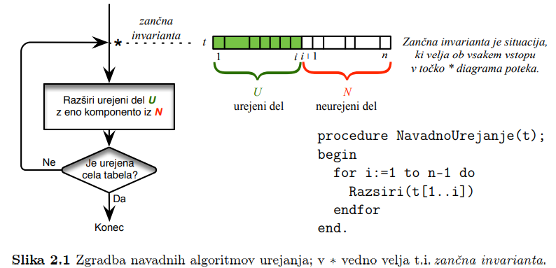

# 1. Uvod
## 1.1. Asimptoticna notacija in osnovni pojmi

> <t-def>Definicija</t-def>
> Naj bo dana funkcija $g : N \to N$. Potem za funkcijo $f : N \to N$ pisemo:
> - $f(n) = O(g(n))$, ce $\exists c > 0$, da je $\lim_{n \to \infty} \frac{f(n)}{g(n)} \leq c$  
>   → <c-r><b>f</b> narasca kvecjem tako hitro kot <b>g</b></c-r> 
> - $f(n) = \Omega(g(n))$, ce $\exists c > 0$, da je $c \leq \lim_{n \to \infty} \frac{f(n)}{g(n)}$    
>   → <c-r><b>f</b> narasca vsaj tako hitro kot <b>g</b></c-r> 
> - $f(n) = \Theta(g(n))$, ce $\exists c_1, c_2 > 0$, da je $c_1 \leq \lim_{n \to \infty} \frac{f(n)}{g(n)} \leq c_2$    
>   → <c-r><b>f</b> narasca podobno hitro hitro kot <b>g</b></c-r> 
> - $f(n) = o(g(n))$, ce je $\lim_{n \to \infty} \frac{f(n)}{g(n)} = 0$  
>   → <c-r><b>f</b> narasca pocasneje kot <b>g</b></c-r> 
> - $f(n) = \omega(g(n))$, ce je $\lim_{n \to \infty} \frac{f(n)}{g(n)} = +\infty$  
>   → <c-r><b>f</b> narasca hitrje kot <b>g</b></c-r> 
> - $f(n) \sim g(n)$, ce je $\lim_{n \to \infty} \frac{f(n)}{g(n)} = 1$  
>   → <c-r><b>f</b> narasca tako hitro kot <b>g</b></c-r> 

- **$O(g(n))$** je **mnozica** vseh fukcij spremenljivke **$n$**, ki narascajo kvecjem tako hitro kot **$g(n)$**

> Definicije **brez limit**:
> - $f(n) = O(g(n))$, ce $\exists c, n_0 > 0 \forall n \geq n_0 : f(n) \leq cg(n)$
> - $f(n) = \Omega(g(n))$, ce $\exists c, n_0 > 0 \forall n \geq n_0 : cg(n) \leq f(n)$
> - $f(n) = \Theta(g(n))$, ce $\exists c_1, c_2, n_0 > 0 \forall n \geq n_0 : c_1g(n) \leq f(n) \leq c_2g(n)$
> - $f(n) = o(g(n))$, ce $\forall c > \exists n_0 > 0 \forall n \geq n_0 : f(n) < cg(n)$
> - $f(n) = \omega(g(n))$, ce $\forall c > 0 \exists n_0 > 0 \forall n \geq n_0 : cg(n) < f(n)$


> **Lastnosti**
> 1. $f(n) = \Theta(g(n)) \Rightarrow g(n) = \Theta(f(n))$
> 2. $f(n) = \Theta(g(n)) \Leftrightarrow f(n) = \Omega(g(n)) \ \wedge \ f(n) = O(g(n))$
> 3. $c \not ={0} \ konstanta \ \Rightarrow O(\|c\| \cdot g(n)) = O(g(n))$ 
> 4. $f(n) = O(h(n)) \ \wedge \ g(n) = O(k(n)) \Rightarrow f(n) + g(n) = O(max(h(n),\ k(n))$
> 5. $f(n) = O(h(n)) \ \wedge \ g(n) = O(k(n)) \Rightarrow f(n) \cdot g(n) = O(h(n) \cdot k(n))$
> 6. $f(n) \cdot O(g(n)) = O(f(n) \cdot g(n))$

> Izrazi z asimptoticno notacijo  
> 
> |**L**||**D**|
> |-:|:-:|:-|
> |$f(n)$|⇝|$O(f(n))$|
> |$c \cdot O(f(n))$|⇝|$O(f(n))$|
> |$O(c \cdot f(n))$|⇝|$O(f(n))$|
> |$f(n) - g(n) = O(h(n))$|⇝|$f(n) = g(n) + O(h(n))$|
> |$O(f(n)) \cdot O(g(n))$|⇝|$O(f(n) \cdot g(n))$|
> |$O(f(n)) + O(g(n))$|⇝|$O(g(n))$, ce $f(n) = O(g(n))$|

> <t-ex>Primer</t-ex>   
> $T(n) = 2 \log_{3} n + 4n + 5n \log_{6} n^7$  
> $\Rightarrow T(n) = O(\log n) + O(n) + O(n \log n) = O(n \log n)$

- **Racunski problem** je vsak problem, ki zahteva kakrsno koli obliko racunanja, ki jo more izvesti Turingov stroj ali kak njemu ekvivalenten model racunanja
- **Teza o izraunljivosti** - *Kar je sposoben izracunati clovek, je sposoben izracunati tudi Turingov stroj (ali njemu ekvivalentni racunski model)*
- **Racunski problem $\Pi$** definiramo tako, da zanj relavantne **formalne parametre** povezemo v neko smiselno vprasanje
- **Primerek** (ali **nalogo**) $\pi$ problema $\Pi$ dobimo, ko v definiciji problema nadomestimo vse formalne paramtetre z **dejanskimi parametri**
- **Velikost primerka** $\pi \in \Pi$ je dolzina besede $\omega(\pi)$ v kateri so kodirani dejanski parametri primerka

> <t-def>Definicija</t-def>  
> Imamo **algoritem** $A$, ki zna izracunati resitev poljubnega primerka $\pi \in \Pi$
> - **casovna zahtevnost** je $T_A(n)$ ($n$ - velikost primerka → opravi $n$ korakov)
> - casovna zahtevnost **kvecjem** $O(g(n))$ → $T_A(n) = O(g(n))$
> - casovna zahtevnost **vsaj** $\Omega(h(n))$ → $T_A(n) = \Omega(h(n))$
> - casovna zahtevnost $\Theta(k(n))$ → $T_A(n) = \Omega(k(n)) \ \wedge \ T_A(n) = O(k(n))$
> - **Tipi casovnih zahtevnosti**
>   - **konstantna** → $T_A(n)$ konstantna → $T_A(n) = O(1)$
>   - **logaritmicna** → $T_A(n)$ logaritmicna funkcija → $T_A(n) = O(\log n)$
>   - **polilogaritmicna** → $T_A(n)$ polilogaritmicna funkcija → $T_A(n) =\ poly(\log n)$
>   - **polinomska** → $T_A(n)$ polinomska funkcija → $T_A(n) =\ poly(n)$
>   - **kvazipolinomska** → $T_A(n) = 2^{poly(\log(n))}$
>   - **subeksponentna** → $T_A(n) = 2^{o(n)}$
>   - **eksponentna** → $T_A(n) = 2^{poly(n)}$
> - **prostorska zahtevnost** je $S_A(n)$, ce bo med resevanjem primerka velikosti $n$ v vsaj enem trenutku rabil $S_A(n)$ pomnilniskih besede


> <t-def>Definicija</t-def> 
> - Funkcija $T_{\Pi}(n)$ bo **casovna zahtevnost problema** $\Pi$, ce bo za $\Pi$ obstajal algoritem $A$ s casovno zahtevnostjo $T_A(n) = T_{\Pi}(n)$
> - Asimptoticno gledano bo imel $\Pi$ casovno zahtevnost reda $O(g(n))$, $\Omega(h(n))$ ali $\Theta(k(n))$, ce bo za $\Pi$ obstajal $A$ s casovno zahtevnostjo $T_A(n)$, ki je reda $O(g(n))$, $\Omega(h(n))$ ali $\Theta(k(n))$
> - Podobno definiramo **prostorsko zahtevnost** $S_{\Pi}(n)$ **problema** $\pi$

- $\tilde{O}$ je okrajsava za nekatere posebne skupine zahtevnosti
  
> <t-def>Definicija</t-def> 
> $f(n) = \tilde{O}(g(n))$, ce $\exists k : f(n) = O(g(n) \log^k g(n))$
> → vpliv $g(n)$ na hitrost rasti funkcije $f(n)$ je pomembnejsi od morebitnega vpliva faktorja $log^kg(n)$ ob funckiji $g(n)$

# 2. Urejanje
## 2.1. Navadno Urejanje
- **<c-r>Problem:</c-r>** dana so stevila $a_1,\ a_2,\ ...,\ a_n,\ n \geq 1$. Pisci razporeditev $a_{i_1},\ a_{i_2},\ ...,\ a_{i_n}$,  da bo $a_{i_1} \leq a_{i_2} \leq ... \leq a_{i_n}$

> <t-def>Definicja</t-def>
> Ce je $R(i)$ casovna zahtevnost razsirjanja $U = t[1..i]$, je casovna zahtevnost urejanja cele tabele $t[1..n]$ enaka $T(n) = \sum_{i = 1}^{n - 1} R(i)$ 
> 

### 2.1.1. Algoritmi
> Razsiritev z **vstavljanjem**
> - prvi elemet v $N,\ t[i + 1]$, se premesti (vrine) na ustrezno mesto v $U = t[1..i]$
> - v najslabsem primeru je treba prestaviti $i$ elementov v $U$, zato je $R(i) = O(i)$

> Razsiritev z **izbiranjem**
> - prvi element v $N, t[i+1]$, se zamenja z najmanjsim elementom v $N$
> - da najdemo najmanjsega v $N$ je treba pogledati cel $N$, zato je $R(i) = \Theta(n - 1)$

> Razsiritev z **menjavanjem**
> - med sprehodom po $N$ od $t[n]$ do $t[i+1]$ se vsak $t[j] (i+1 \leq j \leq n)$ zamenja s $t[j-1]$, ce je $t[j-1] > t[j]$
> - med sprehodom po $N$ se opravi $n-1$ primerjanj, zato je $R(i) = \Theta(n-i)$

- Ti trije nacini sirjenja vodijo do naslednjih treh algoritmov urejanja

> **Navadno vstavlanje (InsertionSort)**
> ```
> procedure NavadnoVstavljanje(t)
> begin
>   for i := 1 to n-1 do
>     Vstavi&Razsiri(t[1..i])
>   endfor
> end
> ```
> 
> $T(n) = O(n^2)$

> **Navadno izbiranje (SelectionSort)**
> ```
> procedure NavadnoVstavljanje(t)
> begin
>   for i := 1 to n-1 do
>     Izberi&Razsiri(t[1..i])
>   endfor
> end
> ```
>
> $T(n) = O(n^2)$

> **Navadno menjavanje (BubbleSort)**
> ```
> procedure NavadnoVstavljanje(t)
> begin
>   for i := 1 to n-1 do
>     Menjaj&Razsiri(t[1..i])
>   endfor
> end
> ```
>
> $T(n) = O(n^2)$

- **<c-r>Sklep:</c-r>** navadni algoritmi urejanja stevil $a_1,\ ...,\ a_n$ imajo casovno zahtevnost $\Theta(n^2)$

## 2.2. Spodnja meja casovne zahtevnosti urejanja
- ker mora vsak algoritem vsako od stevil vsaj prebrati, bo za njihovo ureditev porabil vsaj $\Theta(n)$ casa → vsak algoritem za urejanje $n$ stevil ima casovno zahtevnost navzdol omejeno z $\Omega(n)$