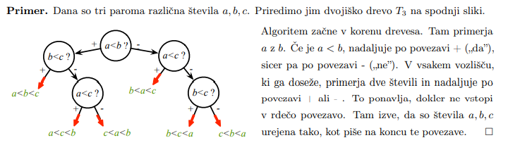
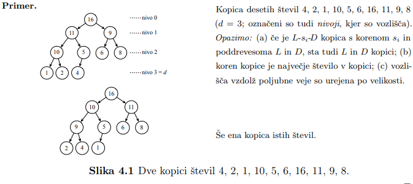
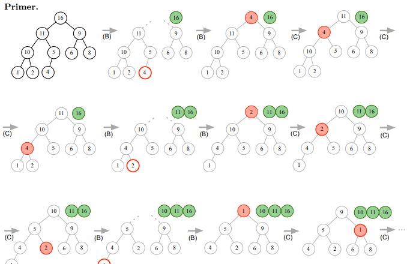
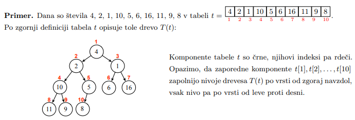

# 1. Uvod
## 1.1. Asimptoticna notacija in osnovni pojmi

> <t-def>Definicija</t-def>
> Naj bo dana funkcija $g : N \to N$. Potem za funkcijo $f : N \to N$ pisemo:
> - $f(n) = O(g(n))$, ce $\exists c > 0$, da je $\lim_{n \to \infty} \frac{f(n)}{g(n)} \leq c$  
>   → <c-r><b>f</b> narasca kvecjem tako hitro kot <b>g</b></c-r> 
> - $f(n) = \Omega(g(n))$, ce $\exists c > 0$, da je $c \leq \lim_{n \to \infty} \frac{f(n)}{g(n)}$    
>   → <c-r><b>f</b> narasca vsaj tako hitro kot <b>g</b></c-r> 
> - $f(n) = \Theta(g(n))$, ce $\exists c_1, c_2 > 0$, da je $c_1 \leq \lim_{n \to \infty} \frac{f(n)}{g(n)} \leq c_2$    
>   → <c-r><b>f</b> narasca podobno hitro hitro kot <b>g</b></c-r> 
> - $f(n) = o(g(n))$, ce je $\lim_{n \to \infty} \frac{f(n)}{g(n)} = 0$  
>   → <c-r><b>f</b> narasca pocasneje kot <b>g</b></c-r> 
> - $f(n) = \omega(g(n))$, ce je $\lim_{n \to \infty} \frac{f(n)}{g(n)} = +\infty$  
>   → <c-r><b>f</b> narasca hitrje kot <b>g</b></c-r> 
> - $f(n) \sim g(n)$, ce je $\lim_{n \to \infty} \frac{f(n)}{g(n)} = 1$  
>   → <c-r><b>f</b> narasca tako hitro kot <b>g</b></c-r> 

- **$O(g(n))$** je **mnozica** vseh fukcij spremenljivke **$n$**, ki narascajo kvecjem tako hitro kot **$g(n)$**

> Definicije **brez limit**:
> - $f(n) = O(g(n))$, ce $\exists c, n_0 > 0 \forall n \geq n_0 : f(n) \leq cg(n)$
> - $f(n) = \Omega(g(n))$, ce $\exists c, n_0 > 0 \forall n \geq n_0 : cg(n) \leq f(n)$
> - $f(n) = \Theta(g(n))$, ce $\exists c_1, c_2, n_0 > 0 \forall n \geq n_0 : c_1g(n) \leq f(n) \leq c_2g(n)$
> - $f(n) = o(g(n))$, ce $\forall c > \exists n_0 > 0 \forall n \geq n_0 : f(n) < cg(n)$
> - $f(n) = \omega(g(n))$, ce $\forall c > 0 \exists n_0 > 0 \forall n \geq n_0 : cg(n) < f(n)$


> **Lastnosti**
> 1. $f(n) = \Theta(g(n)) \Rightarrow g(n) = \Theta(f(n))$
> 2. $f(n) = \Theta(g(n)) \Leftrightarrow f(n) = \Omega(g(n)) \ \wedge \ f(n) = O(g(n))$
> 3. $c \not ={0} \ konstanta \ \Rightarrow O(\|c\| \cdot g(n)) = O(g(n))$ 
> 4. $f(n) = O(h(n)) \ \wedge \ g(n) = O(k(n)) \Rightarrow f(n) + g(n) = O(max(h(n),\ k(n))$
> 5. $f(n) = O(h(n)) \ \wedge \ g(n) = O(k(n)) \Rightarrow f(n) \cdot g(n) = O(h(n) \cdot k(n))$
> 6. $f(n) \cdot O(g(n)) = O(f(n) \cdot g(n))$

> Izrazi z asimptoticno notacijo  
> 
> |**L**||**D**|
> |-:|:-:|:-|
> |$f(n)$|⇝|$O(f(n))$|
> |$c \cdot O(f(n))$|⇝|$O(f(n))$|
> |$O(c \cdot f(n))$|⇝|$O(f(n))$|
> |$f(n) - g(n) = O(h(n))$|⇝|$f(n) = g(n) + O(h(n))$|
> |$O(f(n)) \cdot O(g(n))$|⇝|$O(f(n) \cdot g(n))$|
> |$O(f(n)) + O(g(n))$|⇝|$O(g(n))$, ce $f(n) = O(g(n))$|

> <t-ex>Primer</t-ex>   
> $T(n) = 2 \log_{3} n + 4n + 5n \log_{6} n^7$  
> $\Rightarrow T(n) = O(\log n) + O(n) + O(n \log n) = O(n \log n)$

- **Racunski problem** je vsak problem, ki zahteva kakrsno koli obliko racunanja, ki jo more izvesti Turingov stroj ali kak njemu ekvivalenten model racunanja
- **Teza o izraunljivosti** - *Kar je sposoben izracunati clovek, je sposoben izracunati tudi Turingov stroj (ali njemu ekvivalentni racunski model)*
- **Racunski problem $\Pi$** definiramo tako, da zanj relavantne **formalne parametre** povezemo v neko smiselno vprasanje
- **Primerek** (ali **nalogo**) $\pi$ problema $\Pi$ dobimo, ko v definiciji problema nadomestimo vse formalne paramtetre z **dejanskimi parametri**
- **Velikost primerka** $\pi \in \Pi$ je dolzina besede $\omega(\pi)$ v kateri so kodirani dejanski parametri primerka

> <t-def>Definicija</t-def>  
> Imamo **algoritem** $A$, ki zna izracunati resitev poljubnega primerka $\pi \in \Pi$
> - **casovna zahtevnost** je $T_A(n)$ ($n$ - velikost primerka → opravi $n$ korakov)
> - casovna zahtevnost **kvecjem** $O(g(n))$ → $T_A(n) = O(g(n))$
> - casovna zahtevnost **vsaj** $\Omega(h(n))$ → $T_A(n) = \Omega(h(n))$
> - casovna zahtevnost $\Theta(k(n))$ → $T_A(n) = \Omega(k(n)) \ \wedge \ T_A(n) = O(k(n))$
> - **Tipi casovnih zahtevnosti**
>   - **konstantna** → $T_A(n)$ konstantna → $T_A(n) = O(1)$
>   - **logaritmicna** → $T_A(n)$ logaritmicna funkcija → $T_A(n) = O(\log n)$
>   - **polilogaritmicna** → $T_A(n)$ polilogaritmicna funkcija → $T_A(n) =\ poly(\log n)$
>   - **polinomska** → $T_A(n)$ polinomska funkcija → $T_A(n) =\ poly(n)$
>   - **kvazipolinomska** → $T_A(n) = 2^{poly(\log(n))}$
>   - **subeksponentna** → $T_A(n) = 2^{o(n)}$
>   - **eksponentna** → $T_A(n) = 2^{poly(n)}$
> - **prostorska zahtevnost** je $S_A(n)$, ce bo med resevanjem primerka velikosti $n$ v vsaj enem trenutku rabil $S_A(n)$ pomnilniskih besede


> <t-def>Definicija</t-def> 
> - Funkcija $T_{\Pi}(n)$ bo **casovna zahtevnost problema** $\Pi$, ce bo za $\Pi$ obstajal algoritem $A$ s casovno zahtevnostjo $T_A(n) = T_{\Pi}(n)$
> - Asimptoticno gledano bo imel $\Pi$ casovno zahtevnost reda $O(g(n))$, $\Omega(h(n))$ ali $\Theta(k(n))$, ce bo za $\Pi$ obstajal $A$ s casovno zahtevnostjo $T_A(n)$, ki je reda $O(g(n))$, $\Omega(h(n))$ ali $\Theta(k(n))$
> - Podobno definiramo **prostorsko zahtevnost** $S_{\Pi}(n)$ **problema** $\pi$

- $\tilde{O}$ je okrajsava za nekatere posebne skupine zahtevnosti
  
> <t-def>Definicija</t-def> 
> $f(n) = \tilde{O}(g(n))$, ce $\exists k : f(n) = O(g(n) \log^k g(n))$
> → vpliv $g(n)$ na hitrost rasti funkcije $f(n)$ je pomembnejsi od morebitnega vpliva faktorja $log^kg(n)$ ob funckiji $g(n)$

# 2. Urejanje
## 2.1. Navadno Urejanje
- **<c-r>Problem:</c-r>** dana so stevila $a_1,\ a_2,\ ...,\ a_n,\ n \geq 1$. Pisci razporeditev $a_{i_1},\ a_{i_2},\ ...,\ a_{i_n}$,  da bo $a_{i_1} \leq a_{i_2} \leq ... \leq a_{i_n}$

> <t-def>Definicja</t-def>
> Ce je $R(i)$ casovna zahtevnost razsirjanja $U = t[1..i]$, je casovna zahtevnost urejanja cele tabele $t[1..n]$ enaka $T(n) = \sum_{i = 1}^{n - 1} R(i)$ 
> 

### 2.1.1. Algoritmi
> Razsiritev z **vstavljanjem**
> - prvi elemet v $N,\ t[i + 1]$, se premesti (vrine) na ustrezno mesto v $U = t[1..i]$
> - v najslabsem primeru je treba prestaviti $i$ elementov v $U$, zato je $R(i) = O(i)$

> Razsiritev z **izbiranjem**
> - prvi element v $N, t[i+1]$, se zamenja z najmanjsim elementom v $N$
> - da najdemo najmanjsega v $N$ je treba pogledati cel $N$, zato je $R(i) = \Theta(n - 1)$

> Razsiritev z **menjavanjem**
> - med sprehodom po $N$ od $t[n]$ do $t[i+1]$ se vsak $t[j] (i+1 \leq j \leq n)$ zamenja s $t[j-1]$, ce je $t[j-1] > t[j]$
> - med sprehodom po $N$ se opravi $n-1$ primerjanj, zato je $R(i) = \Theta(n-i)$

- Ti trije nacini sirjenja vodijo do naslednjih treh algoritmov urejanja

> **Navadno vstavlanje (InsertionSort)**
> ```
> procedure NavadnoVstavljanje(t)
> begin
>   for i := 1 to n-1 do
>     Vstavi&Razsiri(t[1..i])
>   endfor
> end
> ```
> 
> $T(n) = O(n^2)$

> **Navadno izbiranje (SelectionSort)**
> ```
> procedure NavadnoVstavljanje(t)
> begin
>   for i := 1 to n-1 do
>     Izberi&Razsiri(t[1..i])
>   endfor
> end
> ```
>
> $T(n) = O(n^2)$

> **Navadno menjavanje (BubbleSort)**
> ```
> procedure NavadnoVstavljanje(t)
> begin
>   for i := 1 to n-1 do
>     Menjaj&Razsiri(t[1..i])
>   endfor
> end
> ```
>
> $T(n) = O(n^2)$

> <t-conc>Sklep</t-conc>
> Navadni algoritmi urejanja stevil $a_1,\ ...,\ a_n$ imajo casovno zahtevnost $\Theta(n^2)$

## 2.2. Spodnja meja casovne zahtevnosti urejanja
- ker mora vsak algoritem vsako od stevil vsaj prebrati, bo za njihovo ureditev porabil vsaj $\Theta(n)$ casa → vsak algoritem za urejanje $n$ stevil ima casovno zahtevnost navzdol omejeno z $\Omega(n)$
- Pri navadnih algoritmih urejanja se polega obicajnih ALO operacij pojavljata se **primerjanje dveh stevil** in **premestitev stevila**

### 2.2.1. Odlocitvena drevesa in urejanje
- Algoritem, ki za razvrscanje uporablja le relacijo $\leq$ se ravna po **odlocitvenem drevesu**  
  
- stevilom $a_1,\ ...,\ a_n$ priredimo dvojisko drevo $T_n$ z lastnostmi:
  - vsako notranje vozlisce vsebojue neko primerjanje $a_i < a_j$
  - v listih so vse permutacije stevil
  - permutacija je v listu ntk. izpoljuje izide vseh primerjanj na veji do tega lista
- vsako drevo morea imeti **$n!$** listov, saj je toliko vseh permutacij $n$ stevil.

> <t-def>Definicija</t-def>
> Ce je visina $h(T)$ drevesa $T$ definirana kot stevilo notranjih vozlisc na najdaljsi veji drevesa $T$, potem je za vsako dvojisko drevo $T$ z $l$ listi $h(T) \geq \lceil \log_2 l \rceil$

- v nasem primeru sta $T = T_n$ in $l = n!$ → visina vsakega drevesa $T_n$ je vsaj $\lceil \log_2 n! \rceil$ → algoritem mora izvesti vsaj $\lceil \log_2 n! \rceil$ primerjanj

> <t-conc>Sklep</t-conc>
> Vsak algoritem urejanja, ki uporablja operacijo primerjanja dveh stevil, zahteva za ureditev vsaj enega zaporedja $n$ stevil $\Omega(n \log n)$ operacij primerjanja 

## 2.3. Heapsort - Urejanje s kopico
- algoritem, ki uporablja podatkovno strukturo, imenovano **kopica**

> <t-def>Definicija</t-def> 
> Kopica stevil $s_1,\ ...,\ s_n$ je dvojisko drevo $T(V,\ E)$ z lastnostmi:
> - $V = {s_1,\ ...,\ s_n}$ je mnozica vozlisc
> - ce ima vozlisce $s_i$ sina $s_j$, je $s_i \geq s_j$ (vsak oce je vecji ali enak svojim sinom)
> - za nek $d \in \mathbb{N}$ ima vsaka veja $d$ ali $d -1$ povezav (drevo je karseda nizko)
> - daljse veje so levo od krajsih (drevo je levo poravnano)
> - *v splosnem lahko stevilom $s_1,\ ...,\ s_n$ priredimo vec razlicnih kopic*

> **Primer**
> 
> 

- **kopica** je **polno** drevo: vsak nivo $l$, razen morda zadnji $l = d$ ima $2^l$ vozlisc, zato je $d$ najmanjse naravno stevilo, za katerega je $\sum_{l = 0}^{d - 1} 2^l < n \leq \sum_{l = 0}^{d} 2^l$ → $2^d - 1 < n \leq 2^{d+1}$ oz $d-1 < \log_2(n +1) - 1 \leq d$ → $d = \lceil \log_2(n + 1) - 1 \rceil$

### 2.3.1. Postopek
- Naj bodo dana stevila $a_1,\ ...,\ a_n$, ki jih uredi v narascajocem vrstnem redu

> **Postopek**
>
> **A)** Algoritem naj iz stevil sestavi zacetno kopico stevil  
> **B)** Vemo, da je koren najvecje stevilo v kopici, zato naj algoritem **izloci koren iz kopice in ga shrani, na njegovo mesto pa prestavi enega od listv kopice** (npr. skrajno desni na najnizjem nivoju)  
> **C)** Rezultat predstavitve je dvojisko drevo, zato naj algoritem popravi drevo v kopico → **Prestavljani list naj pogrezne vzdolz neke veje na prvo mesto, kjer bo vecji ali enak tamkajsnjih sinov**  
> **D)** Zdaj algoritem ponovi koraka *B)* in *C)* nad to kopico
> 
> 

> **A) Sestavljanje zacetne kopice**
> 
> - stevila $a_1,\ ...,\ a_n$ naj bodo dana v tabeli $t$ z $n$ komponentami $t[i] = a_i$ za $i = 1,\ 2,\ ...,\ N$
> - v tej tabeli je zapis dvojiskega drevesa $T(t)$ definiran kot:
>   - vozlisca drevesa $T(t)$ so stevila $t[1],\ ...,\ t[n]$
>   - koren drevesa $T(t)$ je stevilo $t[1]$
>   - ce je $t[i]$ oce v $T(t)$, sta $t[2i]$ oz. $t[2i+1]$ (ce obstaja) njegov levi oz. desni sin  
>    
> - Drevo $T(t)$ ni kopica, potrebno ga je preurediti
> - predpostavimo, da imamo na voljo proceduro **PopraviVKopico(t, i, n)**, ki bi v dvojiskem drevesu $T(t)$ popravla drevo, katerega koren ima indeks $i$, v kopici
> - procedura od spodaj navzgor, po nivojih popravi vsa drevesa s koreni na tekocem nivoju  
> 
>> Programski odsek vhodno tabelo $t$ preuredi tako, da $T(t)$ postane kopica
>>   ``` 
>>   for i := (n div 2) downto 1 do
>>     PopraviVKopico(t, i, n)
>>   endfor;
>>   ```

> **B) Izlocanje korena in prestavljanje lista**
> 
> - po izvedbi *A)* nasa tabela $t$ opisuje kopico $T(t)$
> - iz $T(t)$ moramo izlociti koren in ga nadomestiti z zadnjim listom, to dosezemo ce zamenjamo prvo in $n$-to komponento tabele $t$ in zabelezimo, da prvih $n-1$ omponent opisuje drevo $n$-ta komponenta pa izloceni koren
> - z izlocanjem korena in prestavljanjem lista se bo ponavljalo nad cedalje manjsim kopicami
>
>> Programski odsek zamenja koren trenutne kopice z njenim zadnjim listom in vlkljuci stari koren v drugi del tabele $t$ tako, da zmanjsa mejo $r$ med njima
>> ```
>> x := t[1]; t[1] := t[r]; t[r] := x;
>> r--;
>> ```

> **C) Popravljanje drevesa v kopico**
> - drevo, opisano v $t[1..r]$, je treba popraviti v kopico
> - v vsakem koraku popravljanja, prestavljani list primerjamo s svojima sinovoma; ce je kateri od niju vecji od lista, se zamenja z najvecjim od sinov
> - s tem se prestavljeni list pogrezne po neki veji na mesto, kjer je vecji ali enak od tamkajsnjih sinov
> 
>> Procedura **PopraviVKopico(t, i, r)** vozlisce z indeksom $i$ pogrezne na pravo mesto in pri tem predpostavi, da sta poddrevesi vozlisca $i$ ze kopici
>> ```
>> procedure PopraviVKopico(t, r, i);   |V drev. t z r vozlisci popravi
>> begin                                |drevo s korenom ind=i v kopico
>>  if i<=(r div 2) then                |Ce je koren oce,
>>    s:=2*i;                           |bo s indeks levega sina.
>>    if s+1<=r then                    |Ce obstaja se desni sin,
>>      if t[s]<t[s+1] then s++ endif   |bo s indeks vecjega od sinov.
>>    endif;
>>    if t[i]<t[s] then                 |Ce je oce manjsi od tega sina,
>>      x:=t[i]; t[i]:=t[s]; t[s]:=x;   |ju zamenjaj.
>>      PopraviVKopico(t,r,s)           |Popravi v kopico poddrevo,
>>    endif                             |katerega koren ima indeks s.
>>  endif
>> end.
>> ```

> **D) Algoritem Heapsort**
> - odseke zdruzimo v cel algoritem za urejanje s kopicami
> 
>> Procedura **Heapsort(t, n)**
>> ```
>> procedure Heapsort(t, n);
>> begin
>>   for i:=(n div 2) downto 1 do      |Sestavi zacetno kopico t[1..n]
>>     PopraviVKopico(t,n,i);
>>   endfor;
>>   r:=n;
>>   while r>1 do
>>     x:=t[1]; t[1]:=t[r]; t[r]:=x;   |Zamenjaj v t[1..r] koren in list
>>     r--;                            |Izloci bivsi koren t[r]
>>     PopraviVkopico(t,r,1)           |Popravi drevo t[1..r] v kopico
>>   endwhile
>> end.
>> ```

### 2.3.2. Casovna zahtevnost algoritma Heapsort
- ce klicemo proceduro **PopraviVKopico(t, n, i)** pri vsakem $i = n, n-1,\ ...,\ 1$ in ce bi pri vsakem $i$ izvedla $d = \lceil \log_2(n+1) - 1 \rceil$ pogrezanj, bi sestavljanje zacetne kopice zahtevalo $nd = n \lceil \log_2(n+1) -1 \rceil = O(n \log n)$ pogrezanj → $A$ zahteva $O(n \log n)$ casa

> <t-conc>Sklep</t-conc>
> Algoritem **Heapsort** ima casovno zahtevnost $\Theta(n \log n)$ 

# 3. Metode razvoja algoritmov
