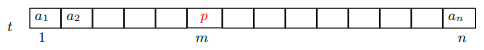
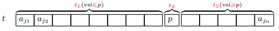
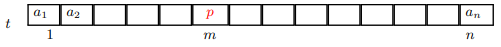
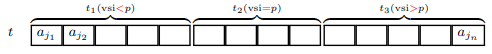

# 1. Uvod
## 1.1. Asimptoticna notacija in osnovni pojmi

> <t-def>Asimptoticna notacija</t-def>
> Naj bo dana funkcija $g : N \to N$. Potem za funkcijo $f : N \to N$ pisemo:
> - $f(n) = O(g(n))$, ce $\exists c > 0$, da je $\lim_{n \to \infty} \frac{f(n)}{g(n)} \leq c$  
>   → <c-r><b>f</b> narasca kvecjem tako hitro kot <b>g</b></c-r> 
> - $f(n) = \Omega(g(n))$, ce $\exists c > 0$, da je $c \leq \lim_{n \to \infty} \frac{f(n)}{g(n)}$    
>   → <c-r><b>f</b> narasca vsaj tako hitro kot <b>g</b></c-r> 
> - $f(n) = \Theta(g(n))$, ce $\exists c_1, c_2 > 0$, da je $c_1 \leq \lim_{n \to \infty} \frac{f(n)}{g(n)} \leq c_2$    
>   → <c-r><b>f</b> narasca podobno hitro hitro kot <b>g</b></c-r> 
> - $f(n) = o(g(n))$, ce je $\lim_{n \to \infty} \frac{f(n)}{g(n)} = 0$  
>   → <c-r><b>f</b> narasca pocasneje kot <b>g</b></c-r> 
> - $f(n) = \omega(g(n))$, ce je $\lim_{n \to \infty} \frac{f(n)}{g(n)} = +\infty$  
>   → <c-r><b>f</b> narasca hitrje kot <b>g</b></c-r> 
> - $f(n) \sim g(n)$, ce je $\lim_{n \to \infty} \frac{f(n)}{g(n)} = 1$  
>   → <c-r><b>f</b> narasca tako hitro kot <b>g</b></c-r> 

- **$O(g(n))$** je **mnozica** vseh fukcij spremenljivke **$n$**, ki narascajo kvecjem tako hitro kot **$g(n)$**

> Definicije **brez limit**:
> - $f(n) = O(g(n))$, ce $\exists c, n_0 > 0 \forall n \geq n_0 : f(n) \leq cg(n)$
> - $f(n) = \Omega(g(n))$, ce $\exists c, n_0 > 0 \forall n \geq n_0 : cg(n) \leq f(n)$
> - $f(n) = \Theta(g(n))$, ce $\exists c_1, c_2, n_0 > 0 \forall n \geq n_0 : c_1g(n) \leq f(n) \leq c_2g(n)$
> - $f(n) = o(g(n))$, ce $\forall c > \exists n_0 > 0 \forall n \geq n_0 : f(n) < cg(n)$
> - $f(n) = \omega(g(n))$, ce $\forall c > 0 \exists n_0 > 0 \forall n \geq n_0 : cg(n) < f(n)$


> **Lastnosti**
> 1. $f(n) = \Theta(g(n)) \Rightarrow g(n) = \Theta(f(n))$
> 2. $f(n) = \Theta(g(n)) \Leftrightarrow f(n) = \Omega(g(n)) \ \wedge \ f(n) = O(g(n))$
> 3. $c \not ={0} \ konstanta \ \Rightarrow O(\|c\| \cdot g(n)) = O(g(n))$ 
> 4. $f(n) = O(h(n)) \ \wedge \ g(n) = O(k(n)) \Rightarrow f(n) + g(n) = O(max(h(n),\ k(n))$
> 5. $f(n) = O(h(n)) \ \wedge \ g(n) = O(k(n)) \Rightarrow f(n) \cdot g(n) = O(h(n) \cdot k(n))$
> 6. $f(n) \cdot O(g(n)) = O(f(n) \cdot g(n))$

> Izrazi z asimptoticno notacijo  
> 
> |**L**||**D**|
> |-:|:-:|:-|
> |$f(n)$|⇝|$O(f(n))$|
> |$c \cdot O(f(n))$|⇝|$O(f(n))$|
> |$O(c \cdot f(n))$|⇝|$O(f(n))$|
> |$f(n) - g(n) = O(h(n))$|⇝|$f(n) = g(n) + O(h(n))$|
> |$O(f(n)) \cdot O(g(n))$|⇝|$O(f(n) \cdot g(n))$|
> |$O(f(n)) + O(g(n))$|⇝|$O(g(n))$, ce $f(n) = O(g(n))$|

> <t-ex>Asimptoticna notacija</t-ex>   
> $T(n) = 2 \log_{3} n + 4n + 5n \log_{6} n^7$  
> $\Rightarrow T(n) = O(\log n) + O(n) + O(n \log n) = O(n \log n)$

- **Racunski problem** je vsak problem, ki zahteva kakrsno koli obliko racunanja, ki jo more izvesti Turingov stroj ali kak njemu ekvivalenten model racunanja
- **Teza o izraunljivosti** - *Kar je sposoben izracunati clovek, je sposoben izracunati tudi Turingov stroj (ali njemu ekvivalentni racunski model)*
- **Racunski problem $\Pi$** definiramo tako, da zanj relavantne **formalne parametre** povezemo v neko smiselno vprasanje
- **Primerek** (ali **nalogo**) $\pi$ problema $\Pi$ dobimo, ko v definiciji problema nadomestimo vse formalne paramtetre z **dejanskimi parametri**
- **Velikost primerka** $\pi \in \Pi$ je dolzina besede $\omega(\pi)$ v kateri so kodirani dejanski parametri primerka

> <t-def>Algoritem</t-def>  
> Imamo **algoritem** $A$, ki zna izracunati resitev poljubnega primerka $\pi \in \Pi$
> - **casovna zahtevnost** je $T_A(n)$ ($n$ - velikost primerka → opravi $n$ korakov)
> - casovna zahtevnost **kvecjem** $O(g(n))$ → $T_A(n) = O(g(n))$
> - casovna zahtevnost **vsaj** $\Omega(h(n))$ → $T_A(n) = \Omega(h(n))$
> - casovna zahtevnost $\Theta(k(n))$ → $T_A(n) = \Omega(k(n)) \ \wedge \ T_A(n) = O(k(n))$
> - **Tipi casovnih zahtevnosti**
>   - **konstantna** → $T_A(n)$ konstantna → $T_A(n) = O(1)$
>   - **logaritmicna** → $T_A(n)$ logaritmicna funkcija → $T_A(n) = O(\log n)$
>   - **polilogaritmicna** → $T_A(n)$ polilogaritmicna funkcija → $T_A(n) =\ poly(\log n)$
>   - **polinomska** → $T_A(n)$ polinomska funkcija → $T_A(n) =\ poly(n)$
>   - **kvazipolinomska** → $T_A(n) = 2^{poly(\log(n))}$
>   - **subeksponentna** → $T_A(n) = 2^{o(n)}$
>   - **eksponentna** → $T_A(n) = 2^{poly(n)}$
> - **prostorska zahtevnost** je $S_A(n)$, ce bo med resevanjem primerka velikosti $n$ v vsaj enem trenutku rabil $S_A(n)$ pomnilniskih besede


> <t-def>Casovna zahtevnost</t-def> 
> - Funkcija $T_{\Pi}(n)$ bo **casovna zahtevnost problema** $\Pi$, ce bo za $\Pi$ obstajal algoritem $A$ s casovno zahtevnostjo $T_A(n) = T_{\Pi}(n)$
> - Asimptoticno gledano bo imel $\Pi$ casovno zahtevnost reda $O(g(n))$, $\Omega(h(n))$ ali $\Theta(k(n))$, ce bo za $\Pi$ obstajal $A$ s casovno zahtevnostjo $T_A(n)$, ki je reda $O(g(n))$, $\Omega(h(n))$ ali $\Theta(k(n))$
> - Podobno definiramo **prostorsko zahtevnost** $S_{\Pi}(n)$ **problema** $\pi$

- $\tilde{O}$ je okrajsava za nekatere posebne skupine zahtevnosti
  
> <t-def>Posebna skupina zahtevnosti</t-def> 
> $f(n) = \tilde{O}(g(n))$, ce $\exists k : f(n) = O(g(n) \log^k g(n))$  
> → vpliv $g(n)$ na hitrost rasti funkcije $f(n)$ je pomembnejsi od morebitnega vpliva faktorja $log^kg(n)$ ob funckiji $g(n)$

# 2. Urejanje
## 2.1. Navadno Urejanje
- **<c-r>Problem:</c-r>** dana so stevila $a_1,\ a_2,\ ...,\ a_n,\ n \geq 1$. Pisci razporeditev $a_{i_1},\ a_{i_2},\ ...,\ a_{i_n}$,  da bo $a_{i_1} \leq a_{i_2} \leq ... \leq a_{i_n}$

> <t-def>Casovna zahtevnost razsirjanja</t-def>
> Ce je $R(i)$ casovna zahtevnost razsirjanja $U = t[1..i]$, je casovna zahtevnost urejanja cele tabele $t[1..n]$ enaka $T(n) = \sum_{i = 1}^{n - 1} R(i)$ 
> 

### 2.1.1. Algoritmi
> Razsiritev z **vstavljanjem**
> - prvi elemet v $N,\ t[i + 1]$, se premesti (vrine) na ustrezno mesto v $U = t[1..i]$
> - v najslabsem primeru je treba prestaviti $i$ elementov v $U$, zato je $R(i) = O(i)$

> Razsiritev z **izbiranjem**
> - prvi element v $N, t[i+1]$, se zamenja z najmanjsim elementom v $N$
> - da najdemo najmanjsega v $N$ je treba pogledati cel $N$, zato je $R(i) = \Theta(n - 1)$

> Razsiritev z **menjavanjem**
> - med sprehodom po $N$ od $t[n]$ do $t[i+1]$ se vsak $t[j] (i+1 \leq j \leq n)$ zamenja s $t[j-1]$, ce je $t[j-1] > t[j]$
> - med sprehodom po $N$ se opravi $n-1$ primerjanj, zato je $R(i) = \Theta(n-i)$

- Ti trije nacini sirjenja vodijo do naslednjih treh algoritmov urejanja

> **Navadno vstavlanje (InsertionSort)**
> ```
> procedure NavadnoVstavljanje(t)
> begin
>   for i := 1 to n-1 do
>     Vstavi&Razsiri(t[1..i])
>   endfor
> end
> ```
> 
> $T(n) = O(n^2)$

> **Navadno izbiranje (SelectionSort)**
> ```
> procedure NavadnoVstavljanje(t)
> begin
>   for i := 1 to n-1 do
>     Izberi&Razsiri(t[1..i])
>   endfor
> end
> ```
>
> $T(n) = O(n^2)$

> **Navadno menjavanje (BubbleSort)**
> ```
> procedure NavadnoVstavljanje(t)
> begin
>   for i := 1 to n-1 do
>     Menjaj&Razsiri(t[1..i])
>   endfor
> end
> ```
>
> $T(n) = O(n^2)$

> <t-conc>Sklep</t-conc>
> Navadni algoritmi urejanja stevil $a_1,\ ...,\ a_n$ imajo casovno zahtevnost $\Theta(n^2)$

## 2.2. Spodnja meja casovne zahtevnosti urejanja
- ker mora vsak algoritem vsako od stevil vsaj prebrati, bo za njihovo ureditev porabil vsaj $\Theta(n)$ casa → vsak algoritem za urejanje $n$ stevil ima casovno zahtevnost navzdol omejeno z $\Omega(n)$
- Pri navadnih algoritmih urejanja se polega obicajnih ALO operacij pojavljata se **primerjanje dveh stevil** in **premestitev stevila**

### 2.2.1. Odlocitvena drevesa in urejanje
- Algoritem, ki za razvrscanje uporablja le relacijo $\leq$ se ravna po **odlocitvenem drevesu**  
- stevilom $a_1,\ ...,\ a_n$ priredimo dvojisko drevo $T_n$ z lastnostmi:
  - vsako notranje vozlisce vsebojue neko primerjanje $a_i < a_j$
  - v listih so vse permutacije stevil
  - permutacija je v listu ntk. izpoljuje izide vseh primerjanj na veji do tega lista

> <t-ex>Odlocitveno drevo</t-ex>
> 

- vsako drevo morea imeti **$n!$** listov, saj je toliko vseh permutacij $n$ stevil.

> <t-def>Visina drevesa</t-def>
> Ce je visina $h(T)$ drevesa $T$ definirana kot stevilo notranjih vozlisc na najdaljsi veji drevesa $T$, potem je za vsako dvojisko drevo $T$ z $l$ listi $h(T) \geq \lceil \log_2 l \rceil$

- v nasem primeru sta $T = T_n$ in $l = n!$ → visina vsakega drevesa $T_n$ je vsaj $\lceil \log_2 n! \rceil$ → algoritem mora izvesti vsaj $\lceil \log_2 n! \rceil$ primerjanj

> <t-conc>Sklep</t-conc>
> Vsak algoritem urejanja, ki uporablja operacijo primerjanja dveh stevil, zahteva za ureditev vsaj enega zaporedja $n$ stevil $\Omega(n \log n)$ operacij primerjanja 

## 2.3. Heapsort - Urejanje s kopico
- algoritem, ki uporablja podatkovno strukturo, imenovano **kopica**

> <t-def>Kopica</t-def> 
> Kopica stevil $s_1,\ ...,\ s_n$ je dvojisko drevo $T(V,\ E)$ z lastnostmi:
> - $V = {s_1,\ ...,\ s_n}$ je mnozica vozlisc
> - ce ima vozlisce $s_i$ sina $s_j$, je $s_i \geq s_j$ (vsak oce je vecji ali enak svojim sinom)
> - za nek $d \in \mathbb{N}$ ima vsaka veja $d$ ali $d -1$ povezav (drevo je karseda nizko)
> - daljse veje so levo od krajsih (drevo je levo poravnano)
> - *v splosnem lahko stevilom $s_1,\ ...,\ s_n$ priredimo vec razlicnih kopic*

> <t-ex>Kopica</t-ex> 
> 
> 

- **kopica** je **polno** drevo: vsak nivo $l$, razen morda zadnji $l = d$ ima $2^l$ vozlisc, zato je $d$ najmanjse naravno stevilo, za katerega je $\sum_{l = 0}^{d - 1} 2^l < n \leq \sum_{l = 0}^{d} 2^l$ → $2^d - 1 < n \leq 2^{d+1}$ oz $d-1 < \log_2(n +1) - 1 \leq d$ → $d = \lceil \log_2(n + 1) - 1 \rceil$

### 2.3.1. Postopek
- Naj bodo dana stevila $a_1,\ ...,\ a_n$, ki jih uredi v narascajocem vrstnem redu

> **Postopek**
>
> **A)** Algoritem naj iz stevil sestavi zacetno kopico stevil  
> **B)** Vemo, da je koren najvecje stevilo v kopici, zato naj algoritem **izloci koren iz kopice in ga shrani, na njegovo mesto pa prestavi enega od listv kopice** (npr. skrajno desni na najnizjem nivoju)  
> **C)** Rezultat predstavitve je dvojisko drevo, zato naj algoritem popravi drevo v kopico → **Prestavljani list naj pogrezne vzdolz neke veje na prvo mesto, kjer bo vecji ali enak tamkajsnjih sinov**  
> **D)** Zdaj algoritem ponovi koraka *B)* in *C)* nad to kopico

> **A) Sestavljanje zacetne kopice**
> 
> - stevila $a_1,\ ...,\ a_n$ naj bodo dana v tabeli $t$ z $n$ komponentami $t[i] = a_i$ za $i = 1,\ 2,\ ...,\ N$
> - v tej tabeli je zapis dvojiskega drevesa $T(t)$ definiran kot:
>   - vozlisca drevesa $T(t)$ so stevila $t[1],\ ...,\ t[n]$
>   - koren drevesa $T(t)$ je stevilo $t[1]$
>   - ce je $t[i]$ oce v $T(t)$, sta $t[2i]$ oz. $t[2i+1]$ (ce obstaja) njegov levi oz. desni sin  
> 
> - Drevo $T(t)$ ni kopica, potrebno ga je preurediti
> - predpostavimo, da imamo na voljo proceduro **PopraviVKopico(t, i, n)**, ki bi v dvojiskem drevesu $T(t)$ popravla drevo, katerega koren ima indeks $i$, v kopici
> - procedura od spodaj navzgor, po nivojih popravi vsa drevesa s koreni na tekocem nivoju  
> 
>> Programski odsek vhodno tabelo $t$ preuredi tako, da $T(t)$ postane kopica
>>   ``` 
>>   for i := (n div 2) downto 1 do
>>     PopraviVKopico(t, i, n)
>>   endfor;
>>   ```

> <t-ex>Sestavljanje zacetne kopice</t-ex> 
> 

> **B) Izlocanje korena in prestavljanje lista**
> 
> - po izvedbi *A)* nasa tabela $t$ opisuje kopico $T(t)$
> - iz $T(t)$ moramo izlociti koren in ga nadomestiti z zadnjim listom, to dosezemo ce zamenjamo prvo in $n$-to komponento tabele $t$ in zabelezimo, da prvih $n-1$ omponent opisuje drevo $n$-ta komponenta pa izloceni koren
> - z izlocanjem korena in prestavljanjem lista se bo ponavljalo nad cedalje manjsim kopicami
>
>> Programski odsek zamenja koren trenutne kopice z njenim zadnjim listom in vlkljuci stari koren v drugi del tabele $t$ tako, da zmanjsa mejo $r$ med njima
>> ```
>> x := t[1]; t[1] := t[r]; t[r] := x;
>> r--;
>> ```

> **C) Popravljanje drevesa v kopico**
> - drevo, opisano v $t[1..r]$, je treba popraviti v kopico
> - v vsakem koraku popravljanja, prestavljani list primerjamo s svojima sinovoma; ce je kateri od niju vecji od lista, se zamenja z najvecjim od sinov
> - s tem se prestavljeni list pogrezne po neki veji na mesto, kjer je vecji ali enak od tamkajsnjih sinov
> 
>> Procedura **PopraviVKopico(t, i, r)** vozlisce z indeksom $i$ pogrezne na pravo mesto in pri tem predpostavi, da sta poddrevesi vozlisca $i$ ze kopici
>> ```
>> procedure PopraviVKopico(t, r, i);   |V drev. t z r vozlisci popravi
>> begin                                |drevo s korenom ind=i v kopico
>>  if i<=(r div 2) then                |Ce je koren oce,
>>    s:=2*i;                           |bo s indeks levega sina.
>>    if s+1<=r then                    |Ce obstaja se desni sin,
>>      if t[s]<t[s+1] then s++ endif   |bo s indeks vecjega od sinov.
>>    endif;
>>    if t[i]<t[s] then                 |Ce je oce manjsi od tega sina,
>>      x:=t[i]; t[i]:=t[s]; t[s]:=x;   |ju zamenjaj.
>>      PopraviVKopico(t,r,s)           |Popravi v kopico poddrevo,
>>    endif                             |katerega koren ima indeks s.
>>  endif
>> end.
>> ```

> **D) Algoritem Heapsort**
> - odseke zdruzimo v cel algoritem za urejanje s kopicami
> 
>> Procedura **Heapsort(t, n)**
>> ```
>> procedure Heapsort(t, n);
>> begin
>>   for i:=(n div 2) downto 1 do      |Sestavi zacetno kopico t[1..n]
>>     PopraviVKopico(t,n,i);
>>   endfor;
>>   r:=n;
>>   while r>1 do
>>     x:=t[1]; t[1]:=t[r]; t[r]:=x;   |Zamenjaj v t[1..r] koren in list
>>     r--;                            |Izloci bivsi koren t[r]
>>     PopraviVkopico(t,r,1)           |Popravi drevo t[1..r] v kopico
>>   endwhile
>> end.
>> ```

> <t-ex>Postopek kopice</t-ex>
> 

### 2.3.2. Casovna zahtevnost algoritma Heapsort
- ce klicemo proceduro **PopraviVKopico(t, n, i)** pri vsakem $i = n, n-1,\ ...,\ 1$ in ce bi pri vsakem $i$ izvedla $d = \lceil \log_2(n+1) - 1 \rceil$ pogrezanj, bi sestavljanje zacetne kopice zahtevalo $nd = n \lceil \log_2(n+1) -1 \rceil = O(n \log n)$ pogrezanj → $A$ zahteva $O(n \log n)$ casa

- koraka *B)* in *C)* se ponovita $n$-krat 
- ocenimo, da je zahtevnost enega para *B, C* najvec $1 + d$ operacij (primerjanj in zamenjav) → izvedba $n$ parov je $n(d + 1)$, kar je zaradi $d \leq \log_2 n + 1$ reda $O(n \log n)$

> <t-conc>Sklep</t-conc>
> Algoritem **Heapsort** ima casovno zahtevnost $\Theta(n \log n)$ 

# 3. Metode razvoja algoritmov
## 3.1. Kratek pregled metod
- zelimo si metod, ki bi nas *sistematicno usmerjale pri nasih poskusih, da bi razvili algoritem za dani problem*
- metode, ki jih bomo obravnavali so:
  - **Deli in vladaj**
  - **Dinamicnega programiranja**
  - **Pozresnost**
  - **Sestopanje**
  - **Gole sile**
  - **Naravne inteligence**

# 4. Deli in vladaj
## 4.1. Motivacija: Quicksort
- *Ali obstaja se kaksen algoritem, ki uporablja operacijo primerjanja in doseze najmanjso mozno casovno zahtevnost $\Theta(n \log n)$ ?*

### 4.1.1. Prva zamisel
- stevila $a_1,\ ...,\ a_n$ zelimo urediti v narascajocem redu
- stevila naj bodo v tabeli $t[1..n]$, kjer je $t[i] = a_i$

> **Postopek**  
> **A)** Algoritem naj po nekem pravilu izbrere eno komponento tabele $t[1..n]$ npr. $t[m$]. Vsebina komponente $a_m$ je vazna zato jo oznacimo s $p$ ($pivot$) → $p := t[m]$   
>   
> **B)** Algoritem naj prerazporedi vsebine kompontnt tako, da bodo $t$ sestavljale tri zaporedne tabele $t_1,\ t_2 \ in t_3$. $t_2$ bo vseboval samo eno komponento $p$. Vsebine vseh komponent $t_1$ bodo manjse ali enake $p$. Vsebine vseh komponent $t_3$ pa bodo vecje ali enake $p$.  
>   
> **C)** Po razporejanju bo $t$ bolj urejena. Potrebno je urediti se $t_1$ in $t_3$. Rekurzivno ponovimo postopek se na $t_1$ in $t_3$ potem je celotna tabela urejena → $t = t_1 t_2 t_3$  

> <t-def>Quicksort (prvic)</t-def> 
> **Quicksort(t, r, s)** uredi tabelo $t[r..s]$ v narascajocem vrstnem redu
>
> ```
> procedure Quicksort(t, r, s); | Uredi tabelo t[r..s]
> begin
>   if s <= r then return endif;  | t[r..s] je trivialna, zato koncaj
>   p := Pivot(t, r, s);          | Izberi delilni element p
>   j := Razdeli(t, r, s);        | Razdeli t[r..s] v t[r..j-1], t[j], t[j+1..s]
>   Quicksort(t, r, j-1);         | Uredi tabelo t[r..j-1]
>   Quicksort(t, j+1, s);         | Uredi tabelo t[j+1..s]
> end
> ```

> **A) Izbiranje delilnega elementa - Pivot(t, r, s)**  
> **Prvi nacin:** procedura **Pivot(t, r, s)** izbere eno od komponent tabele $t[r..s]$, torej $p := t[m]$, kjer $r \leq m \leq s$. Za indeks $m$ je vec moznosti:
>   - $m := r$
>   - $m := s$
>   - $m := \lfloor \frac{r + s}{2} \rfloor$
>   - $m :=\ nakljucno\ izbran\ v\ {r,\ ...,\ s}$
> 
> **Drugi nacin:** procedura **Pivot(t,\ r,\ s)** izracuna $p$ iz vec komponent tabele $t[r..s]$, npr:
>   - $p := \frac{1}{2} (t[r] + t[s])$
>   - $p :=\ mediana^2\ t[r..s]$
>   - pri tem nacinu p ni nujno vsebina kake komponente, zato je $t_2$ lahko prazna

> **B) Razdelitev tabele s prerazporejanjem - Razdeli(t, r, s)**  
> - **Razdeli(t, r, s)** izpolnjuje zahteve:
>   1. za nek $j (r \leq j \leq s)$ vsebina $t[j]$ dokoncno na svojem mestu v tabeli $t[r..s]$
>   2. $t[r],\ ...,\ t[j - 1] \leq t[j]$ 
>   3. $t[j+1],\ ...,\ t[s] \geq t[j]$
> - procedura predpostavlja, da je pivot ze v prvi komponenti tabele $t[r..s]$  
> 
> ```
> procedure Razdeli(t, r, s) return int;                  | Razdeli t[r..s] v t[r..j-1]
> begin                                                   | t[j], t[j+1..s] glede na p=t[r]
>   p := t[r];
>   i := r;
>   h := s + 1;
>   while true dobimo
>     while t[++i] < p do if i = s break endif endwhile;  | i od r+1 v desno
>     while p < t[--j] do if j = r break endif endwhile;  | j od s v levo
>     if j <= i then break endif;                         | ce se i,j ne srecata
>     x := t[i]; t[i] := t[j]; t[j] := x;                 | zamenjaj vsebini t[i], t[j]
>   endwhile;
>   x := t[r]; t[r] := t[j]; t[j] := x;                   | zamenjaj vsebini t[r], t[j]
>   return j;                                             | vrni indeks j
> end 
> ```

- **Opomba:** Quicksort zacetno nalogo razdeli na manjsi nalogi istega problema. Ko sta manjsi nalogi reseni postane resena tudi zacetne naloge

> <t-def>Deli in vladaj</t-def>
> Bistvo je deljenje naloge na manjse naloge katere sestavimo v resitev dane naloge

### 4.1.2. Druga zamisel
> **Postopek**  
> **A)** Algoritem izbere v tabeli $t[1..n]$ pivot $p := a[m]$  
>   
> **B)** Algoritem prerazporedi vsebine komponent tabele $t$ tako, da $t$ sestavljajo tabele $t_1,\ t_2,\ t_3$, kjer so $t_2$ vsebine vseh komponent enake $p$, v $t_1$ vsebine vseh komponent manjse od $p$ in v $t_3$ vsebine vseh komponent vecje od $p$  
>   
> **C)** Algoritem uredi vsako od $t_1$ in $t_3$ rekurzivno, tako da poklice samega sebe

> <t-def>Quicksort (drugic)</t-def> 
> **Quicksort(t, r, s)** uredi tabelo $t[r..s]$ v narascajocem redu  
> 
> ```
> procedure Quicksort(t, r, s);     | Uredi tabelo t[r..s]
> begin
>   if s <= r then return endif;    | t[r..s] je trivialna, zato koncaj
>   u := r; i := r + 1; v := s;
>   p := Pivot(t, r, s);            | Izberi delilni element p
>   (u, v) := Razdeli(t, r, s);     | Razdeli t[r..s]:t[r..u-1], t[u..v], t[v+1..s]
>   Quicksort(t, r, u - 1);         | Uredi tabelo t[r..u-1]
>   Quicksort(t, v + 1, s);         | Uredi tabelo t[v+1..s]
> end
> ```

> **A), B) Izbiranje delilnega elementa, razdelitev tabele s prerazporejanjem**
> - spremeni se samo procedura **Razdeli(t, r, s)**, saj mora tabelo $t[r..s]$ razdeliti v tri tabele $t[r..u-1]$, $t[u, v]$ in $t[v+1..s]$ ter vrniti indeksa $u$ in $v$
> 
> ```
> procedure Razdeli(t, r, s) return (int, int)
> begin
>   p := t[r];            | t[r] je pivot
>   u := r;
>   v := s;
>   i := r + 1;
>   while i <= v do
>     if t[i] < p
>     then
>       x := t[u];
>       t[u] := t[i];
>       t[i] := x;
>       u++;
>       i++;
>     else 
>       if t[i] > p
>       then
>         x := t[i];
>         t[i] := t[v];
>         t[v] := x;
>         v--;
>       else 
>         i++;
>       endif
>     endif
>   endwhile;
>   return (u, v);
> end;
> ```

### 4.1.3. Analiza casovne zahtevnosti algoritma Quicksort
- casovno zahtevnost oznacimo z $T(n)$  

> **Casovna zahtevnost Quicksort (prvic)**  
> 
> ```
> procedure Quicksort(t, 1, n);     | T(n)
> begin
>   if n <= 1 then return endif;    | Theta(1)
>   p := Pivot(t, 1, n);            | Theta(1)
>   j := Razdeli(t, 1, n);          | Theta(n)
>   Quicksort(t, 1, j-1);           | T(j-1);
>   Quicksort(t, j+1, n);           | T(n-j)
> end
> ```  
>
> $T(n) = T(j-1) + T(n-j) + \Theta(n)$

#### 4.1.3.1. Analiza prvega ekstremnega primera
- **predpostavimo**, da bo med rekurzivnim izvajanjem **Quicksort** procedura **Razdeli** trenutno tabelo $t[r..s]$ razdelila na tabele $t[r..j-1]$, $t[j]$, $t[j+1..s]$, kjer bosta $t_1$ in $t_3$ karseda razlicnih velikosti → ena bo imela $0$ komponent in druga pa $s-r$ komponent  

$$
  T(n) = T(0) + T(n-1) + \Theta(n) \Rightarrow T(n) = T(n-1) + \Theta(n)
$$

> **Trditev:** Resitev enacbe $T(n) = T(n -1) + \Theta(n)$ je funkcija $T(n)$ z lastnostjo $T(n) = \Theta(n^2)$$
> 
> $T(n) = T(n-1) + \Theta(n) = ... \Rightarrow T(n) = \Theta(n^2)$

> <t-conc>Sklep</t-conc>
> Algoritem **Quicksort(t, 1, n)** ima lahko casovno zahtevnost $\Theta(n^2)$

#### 4.1.3.2. Analiza drugega ekstremnega primera
- **predpostavimo**, da bo med rekurzivnim izvajanjem **Quicksort** procedura **Razdeli** trenutno tabelo $t[r..s]$ razdelila na tabele $t[r..j-1]$, $t[j]$, $t[j+1..s]$, kjer bosta $t_1$ in $t_3$ karseda podobnih velikosti → ena bo imela $\lceil \frac{s-r}{2} \rceil$, druga pa $\lfloor \frac{s-r}{2} \rfloor$ komponent  

$$
  T(n) = T(\lceil \frac{n-1}{2} \rceil) + T(\lfloor \frac{n-1}{2} \rfloor) + \Theta(n),\ kjer\ T(\lceil \frac{n-1}{2} \rceil) + T(\lfloor \frac{n-1}{2} \rfloor) \leq 2T(\frac{n}{2}) \\
  \\
  \Rightarrow T(n) \leq 2T(\frac{n}{2}) + \Theta(n)
$$

> **Trditev:** Resitev enacbe je funkcija $T(n)$ z lastnostjo $T(n) = \Theta(n \log n)$
> 
> $T(2^m) = 2T(2^{m-1}) + \Theta(n) = ... \Rightarrow T(n) = \Theta(n \log n)$

> <t-conc>Sklep</t-conc>
> Algoritem **Quicksort(t, 1, n)** ima lahko casovno zahtevnost $\Theta(n \log n)$

### 4.1.4. Analiza za povprecni primer
> **<c-r>Predpostavka 1.</c-r>**
> Element tabele $t[1..n]$ naj bodo paroma razlicni

- → v prvi in tretji tabali ne bo komponent z vsebino $p$
- $\bar{T}(n)$ je pricakovani cas urejanja tabele $t[1..n]$  
- $D(k)$ je dogodek, da je $p$ $k$-ti najmanjsi element v $t[r..s]$ in $P(k)$ verjetnost tega dogodka  

$$
  \bar{T}(n) = \sum_{k=1}^{n} P(k)[\bar{T}(k-1)+\bar{T}(n-k)+\Theta(n)]
$$

- $\Theta(n)$ je casovna zahtevnost procedur **Pivot** in **Razdeli** po razdelitvi pa $\bar{T}(k-1)$ pricakovani cas urejanja prve tabele in $\bar{T}(n-k)$ pricakovani cas urejanja tretje tabele
- ce $P(k)$ niso znane predpostavimo, da so vse enake → **Pivot(t, 1, n)** vrne $p$, ki pa je z enako verjetnostjo 1. ali $n$-ti najmanjsi element v tabeli
- $P(k) = \frac{1}{n}$

> **<c-r>Predpostavka 2.</c-r>**
> Naj velja $P(k) = \frac{1}{n}$ za vsak $k = 1,\ ...,\ n$

> **Trditev:** iz enacbe za $\bar{T}(n)$ sledi enacba  
>
> $\bar{T}(n) = cn + \frac{2}{n} \sum_{k=0}^{n-1} \bar{T}(k)$

> **Trditev:** resitev enacbe za $\bar{T}(n)$ je funkcija $\bar{T}(n)$ z lastnostjo   
> $\bar{T}(n) \leq 2(b+c)n \ln n$

> <t-conc>Sklep</t-conc> 
> Algoritem **Quicksort(t, 1, n)** ima pricakovano casovno zahtevnost $\Theta(n \log n)$

## 4.2. Metoda deli in vladaj

> <t-def>Deli in vladaj</t-def> 
> Nalogo $N$ problema $P$ razdeli na manjse podnaloge, te resi in iz njihovih resitev sestavi resitev naloge $N$

> **Posplosen postopek**  
> - dana sta problem $P$ in naloga $N \in P$ velikosti $n$
> - $N$ razdelimo na $p \geq 2$ podnaloge
> - ker so vse podnaloge primerki problema $P$, lahko za resevanje uporabimo isti algoritem $A$
> 
> ```
> procedure A(N);       | Algoritem A, razvit po metodi Deli in Vladaj
> begin
>   if n <= 1 then      | Ce N trivialna naloga, vrni trivalno resitev
>     VrniResitev(N);
>   else                | Ce N ni trivialna naloga
>     Razdeli(N);       | razdeli N na podnaloge N_1, ..., N_p
>     A(N_i_1);         | resi N_i_1
>     ...               | ...
>     A(N_i_a);         | resi N_i_a
>     Sestavi(N);       | sestavi resitve a podnalog v resitve naloge N
>   endif
> end
> ```

### 4.2.1. Casovna zahtevnost algoritma A

$$
  T(n) = T(n_{i_1}) + ... + T(n_{i_a} + R(n) + S(n)
$$

- ce nam uspe razdeliti $N$ na $c$ podnalog je $n_i = \frac{n}{c}$ za nek $c \geq 2$  

$$
  T(n) = aT(\frac{n}{c}) + R(n) + S(n)
$$

- pri $n = 1$ je naloga trivialna in resljiva v konstantnem casu $b > 0$

### 4.2.2. Analiza casovne zahtevnosti algoritma A
- $f(n) = R(n) + S(n)$ je skupen cas, potreben za razdelitev naloge $N$ na $p$ podnalog in sestavljanje resitev $a$ podnalog v resitev naloge $N$
- $f(n)$ narasca kvecjem polinomsko hitro

### 4.2.3. Racunanje $T(n)$ za splosno $f(n)$
- **predpostavimo**, da je $n - c^m$ za nek $m \geq 0$ → olajsa Racunanje

> **Trditev**  
> $T(n) = n^{\log_ca} \left[ b + \sum_{k=1}^{log_cn} \frac{f(c^k)}{a^k} \right]$, kjer je $n > 1$ in $T(1) = b$

### 4.2.4. Racunanje $T(n)$ za polinomsko $f(n)$
- v prejsno enacbo vstavimo polinomsko funkcijo $f(n)$, npr. $f(n) = bn^d, d \geq 0$ in izrazimo $T(n)$

> **Trditev**  
> $T(n) = bn^{\log_ca} = \left[ 1 + \frac{c^d}{a} + \left( \frac{c^d}{a} \right)^2 + ... + \left( \frac{c^d}{a} \right)^m \right]$, kjer $n > 1,\ m = \log_cn$

- resitev enacbe je polinomska funkcija
- v izrazu v oklepajih je geometrijska vrsta in jo analiziramo:
  - ce je $\frac{c^d}{a} > 1$, potem $T(n) = \Theta(n^d)$
  - ce je $\frac{c^d}{a} = 1$, potem $T(n) = \Theta(n^d \log n)$
  - ce je $\frac{c^d}{a} < 1$, potem $T(n) = \Theta(n^{\log_ca})$

> <t-theo>Glavni izrek metode Deli in vladaj</t-theo>  
> za resitev $T(n)$ enacbe  
> 
> $$
>   T(n) = 
>   \begin{cases}
>     b & ce\ n = 1,\\
>     aT(\frac{n}{c}) + bn^d & ce\ n > 1
>   \end{cases}
> $$  
> 
> kjer so $a \geq 1$, $b > 0$, $c \geq 2$ in $d \geq 0$, velja naslednje:  
> 
> $$
>   T(n) = 
>   \begin{cases}
>     \Theta(n^d) & ce \frac{c^d}{a} > 1, \\
>     \Theta(n^d \log n) & ce \frac{c^d}{a} = 1, \\
>     \Theta(n^{\log_ca}) & ce \frac{c^d}{a} < 1 
>   \end{cases}
> $$

## 4.3. Mnozenje stevil
