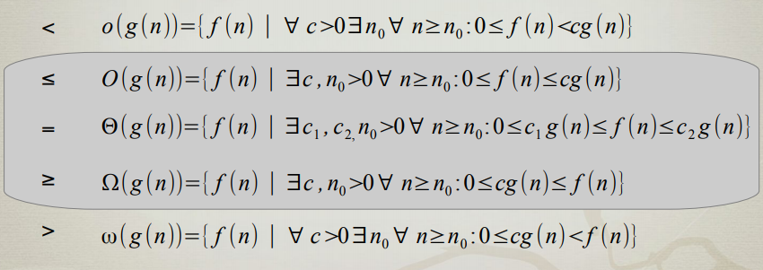

## Zahtevnosti Algoritmov
- Algoritem za izvajanje potrebuje
  - **cas** (realni cas, st. operacij in st. dostopov do pomnilnika) → **casovna zahtevnost algoritma**
  - **prostor** (pomnilnik, disk) → **prostorska zahtevnost algoritma**
- Zahtevnost je odvisna od **samega algoritma** in **naloge (vhoda algoritma)** → **asimptotska zahtevnost**

### Asimptotska notacija
- **O-notacija** - $f(n) = O(g(n))$
  - $f$ je kvecjem reda $g$
  - $f$ ne raste hitreje kot $g$
  - $f$ je od zgoraj omejena z $g$
- **$\Omega$-notacija** - $f(n) = \Omega(g(n))$
  - $f$ je vsaj reda $g$
  - $f$ ne raste pocasneje kot $g$
  - $f$ je od spodaj omejena z $g$
- **$\Theta$-notacija** - $f(n) = \Theta(g(n))$
  - $f$ je reda $g$
  - $f$ je od zgoraj in od spodaj omejena z $g$ 
- **Formalne definicije**  
  
- Ustaljena (zlo-)raba
  - namesto $\in$ uporabljamo $=$ za vse $O$, $\Omega$ in $\Theta$  
    $f(n) = O(g(n)) \equiv f(n) \in O(g(n))$
- **Notacija s $\sim$**
  - $f(n) \sim g(n) \equiv lim_{n \to \infty} \frac{f(n)}{g(n)} = 1$
- **Notacija z limitami**
  - $L = \lim_{n \to \infty} \frac{f(n)}{g(n)}$  
  
  |namig|notacija|limita|
  |:-:|:-:|:-:|
  |$<$|$o$|$L = 0$|
  |$\leq$|$O$|$0 \leq L < \infty$|
  |$=$|$\Theta$|$0 < L < \infty$|
  |$\geq$|$\Omega$|$0 < L \leq \infty$|
  |$>$|$\omega$|$L = 0$|
  |$\sim$|$\sim$|$L = 1$|

### Razredi asimptotske Zahtevnosti

|Funkcija|Razred zahtevnosti|
|-|-|
|$1$|konstantna|
|$\log n$|logaritemska|
|$n$|linearna|
|$n \log n$| logaritmicna, n-log-n|
|$n^2$|kvadratna|
|$n^3$|kubicna|
|$2^n$|eksponentna|
|$n!$|faktoriela|

### Racunanje z asimptotsko notacijo
- **Refleksivnost:** $f(n) = O(f(n))$
- **Eliminacija konstante**
  - ce velja za $\Theta$, potem velja tudi za $O$ in $\Omega$
  - $c > 0 : c \cdot f(n) = \Theta(f(n))$
- **Izrek (simetrija)**
  - $f(n) = \Theta(g(n)) \Leftrightarrow f(n) = \Omega(g(n)) \wedge f(n) = O(g(n))$
- **Izrek (transponirana simetrija)**
  - 