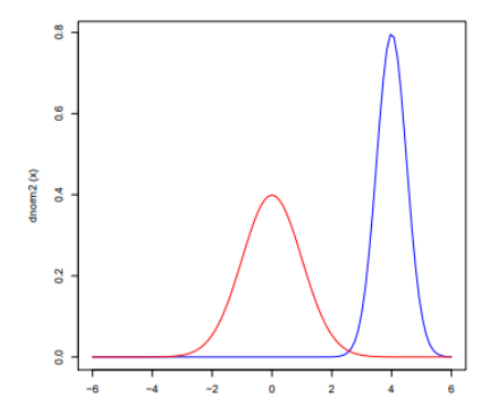
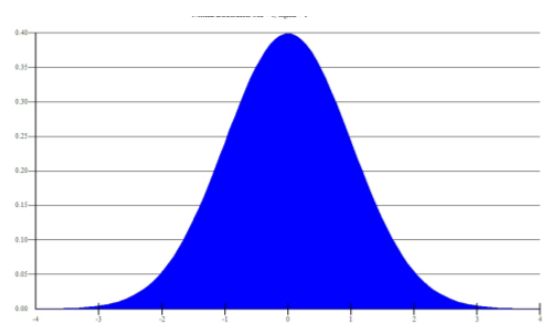

## 1. Slucajne spremenljivke
- **Slucajna spremenljivka** je spremenljivka, ki je odvisna od slucaja, pri cemer v doloceni ponovitvi poskusa zavzame eno od mogocih vrednost.

### Primeri
- **stevilske** (starost), **opisne** (spol), **urejenostne** (uspeh v soli), **razmericne** (temp), **razmernostne** (starost), **absolutne** (stetje v populaciji), **diskretne** in **zvezne**.

### Definicija (zaloga vrednosti in porazdelitveni zakon)
- **Zaloga vrednosti** slucajne spremenljivke je mnozica vrednosti, ki jih lahko prevzavme ob neki ponovitvi poskusa.
- **Porazdelitveni zakon** nam pove verjetnost, da slucajna spremenljivka prevzame neko vrednostv ponovitvi poskusa.

### Porazdelitvena funkcija
- Oznacimo jo z $F(x)$ in nam pove verjetnost, da spremenljivka zavzame vrednost $x$. **Porazdelitveni zakon** nekega $X$-a je poznan, ce je mogoce za vsako realno stevilo dolociti verjetnost $F(x)=P(X \leq x)$.
- **Lastnosti:**
  - Funkcija $F$ je definirana na vsem $R$ in zanjo velja $0 \leq F(x) \leq 1$ za $\forall x \in R$.
  - Funkcija $F$ je ne padajoca: $x_1 < x_2 \Rightarrow F(x_1) \leq F(x_2)$.
  - $F(-\infty) := \lim_{x \to -\infty} F(x) = 0$ in $F(\infty) := \lim_{x \to \infty} F(x) = 1$.
  - Funkcija je v vsaki tocki z desne zvezna: $F(x+) := \lim_{0 \leq h \to 0} F(x + h) = F(x)$.
  - Funkcija ima lahko v nekaterih tockah skok. Vsej skokov je najvec stevno mnogo.
  - $P(x_1 < X \leq x_2) = F(x_2) - F(x_1)$.
  - $P(X > x) = 1 - F(x)$.
  - $P(X = x) = F(x) - F(x-)$.

### Diskretna, zvezna
- **Diskretna** ima za zaloga vrednosti neko stevno mnozico (npr. met kocke). Lahko podamo z verjetnostno tabelo (zgoraj $x$-i, spodaj $p$-ji, kjer mora biti vsota $p$-jev enaka `1`).
- **Zvezna** ima za zalogo vrednosti nek bodisi neskoncen bodisi koncen interval (npr. kolicina padavin v nekem dnevu v nekem kraju).

### Primer mesane sljucajne spremenljivke
- **Mesane** imajo nekaj lastnosti diskretnih in nekaj lastnosti zveznih.

## 2. Diskretne slucajne spremenljivke
### Primer tabele
- Zgoraj $X$ oznacuje stevilo pik, ki pade na kocki.
- $X ~ \binom{1\ \ 2\ \ 3\ \ 4\ \ 5\ \ 6}{\frac{1}{6}\ \frac{1}{6}\ \frac{1}{6}\ \frac{1}{6}\ \frac{1}{6}\ \frac{1}{6}}$
- Vsota verjetnosti vseh dogodkov je `1`.

### Primeri: enakomerna, binomska, Poissonova, Pascalova, hipergeometrijska
- **Enakomerna:**
  - Vse vrednosti so enako verjetne.
  - *Primer: za vsako stevilo pik na kocki je enaka verjetnost da pade*.
  - *Primer: met standardne kocke, za vsako stevko je verjetnost, da pade enaka $\frac{1}{6}$*.
- **Binomska:**
  - Verjetnost, da se v $n$ poskusih dogodek zgodi $k-krat$.
  - *Primer: koliksna je verjetnost, da v 4 metih kocke vrzemo sestico natanko 2x*.
  - *Primer: Koliko sestic dobimo, ce mecemo kocko 10-krat*.
- **Poissonova:**
  - Verjetnost, kjer je $X$ stevilo ponovitev dogodka na danem intervalu (v nekem intervalu, se dogodek ponavadi zgodi $\lambda$ krat).
  - *Primer: stetje prometa*.
- **Pascalova:**
  - Verjetnost, da bomo potrebovali $k$ ponovitev poskusa, da pridemo do $n$-te pojavitve vrednosti.
  - *Primer: da vrzemo 6 10x , ce dogodek ponovimo 12x*.
  - *Primer: Koliko metov je potrebno, da 5x zadanemo kos, ce je verjetnost, da zadanemo 0.7*.
- **Hipergeometrijska:**
  - Verjetnost da izvlecemo $k$ rdecih kroglic, ce izvlecemo $n$ kroglic.
  - *Primer: Imamo $R$ rdecih in $B$ belih kroglic, izvlecemo jih $n$, $k$ je stevilo izvlecenih rdecih kroglic*.
  - *Primer: Koliksna je verjetnost, da iz 5 rdecih in 6 belih kroglic vzamemo 3 koglice in sta od teh dve beli*.

### Definicija (tabela, zaloga vrednosti je stevna mnozica)
- **Zaloga vrednosti** je stevna mnozica ${x_1, x_2, ..., x_m}$.
- **Verjetnostna tabela** - Glej primer tabele.

### Porazdelitvena funkcija je stopnicasta funkcija
- Porazdelitveno funkcijo v diskretnem primeru izrazimo z  
$$
F(x_k) = P(X \leq x_k) = \sum_{i = 1}^{k} p_i
$$

### Izpeljava netrivialne pricakovane vrednosti ali odklona
- **Pricakovana vrednost** (koncne) diskretne spremenljivke $X$, oznacimo z $E(X)$ oz. $\mu_x$, je posplositev povprecne vrednosti. Zacnemo z **utezenim povprecjem**, kjer je $\sum_{i = 1}^{m} = N$ in upostevamo $f_i = \frac{k_i}{N}$:  
$$
\overline{X} = \frac{\sum_{i = 1}^{m} x_ik_i}{N} = \sum_{i = 1}^{m} = x_if_i
$$
- na osnovi cesar vpeljemo:  
$$
E(X) = \sum_{i = 1}^{m} = x_ip_i
$$

## 3. Poissonova porazdelitev
### Primer
- Npr. Stevilo dostopov do omreznega streznika na minuto
- Npr. Stetje prometa, kjer nas zanima verjetnost, da v nekem casovnem intervalu pride mimi $k$ avtomobilov

### Zaloga vrednosti
- Zaloga vrednsti so vsa naravna stevila vklucno z 0.
- Zaloga vrednosti ni omejena.
- To je bistvene razlika od binomske porazdelitve, kjer stevilo uspehov logicno ne more presegati stevilo bernullijevih poskusov $n$

### Predpostavke
- Predpostavki za Poissonovo porazdelitev sta:
  - vsaka ura je enaka kot vsaka druga ura (vsak casovni interval je isti kot drug)
  - ce v enem casovnem intervalu pride veliko avtomobilov to se ne pomeni, da bo podobno tudi v naslednjem casovnem intervalu

### Definicija - verjetnostna funkcija
- $k$ - stevilo ponovitev dogodka na danem intervalu (oz. je to $X$ za $k = 0,\ 1,\ \ldots$)
- $e$ - osnova naravnega logaritma
- $p_k = \lambda^k \frac{e^{-\lambda}}{k!}$ 
- $\lambda$ - pricakovana pogostost nekega dogodka

### Povezava z binomsko porazdelitvijo
- Imamo nek problem (npr. koliko avtov pride v eni casovni enoti) in predpostavimo, da je ena casovna enota enaka kot druga vendar, ce v enem casovnem intervalu pride veliko avtov, se ne pomeni, da bo enako za naslednji interval.
-  Dan problem opredelimo z binomsko porazdelitvijo $B(n, p)$, kjer $n$ predstavlja stevilo manjsih casovnih enot, $p$ pa da v dani manjsi casovni enoti pride vsaj en avto.
-  Opazimo, da naletimo na problem: v eni manjsi casovni enoti gre lahko mimo vec kot en avtomobil na minuto, zato zmanjsamo casnovno enoto -> preverimo, kaj se zgodi ce gre to stevilo do neskoncnosti ... na koncu pridemo do Poissonovega obrazca:
- $P_n(k) \approx \frac{(np)^ke^{-np}}{k!}$
- Ce pogledamo zgornjo enacbo se vidi, da enacimo $\lambda = np$

### Razlaga parametra $\lambda$
- V povprecju imamo na nekem intervalu ponovitev dogodka **A**
- Ce spremenimo interval, moramo ustrezno popraviti tudi ???

### Pricakovana vrednost in disperzija
- $E(X) = \lambda$
- $D(X) = \lambda$

### Poissonov obrazec
- $P_n(k) \approx \frac{(np)^ke^{-np}}{k!}$

## 4. Pascalova porazdelitev

### Primeri (npr. geometrijska)
- Koliko metov je potrebnih, da 5x zadanemo kos pri kosarki, ce je verjetnost, da zadanemo, 0.7? 
- Koliko stevilo poskusov, da se $n$-krat zgodi dogodek

### Zaloga vrednosti
- Za neko porazdelitev $P(m, p)$ je zaloga vrednosti $m,\ m+1,\ \ldots$
- $m$ - stevilo ponovited dogodka
- $p$ - verjetnost tega dogodka

### Definicija
- Gre za porazdelitev, kjer opazujemo porazdelitev potrebnega stevil poskusov, da se dogodek $A$ zgodi $m$-krat
- Ce $m$ omejimo na $m = 1$ dobimo gemonetrijsko porazdelitev $G(p)$, ta pa opisuje, da se dogodek $A$ v zadnji ponovitvi poskusa zgodi prvic.
  
### Verjetnostna funkcija
- $p_k = \binom{k - 1}{m - 1}p^mq^{k - m} \ za \ k \geq m$

### Pricakovana vrednost in disperzija
- $E(X) = \frac{m}{p}$
- $D(X) = \frac{m(1 - p)}{p^2}$ 

### Izpeljava pricakovane vrednosti za geometrijsko porazdelitev
- Ce pri Pascalovi porazdelitvi upostevamo, da $m = 1$, dobimo geometrijsko porazdelitev $G(p)$, torej bo pricakovana vrednost $\frac{1}{p}$ in disperzija $\frac{q}{p}$

### Uporaba pri problemu “zbiranje kuponov”
- ???

## 5. Hipergeometrijska porazdelitev

### Zaloga vrednosti
- Zaloga vrednosti je podmnozica mnozice $N$
- $N$ - mnozica vseh opazovanih elementov, npr. $N = R + B$, kjer $R$ rdece in $B$ bele kroglice

### Definicija (verjetnostna funkcija)
- Hipergeometricna porazdelitev je odvisna od treh parametrov:
  1. Stevila elementov $N$
  2. Stevila elementov $M \leq N$ z doloceno znacilnostjo (npr. stevilo moznih neuspehov)
  3. Stevila elementov $n \leq N$ izvlecenih v enem poskusu
- Verjetnost, da izmed $N$ elementov, med katerimi jih ima $M$ znacilnost, uspesno dobimo $k$ uspesnih je enaka $\frac{\binom{M}{k}\binom{N - M}{n - k}}{\binom{N}{n}}$

### Omejitve parametrov
- $M \leq N$
- $n \leq N$
- $k = {0,\ 1,\ \ldots,\ min(n,\ k)}$

### Primer uporabe
- V posodi imamo dve vrsti enako velikih kroglic, ene so bele in druge crne
- Vseh kroglic je $N$, od tega je $M$ belih.
- Izvlecemo $n$ kroglic, ki jih ne vracamo v posodo.
- Hipergeometricna porazdelitev doloca porazdelitev belih izvlecenih kroglic

### Je vec parametrov boljse ali slabse
- Hipergeometrijsko porazdelitev uporabljamo za primere, kjer je $n$ obcuten glede na velikost celotne populacije, za vecje populacije z manjsimi $n$-ji lahko uporabljamo kar binomsko porazdelitev.

### Povezava z binomsko
- Tako hipergeometrijska kot binomska porazdelitev opisujeta, kolikokrat se dogodek zgodi v dolocenem stevilu poskusov
- Za binomsko porazdelitev je verjetnost enaka za vsako preskusanje
- Za hipergeometricno porazdelitev vsak poskus spremeniverjetnost za vsak naslednji poskus, ker ni zamenjave

## 6. Zvezne slucajne spremenljivke
### Primer - slika gostote verjetnosti
- Na abcisno os nanasamo vrednosti slucajne spremenljivke
- Na ordinatno os pa gostoto verjetnosti $p(x)$
- Primer: kolicina padavin v nekem $x$ dnevu v nekem kraju  
    

### Opisi primerov: enakomerna, normalna, eksponentna (in Gama), Cauchyjeva
- **Enakomerna:**
  - Porazdelitev, ki ima na intervalu $(a,\ b)$ konstantno funkcijo gostote verjetnosti 
  - *Primer: Idealiziran generator nakljucnih stevil*
  - Gostota: 
$$
  p(x) =
    \begin{cases}
      \frac{1}{b-a} & a \leq x \leq b\\
      0 & \text{sicer}\\
    \end{cases} 
$$
- **Normalna:**
  - Zanjo velja, da je zvonaste oblike (kot zgoraj), ce je simetricna nad premico x, potem pravimo, da je **simetricna**.
  - *Primer: ocene, najvec je povprecnih ucencev, nekaj izredno dobrih in nekaj izredno slabih*
  - Gostota: 
$$
p(x) = \frac{1}{\sigma \sqrt{2\pi}}e^{-\frac{1}{2}(\frac{x - \mu}{\sigma})^2}
$$ 
  - Eksponentno pada proti 0
  - Porazdelitvena funkcija:
    - $\frac{1}{2}+\Phi(\frac{x - \mu}{\sigma})$
    - kjer je **funkcija napake**: 
$$
  \Phi(x) = \frac{1}{\sqrt{2\pi}} \int_{0}^{x}e^{-\frac{1}{2}t^2}\ dt
$$
- **Exponentna:**
  - Opisuje cas med dvema zaporednima dogodkoma v procesu pri katerem se dogotki pojavljajo zvezno in neodvisno pri konstantni porvprecni hitrosti pojavljanja
  - *Primer: Cas med dvema dogodkoma je exponentrno porazdeljen*
  - Gostota: $p(x) = \lambda e^{-\lambda x}$
  - Porazdelitvena funkcija: $F(x) = \int_0^x \lambda e^{-\lambda t} dt = 1 - e^{-\lambda x}$
- **Gamma:**
  - Bolj posplosena oblika exponentne, kjer pri Poissonovem procesu (proces pri katerem so dogodki zvezni in neodvisni en od drugega, s konstantno povprecno hitrostjo ponavljanja) merimo cas, da se zgodi $k$ dogodkov.
  - *Primer: koliko dezevnice se nabere v zbiralniku, ko dezuje*
  - Gostota: ???
  - **Funkcijo Gamma** lahko definiramo z dolocenim integralom za $R[z] > 0$ (Eulerjeva integralna forma)  
$$
\Gamma(z) = \int_0^\infty t^{z-1}e^{-t}dt = 2 \int_0^\infty e^{-t^2} t^{2z - 1} dt
$$

- **Cauchyeva:**
  - Dobimo s slucajno spremenljivko $X = tg U$, kjer $U$ zvezno enakomerno porazdeljena na intervalu $(-\frac{\pi}{2},\ \frac{\pi}{2})$
  - Gostota: $p(x) = \frac{a}{\pi} \frac{1}{1 + a^2(x - b)^2},\ \infty < x < \infty,\ a > 0$
  - Porazdelitvena funkcija: $F(x) = \frac{a}{\pi} \int_{-\infty}^x \frac{1}{1 + a^2(x - b)^2}dx = \frac{1}{\pi} \arctan(a(x-b)) + \frac{1}{2}$

### Definicija zvezne s.s. z gostoto verjetnosti
- Slucajna spremenljivka je zvezno porazdeljena, ce obstaja taka integrabilna funkcija $p$ (gostota verjetnosti), da za vsak $x$, ki je element realnih stevil velja:
  - $F(x) = P(X \leq x) = \int_{-\infty}^x p(t) dt$
  - $\int_{-\infty}^{\infty} p(x) dx = 1$
  - $P(x_1 < X \leq x_2) = \int_{x_1}^{x_2} p(t) dt = F(x_2) - F(x_1)$
  - $p(x) = F'(x)$

### Zveza med gostoto verjetnosti in porazdelitveno funkcijo
- $p(x) = F'(x)$
- Gostota je odvod porazdelitvene funkcije

### Racunanje verjetnosti na podintervalu
- $P(x_1 < X \leq x_2) = \int_{x_1}^{x_2} p(t) dt = F(x_2) - F(x_1)$

### Izpeljava netrivialne pricakovane vrednosti ali odklona
- ???

## 7. Normalna porazdelitev

### Slika: unimodalna, zvonasta krivulja
- Unimodala = zvonasta
- 

### Povezava z vsoto slucajnih spremenljivk in/ali CLI
- Z vsoto slucajnih spremenljvk - ce imamo slucanje spremenljivke $X_1,\ldots,X_n$, ki so enako porazdeljene potem obstaja $S = X_1 + \ldots + X_n$, ki je porazdeljen z normalno $N - (n \mu, \frac{\sigma}{\sqrt{n}})$
- s CLI - CLI ti omogoca, da razlicne staticne metode uporabis tudi ce osnovna porazdelitev sl. spremenljivke $X$ ni normalna in nam da aproksimacijo porazdelitev z normalno porazdelitvijo.

### Zaloga vrednosti, gostota verjetnosti, funkcija napake
- Zaloga vrednosti so vsa realna stevila
- Gostota: $p(x) = \frac{1}{\sigma \sqrt{2\pi}}e^{-\frac{1}{2}(\frac{x - \mu}{\sigma})^2}$
- Funkcija napake: $\Phi(x) = \frac{1}{\sqrt{2\pi}} \int_0^x e^{-\frac{1}{2}t^2} dt$

### Standardizacija in tabela za N(0, 1)
- Porazdelitev N(0, 1) je standardizirana normalna porazdelitev
- Spremenljivko $Y$ - $N(\mu, \sigma)$ pretvorimo s transformacijo $z = (x - \mu) / \sigma$  v standardizirano spremenljivko $Z$ - $N(0, 1)$

### Kje sta µ in σ na grafu y = p(x) in pravilo 68-95-99,7
- Priblizno 68% vseh meritev lezi na intervalu $(\mu - \sigma, \mu + \sigma)$
- 95% meritev lezi na intervalu $(\mu - 2\sigma, \mu + 2\sigma)$
- skoraj vse meritve 99,7% lezijo na intervalu $(\mu - 3\sigma, \mu + 3\sigma)$

### Vecrazsezna gostota porazdelitve
- ???

### Vektorska oblika s kovariancno matriko
- ???

## 8. Bernullijev zakon velikih stevil

### Statisticna in klasicna definicija verjetnosti
- Statisticna definicija verjetnosti - Verjetnost dogodka $A$ v danem poskusu je stevilo $P(A)$, pri katerem se navadno ustali relativna frekvenca dogodka $A$ v velikem stevilu ponovitev tega poskusa
- Klasicna definicija verjetnosti - Vzemimo, da so dogodki iz popolnega sistema dogodkov ${E_1, \ldots, E_s}$ enako verjetni: $P(E_1) = \ldots = P(E_s) = p$. Tedaj je $P(E_i) = 1/2$ in $i = 1, \ldots, s$. Ce je nek dogodek $A$ sestavljen iz $r$ dogodkov iz tega popolnega sistema dogodkov, potem je njegova verjetnost $P(A) = r/s$

### Definicija funkcija napake
### Podroben zapis izreka
### Uporaba/primer za izraˇcun verjetnosti ali velikost n
### Dokaz z aproksimacijo prek zveze med binomsko in normalno porazdelitvijo
### Zakaj to smatramo za prvo verzijo CLI?

## 9. Eksponentna porazdelitev

### primer
### slika, zaloga vrednosti, gostota verjetnosti
### porazdelitvena funkcija
### definicija - povezava s Poissonovim procesom
### razlaga parametra λ
### priˇcakovana vrednost in disperzija
### karakterizacija: zvezna sluˇcajna spremenljivka brez spomina

## 10. Gama porazdelitev
### posebni primeri (npr. eksponentna, hi-kvadrat), kako lahko iz eksponentne pridemo do Gama porazdelitve
### slika, zaloga vrednosti, gostota verjetnosti in kako pridemo do zgornjih primerov iz Gama porazdelitve
### Gama funkcija (definicija, rekurzija in nekatere vrednosti, tudi za 1/2)
### Priˇcakovana vrednost in disperzija
### Uporaba hi-kvadrat porazdelitve
### Dedna lastnost gama porazdelitve, skica dokaza za aditivnost, tj. Γ(k, λ) + Γ(h, λ) = Γ(k + h, λ)